# Plan for Enhancing the Master PRD Document

## Goal
To further improve the clarity, accessibility, and impact of `PRD-pflow-master.md` for its primary audience (Product Managers and Architects) by incorporating a glossary, additional architectural diagrams, and targeted summaries.

---

## Improvement 1: Add a Glossary of Key Terms

**Action:**
Create a new top-level section at the end of `PRD-pflow-master.md`, titled "Appendix A: Glossary of Key Terms".

**Location in `PRD-pflow-master.md`:**
After the "Conclusion" section (Section 12) and before the "*End of PRD*" marker.

**Content to Include:**
This section will list and define key pflow-specific terminology and concepts used throughout the PRD. Each term should have a concise, pflow-contextual definition.

**Example Terms to Define:**
*   `Action-Based Transitions`: The mechanism for conditional flow control based on node `post()` return values.
*   `@flow_safe`: The decorator used to mark nodes as pure (deterministic, idempotent, no side effects), making them eligible for caching and retries.
*   `JSON IR (Intermediate Representation)`: The structured JSON format defining a pflow, including nodes, edges, parameters, and mappings, used as the control plane.
*   `Lockfile`: A file (`flow.lock.json`) containing a validated IR hash and pinned node versions, ensuring deterministic and reproducible flow execution.
*   `MCP Wrapper Node`: An auto-generated pflow Node that exposes an MCP tool with a natural shared store interface, integrating it seamlessly into pflow.
*   `Metadata-Driven Selection`: The planner's process of choosing nodes based on extracted JSON metadata from docstrings, rather than code inspection.
*   `Natural Interface`: The pflow convention where nodes read from and write to the shared store using intuitive, human-readable key names (e.g., `shared["url"]`, `shared["summary"]`).
*   `NodeAwareSharedStore (Proxy)`: An optional mapping layer that transparently translates shared store keys for a node, enabling it to use its natural interface even if the flow's shared store schema uses different key names (e.g., for marketplace compatibility).
*   `Params`: Node-specific configuration values (e.g., `temperature`, `max_tokens`) accessed via `self.params`, distinct from data flowing through the shared store.
*   `Planner (Dual-Mode)`: The pflow component responsible for converting user intent (either natural language or CLI pipe syntax) into validated JSON IR.
*   `pocketflow Framework`: The underlying 100-line Python execution engine providing the `Node` base class, `prep`/`exec`/`post` lifecycle, and flow orchestration operators.
*   `Shared Store`: A flow-scoped, in-memory dictionary that nodes use for primary data communication, passing inputs and outputs via natural key names.
*   `Unified Registry`: The central system in pflow for discovering and managing all types of nodes (manual, MCP wrappers), including their versions and metadata.

---

## Improvement 2: Enhance Visuals for Core Runtime Architecture

**Action:**
Design and insert a new Mermaid diagram that visually explains the runtime data flow, emphasizing the Shared Store and the optional Proxy layer.

**Location in `PRD-pflow-master.md`:**
Within Section 2 ("Core Concepts"), as a new subsection, potentially titled "2.2.1 Visualizing Shared Store Data Flow" (following subsection 2.2 "Shared Store Pattern").

**Diagram Content & Focus:**
The diagram should illustrate:
*   The flow of data into the `shared` store (e.g., from CLI input).
*   How a node (`Node A`) accesses `shared` data directly via its natural interface in its `prep()` method and writes back in `post()`.
*   How node-specific `params` are separate from the `shared` store.
*   How a subsequent node (`Node B`) might interact with the `shared` store via the `NodeAwareSharedStore` proxy if mappings are defined in the IR. The proxy should be shown as translating keys, while Node B's code still uses its natural interface.
*   The progression of the `shared` store state.

**Draft Mermaid Code (to be refined):**

```mermaid
graph LR
    subgraph "pflow Runtime Execution Example"
        direction LR
        UserInput["User Input (CLI Flags/Pipe)"] --> SharedStore_Init["Shared Store (Initial)"]

        subgraph NodeA ["Node A Execution (Direct Access)"]
            direction TB
            NodeAParams["Node A.params<br>(node-specific config)"]
            SharedStore_Init -->|reads via natural interface| A_prep["A.prep()"]
            A_prep --> A_exec["A.exec()"]
            A_exec --> A_post["A.post()"]
            A_post -->|writes via natural interface| SharedStore_Mid["Shared Store (After Node A)"]
        end
        SharedStore_Init -.-> NodeAParams


        subgraph NodeB ["Node B Execution (via Proxy for Mapped Keys)"]
            direction TB
            NodeBParams["Node B.params<br>(node-specific config)"]
            SharedStore_Mid --> Proxy["NodeAwareSharedStore Proxy<br>(Translates 'flow_key' to 'nodeB_natural_key')"]
            Proxy --> |reads 'nodeB_natural_key'| B_prep["B.prep()"]
            B_prep --> B_exec["B.exec()"]
            B_exec --> B_post["B.post()"]
            B_post --> |writes 'nodeB_natural_key'| Proxy
            Proxy -.-> SharedStore_Final["Shared Store (After Node B)"]
        end
        SharedStore_Mid -.-> NodeBParams
    end

    style Proxy fill:#f3e5f5,stroke:#333,stroke-width:2px
```

*Caption*: "Illustrative data flow showing direct shared store access (Node A) and proxied access (Node B) for key mapping, with node-specific params."

---

## Improvement 3: Add "Key Takeaways for PMs/Architects" Summaries

**Action:**
At the end of selected major technical sections, add a short, bulleted list titled "**Key Takeaways for Product Managers & Architects:**". These takeaways should distill the strategic implications, benefits, or critical decision points from the section.

**Locations in `PRD-pflow-master.md` & Example Content:**

1.  **End of Section 3: Planning Pipeline Architecture**
    *   *Focus*: Implications of dual-mode planning, metadata importance, and retrieval-first strategy.
    *   *Example Takeaways*:
        *   Dual-mode ensures both power-users (CLI) and new users (NL) benefit from the same robust validation.
        *   Rich node metadata is crucial for effective NL planning and discoverability.
        *   Retrieval-first planning enhances stability and reduces LLM dependency over time.

2.  **End of Section 5: JSON IR & Schema Governance**
    *   *Focus*: Strategic value of a well-defined IR.
    *   *Example Takeaways*:
        *   Standardized IR is key to interoperability, enabling future tools like GUI builders or advanced analytics.
        *   Versioned schemas and lockfiles ensure flow reproducibility, vital for reliable automation and CI/CD.
        *   The IR acts as a stable contract, decoupling planning from execution and simplifying system evolution.

3.  **End of Section 6: Runtime Behavior & Performance**
    *   *Focus*: How purity, caching, and retries impact product reliability and user experience.
    *   *Example Takeaways*:
        *   The opt-in `@flow_safe` model balances safety with performance, requiring clear guidance for node developers.
        *   Caching significantly improves UX for expensive, repeatable operations, reinforcing the value of pure nodes.
        *   Configurable retries enhance flow resilience against transient issues for critical tasks.

4.  **End of Section 7: MCP Integration & Unified Registry**
    *   *Focus*: Strategic advantage of seamless MCP integration.
    *   *Example Takeaways*:
        *   Unified registry makes MCP tools first-class citizens, expanding pflow's capabilities without custom integrations.
        *   Natural interface mapping for MCP tools simplifies flow creation and lowers the barrier to using external services.
        *   Action-based error handling for MCP tools provides consistent resilience patterns across all node types.

---

## Implementation Order
A suggested order to implement these enhancements:

1.  **Improvement 2 (Mermaid Diagram for Runtime)**: This is a targeted addition to an existing section and can help solidify understanding of core concepts early.
2.  **Improvement 3 (Key Takeaways)**: Add these summaries section by section. This involves careful thought for each relevant section but can be done incrementally.
3.  **Improvement 1 (Glossary)**: Compile the glossary last. This allows for the inclusion of all relevant terms that have been used and emphasized throughout the document, including any that might be highlighted by the new "Key Takeaways" sections.

---

## Final Review
After all enhancements are implemented, a full read-through of `PRD-pflow-master.md` is recommended to ensure:
*   Consistency in terminology (especially with the new glossary).
*   Smooth flow and integration of new visual and summary elements.
*   Overall clarity and impact for the target audience.

---
