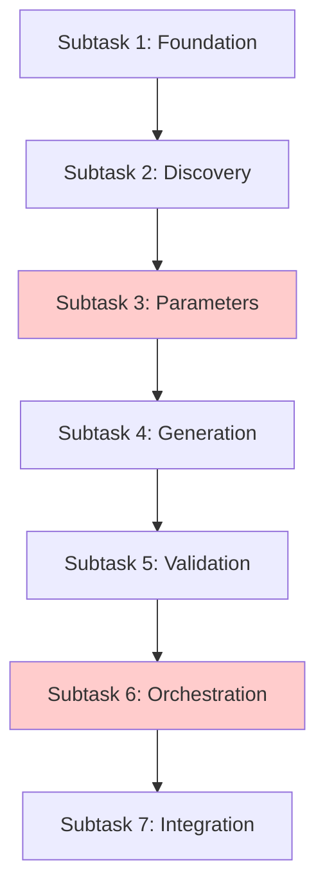

# Task 17: Natural Language Planner - Subtask Decomposition Plan

## Overview

Task 17 implements a sophisticated meta-workflow that orchestrates the entire lifecycle of finding or creating workflows based on natural language input. Due to its complexity (9+ nodes, branching logic, multiple integrations), we need to decompose it into manageable subtasks.

## ⚠️ Critical Architecture: The Two-Path Meta-Workflow

**This is NOT a simple linear pipeline!** The planner implements a sophisticated meta-workflow with TWO distinct execution paths that converge at a critical verification point:

### Path A: Workflow Reuse (When existing workflow found)
```
WorkflowDiscoveryNode → ParameterMappingNode → ParameterPreparationNode → ResultPreparationNode
        ↓                      ↑ (CONVERGENCE)
   "found_existing"
```

### Path B: Workflow Generation (When no match found)
```
WorkflowDiscoveryNode → ComponentBrowsingNode → ParameterDiscoveryNode → GeneratorNode
        ↓                                                                      ↓
   "not_found"                                                          ValidatorNode
                                                                              ↓
                                                                    MetadataGenerationNode
                                                                              ↓
                                                   ParameterMappingNode ← ← ← ┘
                                                        ↓ (CONVERGENCE)
                                              ParameterPreparationNode → ResultPreparationNode
```

**KEY INSIGHTS**:
- Both paths CONVERGE at `ParameterMappingNode` - this is the verification gate
- `ParameterMappingNode` doesn't just extract parameters - it VERIFIES the workflow can execute
- Path A is fast (reuse), Path B is creative (generate)
- The planner returns a single output format regardless of path taken

## Node Responsibilities Matrix

| Node | Path A | Path B | Purpose | Critical Responsibility |
|------|--------|--------|---------|------------------------|
| WorkflowDiscoveryNode | ✓ | ✓ | Entry point, routing | Decides "found_existing" or "not_found" |
| ComponentBrowsingNode | - | ✓ | Find building blocks | Selects nodes AND workflows for composition |
| ParameterDiscoveryNode | - | ✓ | Extract named params | Provides context BEFORE generation |
| GeneratorNode | - | ✓ | Create workflow | MUST use template variables ($var) |
| ValidatorNode | - | ✓ | Validate IR + templates | Uses registry's Node IR for validation |
| MetadataGenerationNode | - | ✓ | Extract metadata | Only runs on VALID workflows |
| ParameterMappingNode | ✓ | ✓ | **Both paths** | Verifies ALL params available |
| ParameterPreparationNode | ✓ | ✓ | Format for runtime | Prepares execution_params |
| ResultPreparationNode | ✓ | ✓ | Package for CLI | Creates planner_output dict |

## ⚠️ CRITICAL: Parameter Extraction Independence

**→ See `task-17-standardized-conventions.md` for full parameter flow details**

Key insight: ParameterMappingNode does **INDEPENDENT EXTRACTION** - it doesn't use discovered_params from Path B. This independence makes it a verification gate that ensures the workflow is actually executable with the user's input.
**Example**: If workflow expects `inputs: {"issue_number": ..., "repo": ...}`, ParameterMappingNode tries to extract values for exactly "issue_number" and "repo" from the natural language.
## Critical Implementation Concepts

See core documentation for detailed guidance. Key reminders:
- **Template Variables**: Always use $var syntax, never hardcode - see task-17-core-concepts.md
- **Registry Access**: Direct instantiation pattern - see task-17-implementation-guide.md
- **Context Builder**: Already implemented (Tasks 15/16) - just import and use
- **No Proxy Mappings**: Use template paths ($data.field) instead (~20 lines vs ~200)

## Decomposition Strategy

The decomposition follows these principles:
1. **Functional Cohesion**: Group related functionality together
2. **Path Awareness**: Understand which nodes belong to which path
3. **Convergence Focus**: Both paths must properly converge
4. **Integration Points**: Clear interfaces between subtasks
5. **Incremental Value**: Each subtask adds working functionality

## Subtask Breakdown

### Subtask 1: Foundation & Infrastructure

**Quick Start**:
1. Create `src/pflow/planning/` directory structure
2. Set up workflow loader utility for `~/.pflow/workflows/`
3. Configure LLM using Simon Willison's library
4. Create test fixtures for mocking

**Scope**: Establish the basic structure and utilities needed by all other components

**Deliverables**:
- Create `src/pflow/planning/` directory structure following PocketFlow conventions
- Utility functions for workflow loading from `~/.pflow/workflows/`
- Helper functions for registry access patterns
- LLM integration setup using Simon Willison's `llm` library
  - Note: The planner uses `llm` directly in its nodes (NOT the llm node from Task 12)
  - Model is configurable (gpt-4, claude, etc.)
- Basic test infrastructure setup

**Dependencies**: None (can start immediately)

**Key Files** (PocketFlow Structure):
- `src/pflow/planning/__init__.py`
- `src/pflow/planning/utils/workflow_loader.py`
- `src/pflow/planning/utils/registry_helper.py`
- `tests/test_planning/conftest.py`

**Implementation Checklist**:
- [ ] Directory structure created
- [ ] Workflow loader can read from `~/.pflow/workflows/`
- [ ] Registry helper utilities working
- [ ] LLM library configured and tested
- [ ] Test fixtures for mocking LLM responses

---

### Subtask 2: Discovery System

**Quick Start**:
1. Create WorkflowDiscoveryNode in nodes.py
2. Import `build_discovery_context()` from context_builder
3. Use LLM to match user input against workflow descriptions
4. Return "found_existing" or "not_found" based on match

**Scope**: Implement nodes that handle the initial routing decision for both paths

**Deliverables**:
- `WorkflowDiscoveryNode` - Entry point that routes to Path A or Path B
  - Returns "found_existing" if complete workflow match found
  - Returns "not_found" otherwise
- `ComponentBrowsingNode` - Path B only, finds building blocks
  - Can select BOTH nodes and existing workflows for composition
  - Over-inclusive browsing better than missing components
- Integration with existing context builder (Tasks 15/16)
- Unit tests for discovery logic and routing

**Dependencies**: Subtask 1 (foundation)

**Key Files**:
- `src/pflow/planning/nodes.py` (all nodes in one file following PocketFlow pattern)
- `tests/test_planning/test_discovery.py`

**Implementation Checklist**:
- [ ] WorkflowDiscoveryNode class created with semantic matching
- [ ] ComponentBrowsingNode can browse nodes AND workflows
- [ ] Context builder integration working (both phases)
- [ ] Routing logic returns correct action strings
- [ ] Tests pass for both Path A and Path B routing

---

### Subtask 3: Parameter Management System

**Quick Start**:
1. Create ParameterDiscoveryNode (Path B only) for NL extraction
2. Create ParameterMappingNode (both paths) for verification
3. Implement parameter verification logic
4. Create ParameterPreparationNode for runtime formatting

**Scope**: Implement the sophisticated two-phase parameter handling pipeline

**Deliverables**:
- `ParameterDiscoveryNode` - Path B ONLY, extracts named params from NL
  - Runs BEFORE generation to provide context
  - Example: "20 issues" → `{"limit": "20"}`
- `ParameterMappingNode` - Both paths converge here
  - INDEPENDENTLY extracts values for workflow's defined inputs (doesn't use discovered_params)
  - Verifies ALL required parameters are available
  - Routes to "params_incomplete" if missing
- `ParameterPreparationNode` - Formats parameters for runtime execution
- Unit tests for extraction, mapping, and verification

**Dependencies**: Subtask 2 (discovery system)

**Key Files**:
- `src/pflow/planning/nodes.py` (continued)
- `tests/test_planning/test_parameters.py`

**Implementation Checklist**:
- [ ] ParameterDiscoveryNode extracts params with names
- [ ] ParameterMappingNode verifies parameter availability
- [ ] Proper routing: "params_complete" vs "params_incomplete"
- [ ] ParameterPreparationNode formats execution_params
- [ ] Tests cover extraction, mapping, and missing params

---

### Subtask 4: Generation System

**Quick Start**:
1. Create GeneratorNode with LLM integration
2. Build Pydantic models for FlowIR in ir_models.py
3. Create prompts that emphasize template variables
4. Implement retry with progressive enhancement

**Scope**: Implement the workflow generation capability with LLM

**Deliverables**:
- `GeneratorNode` with progressive enhancement on retry
  - MUST generate workflows with template variables ($var, $var.field)
  - NEVER hardcode extracted values
  - Max 3 retries with error-specific improvements
- Pydantic models for IR generation (`ir_models.py`)
- Prompt templates emphasizing template variable usage
- Structured output generation via `llm` library
- Unit tests with mocked LLM responses

**Dependencies**: Subtask 3 (parameters - provides context for generation)

**Key Files**:
- `src/pflow/planning/nodes.py` (continued)
- `src/pflow/planning/ir_models.py`
- `src/pflow/planning/prompts.py`
- `tests/test_planning/test_generation.py`

**Implementation Checklist**:
- [ ] GeneratorNode uses discovered_params as context
- [ ] Pydantic FlowIR model created
- [ ] Structured output: `model.prompt(prompt, schema=FlowIR)`
- [ ] Generated workflows use template variables
- [ ] Progressive enhancement on validation errors
- [ ] Tests verify template variable usage

---

### Subtask 5: Validation & Refinement System

**Quick Start**:
1. Create ValidatorNode using existing validate_ir()
2. Add template validation with registry's Node IR
3. Create MetadataGenerationNode for metadata extraction
4. Format errors for LLM retry

**Scope**: Implement validation and metadata extraction for generated workflows

**Deliverables**:
- `ValidatorNode` with dual validation approach:
  - Structure validation via existing `validate_ir()`
  - Template validation using registry's Node IR (Task 19)
  - Routes "invalid" back to generator with specific errors (max 3 retries)
- `MetadataGenerationNode` for workflow metadata extraction
  - ONLY runs after successful validation
  - Extracts name, description, inputs, outputs
- Error feedback formatting for LLM retry
- Unit tests for validation scenarios

**Dependencies**: Subtask 4 (generation - validates generated workflows)

**Key Files**:
- `src/pflow/planning/nodes.py` (continued)
- `tests/test_planning/test_validation.py`

**Implementation Checklist**:
- [ ] ValidatorNode validates structure and templates
- [ ] Template paths verified against registry
- [ ] Routes: "metadata_generation" → metadata, "retry" → generator, "failed" → result
- [ ] MetadataGenerationNode extracts workflow info
- [ ] Error messages actionable for retry
- [ ] Tests cover valid/invalid scenarios

---

### Subtask 6: Flow Orchestration

**Quick Start**:
1. Read `pocketflow/__init__.py` and understand how pocketflow works
2. Create a detailed plan of the implementation
3. Verify that the plan follows all pocketflow conventions and patterns
4. Verify that the plan is considering what is actually implemented in the codebase (nodes made in previous subtasks)
5. Create ResultPreparationNode for output formatting
6. Create create_planner_flow() in flow.py
7. Wire all nodes with proper edges and action strings
8. Test both complete paths end-to-end

**Scope**: Wire all nodes together into the complete meta-workflow with proper branching

**Deliverables**:
- `ResultPreparationNode` for final output formatting
  - Creates `planner_output` dict for CLI consumption
- `create_planner_flow()` function that wires everything:
  - Path A: Discovery → Mapping → Preparation → Result
  - Path B: Discovery → Browsing → Parameter Discovery → Generation → Validation → Metadata → Mapping → Preparation → Result
- Complete flow with all edges and action strings
- Integration tests for both complete paths

**Dependencies**: Subtasks 2-5 (all nodes must exist)

**Key Files**:
- `src/pflow/planning/flow.py`
- `src/pflow/planning/nodes.py` (ResultPreparationNode)
- `tests/test_planning/test_flow_integration.py`

**Critical Flow Logic**:
```python
# Simplified edge structure
flow.add_edge("discovery", "found_existing", "param_mapping")  # Path A
flow.add_edge("discovery", "not_found", "browsing")            # Path B
flow.add_edge("generator", "validate", "validator")           # Path B validation
flow.add_edge("validator", "retry", "generator")              # Retry loop
flow.add_edge("validator", "metadata_generation", "metadata")  # Success
flow.add_edge("param_mapping", "params_complete", "preparation") # Convergence
```

**Required reading (do not delagate to subagents):**:
- `pocketflow/__init__.py` - The pocketflow framework code (only 200 lines)

**Requirements**:
- Make sure to follow all pocketflow conventions and patterns (delegate reserach to subagents)

**Implementation Checklist**:
- [ ] ResultPreparationNode formats planner_output
- [ ] All nodes properly wired in flow
- [ ] Path A works end-to-end
- [ ] Path B works end-to-end
- [ ] Both paths converge correctly
- [ ] Integration tests pass for both paths
- [ ] Running the full flow works end-to-end with real LLM calls (Path A + B)

---

### Subtask 7: Integration & Polish

**Quick Start**:
1. Update CLI to invoke planner for natural language
2. Add end-to-end tests with real scenarios
3. Create optional real LLM tests
4. Update documentation

**Scope**: Connect planner to CLI and add comprehensive testing

**Deliverables**:
- CLI integration in `src/pflow/cli/main.py`
  - Invoke planner for natural language input
  - Handle planner_output appropriately
- End-to-end tests with real workflow scenarios
- Hybrid testing approach:
  - Mocked LLM for standard tests (`make test`)
  - Optional real LLM tests (`make test-llm`)
- Documentation updates reflecting implementation
- Performance validation (<1s for discovery)

**Dependencies**: Subtask 6 (complete flow)

**Key Files**:
- Integration points in `src/pflow/cli/main.py`
- `tests/test_planning/test_e2e.py`
- `tests/test_planning/test_llm_integration.py` (optional)
- Documentation updates

**Implementation Checklist**:
- [ ] CLI invokes planner for natural language
- [ ] CLI handles planner_output correctly
- [ ] E2E tests with realistic scenarios
- [ ] Mocked LLM tests pass
- [ ] Optional real LLM tests created
- [ ] Documentation updated
- [ ] Performance targets met

---

## Testing Strategy

Focus on complete path testing, not isolated nodes:
- **Path A**: Discovery → Mapping → Result (workflow reuse)
- **Path B**: Discovery → Browse → Generate → Validate → Mapping → Result
- **Mocked LLM**: Standard tests (`make test`)
- **Real LLM**: Optional validation (`make test-llm`)

For detailed testing patterns, see task-17-implementation-guide.md

## Development Sequence



**Note**: Subtasks 3 and 6 are particularly critical as they handle the convergence architecture.

## ⚠️ Critical Implementation Warnings

1. **Template Variables**: NEVER hardcode values - use $var for reusability
2. **Two Paths**: Path A (reuse) and Path B (generate) handle different scenarios
3. **Single nodes.py**: Keep all nodes together for cohesion
4. **Context Builder**: Import from Tasks 15/16 - don't recreate
5. **Testing**: Test complete paths, not individual nodes

## Risk Mitigation

### Technical Risks
1. **LLM Response Quality**: Mitigated by structured output + validation + retry with enhancement
2. **Complex Flow Logic**: Mitigated by clear path separation and convergence testing
3. **Template Variable Errors**: Mitigated by registry-based validation using Node IR

### Process Risks
1. **Architecture Confusion**: Mitigated by clear two-path documentation and warnings
2. **Dependencies**: Sequential development with clear integration points
3. **Testing Complexity**: Hybrid approach (mocked + optional real) manages costs

## Estimation

**Rough Complexity Estimates** (considering two-path architecture):
- Subtask 1 (Foundation): Low - mostly setup and utilities
- Subtask 2 (Discovery): Medium - semantic matching and routing logic
- Subtask 3 (Parameters): High - convergence point architecture
- Subtask 4 (Generation): High - complex LLM interaction with templates
- Subtask 5 (Validation): Medium - leverages existing validation + registry
- Subtask 6 (Orchestration): High - complex branching and convergence
- Subtask 7 (Integration): Medium - mostly wiring and testing

## Success Metrics

The complete implementation should achieve:
- ≥95% success rate for natural language → valid workflow
- ≥90% user approval rate without modification
- Fast discovery (<1s for workflow matching)
- Both paths working end-to-end
- Proper convergence at parameter mapping
- Template variables preserved for reusability
- Comprehensive test coverage (unit + integration + paths)

## Next Steps

1. Proceed implementing Subtasks 1-7 in order (stop and ask user for guidance after each subtask)
2. Test complete paths throughout development

---

*This plan provides logical boundaries while maintaining flexibility for implementation details. Each subtask builds value incrementally toward the complete Natural Language Planner System.*
