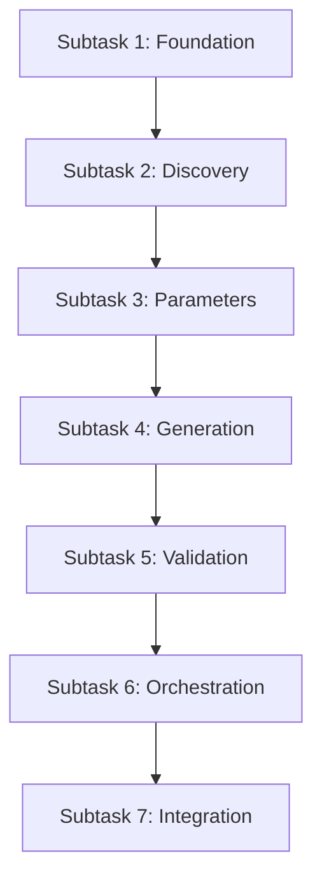

# Task 17: Natural Language Planner - Subtask Decomposition Plan

## Overview

Task 17 implements a sophisticated meta-workflow that orchestrates the entire lifecycle of finding or creating workflows based on natural language input. Due to its complexity (9+ nodes, branching logic, multiple integrations), we need to decompose it into manageable subtasks.

## Decomposition Strategy

The decomposition follows these principles:
1. **Functional Cohesion**: Group related functionality together
2. **Dependency Management**: Build foundations before dependent components
3. **Testability**: Each subtask produces testable deliverables
4. **Integration Points**: Clear interfaces between subtasks
5. **Incremental Value**: Each subtask adds working functionality

## Subtask Breakdown

### Subtask 1: Foundation & Infrastructure
**Scope**: Establish the basic structure and utilities needed by all other components

**Deliverables**:
- Create `src/pflow/planning/` directory structure following PocketFlow conventions
- Shared store design document
- Utility functions for external interactions (NOT LLM)
- LLM usage with `anthropic/claude-sonnet-4-0` (llm library)
- Basic test infrastructure setup

**Dependencies**: None (can start immediately)

**Key Files** (PocketFlow Structure):
- `src/pflow/planning/__init__.py`
- `src/pflow/planning/utils/workflow_loader.py` (utility for loading workflows)
- `src/pflow/planning/utils/registry_helper.py` (utility for registry access)
- `tests/test_planning/conftest.py`

**PocketFlow Principles Applied**:
- Clear separation: utilities for external I/O only
- No base node class needed - nodes inherit directly from PocketFlow Node
- Design shared store BEFORE implementation
- Keep utilities simple and focused

**Success Criteria**:
- Directory structure follows PocketFlow conventions
- Utilities can load workflows and access registry
- Shared store design documented
- Test fixtures available

---

### Subtask 2: Discovery System
**Scope**: Implement nodes that find existing workflows and browse available components

**Deliverables**:
- `WorkflowDiscoveryNode` - finds complete workflow matches
- `ComponentBrowsingNode` - browses for building blocks
- Integration with context builder (already exists)
- Unit tests for discovery logic

**Dependencies**: Subtask 1 (foundation)

**Key Files**:
- `src/pflow/planning/nodes/discovery.py`
- `tests/test_planning/test_discovery.py`

**Success Criteria**:
- Can discover existing workflows by semantic matching
- Can browse and select relevant components
- Proper routing based on discovery results

---

### Subtask 3: Parameter Management System
**Scope**: Implement the sophisticated parameter handling pipeline

**Deliverables**:
- `ParameterDiscoveryNode` - extracts named params from NL
- `ParameterMappingNode` - convergence point, verifies executability
- `ParameterPreparationNode` - formats for runtime
- Unit tests for parameter extraction and mapping

**Dependencies**: Subtask 2 (discovery)

**Key Files**:
- `src/pflow/planning/nodes/parameters.py`
- `tests/test_planning/test_parameters.py`

**Success Criteria**:
- Correctly extracts parameters from natural language
- Maps parameters to workflow requirements
- Verifies all required parameters are available
- Handles missing parameters appropriately

---

### Subtask 4: Generation System
**Scope**: Implement the workflow generation capability with LLM

**Deliverables**:
- `WorkflowGeneratorNode` with progressive enhancement
- Pydantic models for IR generation (`ir_models.py`)
- Prompt templates for workflow generation
- Structured output generation with retry logic
- Unit tests with mocked LLM responses

**Dependencies**: Subtask 3 (parameters - needed for context)

**Key Files**:
- `src/pflow/planning/nodes/generator.py`
- `src/pflow/planning/ir_models.py`
- `src/pflow/planning/prompts/generation.py`
- `tests/test_planning/test_generation.py`

**Success Criteria**:
- Generates valid JSON IR from natural language
- Uses template variables correctly ($var syntax)
- Handles retry with progressive enhancement
- Structured output via Pydantic models

**Implementation Note**: The `llm` library supports direct Pydantic schema validation via `model.prompt(prompt, schema=PydanticModel)`, simplifying structured output generation.

---

### Subtask 5: Validation & Refinement System
**Scope**: Implement validation and metadata extraction for generated workflows

**Deliverables**:
- `ValidationNode` with dual validation (structure + templates)
- `MetadataGenerationNode` for workflow metadata extraction
- Error feedback formatting for LLM retry
- Unit tests for validation scenarios

**Dependencies**: Subtask 4 (generation - validates generated workflows)

**Key Files**:
- `src/pflow/planning/nodes/validation.py`
- `src/pflow/planning/nodes/metadata.py`
- `tests/test_planning/test_validation.py`

**Success Criteria**:
- Validates both IR structure and template variables
- Provides actionable error messages for retry
- Extracts meaningful metadata from workflows
- Routes correctly based on validation results

---

### Subtask 6: Flow Orchestration
**Scope**: Wire all nodes together into the complete meta-workflow

**Deliverables**:
- `ResultPreparationNode` for final output formatting
- `create_planner_flow()` function that wires everything
- Proper branching logic (Path A vs Path B)
- Convergence at parameter mapping
- Integration tests for complete flow paths

**Dependencies**: Subtasks 2-5 (all nodes must exist)

**Key Files**:
- `src/pflow/planning/flow.py`
- `src/pflow/planning/nodes/result.py`
- `tests/test_planning/test_flow_integration.py`

**Success Criteria**:
- Path A (reuse) works end-to-end
- Path B (generate) works end-to-end
- Proper convergence at parameter mapping
- Returns correct output format for CLI

---

### Subtask 7: Integration & Polish
**Scope**: Connect planner to CLI and add comprehensive testing

**Deliverables**:
- CLI integration in `src/pflow/cli/main.py`
- End-to-end tests with real workflows
- Optional real LLM integration tests
- Documentation updates
- Performance testing

**Dependencies**: Subtask 6 (complete flow)

**Key Files**:
- Integration points in `src/pflow/cli/main.py`
- `tests/test_planning/test_e2e.py`
- `tests/test_planning/test_llm_integration.py`
- Documentation updates

**Success Criteria**:
- CLI successfully invokes planner for natural language input
- Complete workflows generated and executed
- Both mocked and real LLM tests pass
- Documentation reflects implementation

---

## Development Sequence

**Sequential Development**:
- Subtasks will be implemented sequentially to avoid complexity
- Each subtask builds on the previous ones
- Clear dependencies ensure proper integration
- Testing can be incremental throughout

## Risk Mitigation

### Technical Risks
1. **LLM Response Quality**: Mitigated by structured output + validation + retry
2. **Complex Flow Logic**: Mitigated by incremental testing of each path
3. **Integration Issues**: Mitigated by clear interfaces between components

### Process Risks
1. **Scope Creep**: Each subtask has clear boundaries and success criteria
2. **Dependencies**: Sequential development ensures proper integration
3. **Testing Complexity**: Hybrid testing approach (mocked + real) manages costs

## Estimation

**Rough Complexity Estimates**:
- Subtask 1 (Foundation): Low - mostly setup and structure
- Subtask 2 (Discovery): Medium - semantic matching logic
- Subtask 3 (Parameters): Medium - extraction and mapping logic
- Subtask 4 (Generation): High - complex LLM interaction and retry
- Subtask 5 (Validation): Medium - leverages existing validation
- Subtask 6 (Orchestration): High - complex branching and convergence
- Subtask 7 (Integration): Medium - mostly wiring and testing

## Success Metrics

The complete implementation should achieve:
- ≥95% success rate for natural language → valid workflow
- ≥90% user approval rate without modification
- Fast discovery (<1s for workflow matching)
- Comprehensive test coverage (unit + integration)
- Clear separation of concerns
- Maintainable, extensible architecture

## Next Steps

1. Review and approve this decomposition
2. Create detailed specifications for Subtask 1
3. Begin implementation with foundation layer
4. Proceed implementing Subtasks 1-7 in order (stop and ask user for guidance after each subtask)
5. Regular integration testing as components complete

---

*This plan provides logical boundaries while maintaining flexibility for implementation details. Each subtask builds value incrementally toward the complete Natural Language Planner System.*