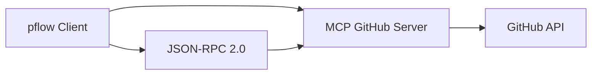

# MCP (Model Context Protocol) for GitHub Integration in pflow - Research Analysis

## Executive Summary

Model Context Protocol (MCP) is an open standard developed by Anthropic for connecting AI systems to external data sources and tools. For pflow's GitHub integration needs, MCP presents both compelling benefits and significant architectural challenges that need careful consideration.

**Key Findings:**
- MCP provides a standardized approach to tool integration with existing GitHub servers
- The protocol is transport-agnostic and supports local (stdio) and remote (HTTP/SSE) execution
- Integration would require significant architectural additions not planned for pflow MVP
- The benefits may not justify the complexity for pflow's "Plan Once, Run Forever" philosophy

## 1. What is MCP and How Does It Work?

### Technical Architecture

MCP is built on **JSON-RPC 2.0** as its core messaging protocol, providing:

- **Stateful Connections**: Long-lived connections between clients and servers
- **Capability Negotiation**: Dynamic discovery of available tools and resources
- **Transport Agnostic**: Supports stdio, HTTP+SSE, and WebSocket transports

### Core Components

1. **MCP Servers**: Expose data sources and tools (e.g., GitHub server)
2. **MCP Clients**: Connect hosts to servers with 1:1 relationships
3. **Host Applications**: Coordinate overall system and manage LLM interactions
4. **Base Protocol**: JSON-RPC 2.0 messaging layer

### Communication Flow



**Message Types:**
- **Requests**: Client-to-server operations (with responses)
- **Responses**: Server replies to requests
- **Notifications**: One-way messages (no response expected)

## 2. Existing MCP GitHub Server

### Official GitHub MCP Server

**Status**: GitHub maintains an official MCP server at `github.com/github/github-mcp-server`
- **Previous Package**: `@modelcontextprotocol/server-github` (deprecated, moved to GitHub)
- **Current Location**: `github.com/github/github-mcp-server`
- **Language**: Go implementation
- **Deployment**: Supports both remote (cloud-hosted) and local (Docker/self-hosted)

### Capabilities

The GitHub MCP server provides comprehensive GitHub API access:

**Toolset Categories:**
- **Actions**: Workflow management
- **Code Security**: Security scanning and analysis
- **Dependabot**: Dependency management
- **Discussions**: Community discussions
- **Gists**: Code snippet management
- **Issues**: Issue tracking and management
- **Repositories**: Repository operations
- **User Context**: User and organization data

### Authentication Requirements

**GitHub Personal Access Token (PAT)**:
- Required for all operations
- Supports OAuth in some configurations
- Recommended minimal scopes: `repo`, `read:packages`
- Token rotation and environment variable management required

## 3. How pflow Nodes Would Interact with MCP

### Current pflow Node Architecture

pflow nodes follow the **pocketflow framework** pattern:

```python
class Node:
    def prep(self, shared: dict) -> dict:
        """Extract inputs from shared store"""

    def exec(self, prep_res: dict) -> dict:
        """Execute core logic"""

    def post(self, shared: dict, prep_res: dict, exec_res: dict) -> str:
        """Write outputs to shared store"""
```

### Proposed MCP Integration Pattern

Based on pflow's architecture documentation, MCP tools would become **wrapper nodes**:

```python
class McpGithubSearchCodeNode(Node):
    """Search code in GitHub repositories via MCP.

    Interface:
    - Reads: shared["query"]: str  # Search query string
    - Reads: shared["language"]: str  # Programming language filter (optional)
    - Writes: shared["search_results"]: list  # Array of code search results
    - Params: max_results: int  # Maximum results to return (default: 10)

    MCP Source: github-server/search_code v1.2.0
    """

    def __init__(self):
        super().__init__()
        self._mcp_executor = McpExecutor("github-server")

    def prep(self, shared):
        query = shared.get("query")
        if not query:
            raise ValueError("Missing required 'query' in shared store")

        return {
            "query": query,
            "language": shared.get("language"),
            "max_results": self.params.get("max_results", 10)
        }

    def exec(self, prep_res):
        response = self._mcp_executor.call_tool("search_code", prep_res)
        return response["results"]

    def post(self, shared, prep_res, exec_res):
        shared["search_results"] = exec_res
        return "default"
```

### Integration Requirements

**New Components Needed:**
1. **MCP Executor**: Handles protocol communication
2. **Wrapper Generator**: Auto-generates nodes from MCP manifests
3. **Registry Integration**: Unified discovery of MCP and native nodes
4. **Transport Manager**: Handles stdio/HTTP/SSE connections
5. **Error Handler**: Maps MCP errors to pflow exceptions

## 4. Pros and Cons of Using MCP

### Pros

**Standardization Benefits:**
- **Industry Standard**: Leverages Anthropic's open protocol with broad adoption
- **Existing Infrastructure**: GitHub's official MCP server provides comprehensive API coverage
- **Future-Proof**: Protocol designed for AI tool integration
- **Community Ecosystem**: Growing library of MCP servers for various platforms

**Technical Benefits:**
- **Capability Discovery**: Dynamic tool discovery through MCP manifest
- **Transport Flexibility**: Support for local (stdio) and remote (HTTP/SSE) execution
- **Error Handling**: Structured error responses with standard error codes
- **Authentication**: Built-in OAuth 2.1 support for secure API access

**Architectural Benefits:**
- **Unified Interface**: All GitHub operations through single MCP server
- **Automatic Updates**: Server updates provide new tools without pflow changes
- **Consistent Patterns**: Same integration approach for other platforms (Slack, Google, etc.)

### Cons

**Complexity Overhead:**
- **Protocol Complexity**: JSON-RPC 2.0 with capability negotiation adds substantial complexity
- **Transport Management**: Multiple transport layers (stdio, SSE, WebSocket) to support
- **State Management**: Long-lived connections require connection pooling and health monitoring
- **Error Recovery**: Complex error scenarios across network and protocol layers

**Performance Considerations:**
- **Network Latency**: Remote MCP servers add 100-500ms per operation
- **Connection Overhead**: Stateful connections require persistent management
- **Serialization Cost**: JSON-RPC messaging adds encoding/decoding overhead
- **Rate Limiting**: External MCP servers subject to their own rate limits

**Architectural Misalignment:**
- **MVP Scope Creep**: MCP integration planned for v2.0, not MVP
- **Dependency Weight**: Heavy dependency on external protocol vs. lightweight native nodes
- **Debugging Complexity**: Multi-layer debugging (pflow → MCP → GitHub API)
- **Testing Challenges**: Mock MCP servers required for reliable testing

**Deployment Complexity:**
- **Server Management**: Local MCP servers require process management
- **Authentication Setup**: PAT management and token rotation
- **Version Compatibility**: MCP protocol and server version synchronization
- **Network Configuration**: Firewall and proxy configuration for remote servers

## 5. Authentication and Security Considerations

### Authentication Models

**GitHub Personal Access Token (PAT):**
```bash
# Environment variable configuration
export GITHUB_PERSONAL_ACCESS_TOKEN="ghp_xxxxxxxxxxxx"
```

**OAuth 2.1 Integration:**
- MCP servers can act as OAuth Resource Servers
- Supports token validation from separate Authorization Servers
- RFC 9728 compliant for Authorization Server discovery

### Security Best Practices

**Token Management:**
- Environment variables for sensitive data
- No credentials in IR or lockfiles
- Token rotation capabilities
- Minimal scope requirements (`repo`, `read:packages`)

**Network Security:**
- HTTPS required for remote MCP servers
- Certificate pinning supported via optional pin files
- Development `--insecure` flag for local testing
- Host validation before connection

**Trust Model Integration:**
```python
# MCP nodes default to impure (no caching)
class McpGithubSearchCode(Node):
    # No @flow_safe decorator - has external side effects
    pass

# Rare read-only MCP tools can be marked pure
@flow_safe
class McpGithubGetRepository(Node):
    # Cacheable if MCP manifest declares readonly=true
    pass
```

## 6. Performance Characteristics

### Latency Analysis

| Operation Type | Local (stdio) | Remote (HTTP/SSE) | Direct GitHub API |
|---|---|---|---|
| Simple API call | 10-50ms | 100-500ms | 50-200ms |
| Connection setup | 5-10ms | 100-300ms | 50-100ms |
| Error recovery | 10ms | 200-600ms | 100-300ms |

### Network Overhead

**Local MCP Server (stdio):**
- **Pros**: Microsecond latency, no network overhead, OS-level security
- **Cons**: Process management, server startup time, resource usage

**Remote MCP Server (HTTP/SSE):**
- **Pros**: No local server management, automatic updates, shared infrastructure
- **Cons**: Network latency, external dependencies, rate limiting

### Memory and Resource Usage

**MCP Client Overhead:**
- JSON-RPC message parsing and validation
- Connection state management
- Transport-specific buffers
- Protocol compliance validation

**Estimated Overhead**: 2-5MB memory per active MCP connection, 10-50ms processing overhead per operation

## 7. Dependencies and Deployment Complexity

### Required Dependencies

**Core MCP Dependencies:**
```python
# New dependencies for MCP integration
mcp-client==1.0.0           # MCP protocol client
jsonrpc-requests==0.7.0     # JSON-RPC 2.0 implementation
websockets==12.0            # WebSocket transport support
aiohttp==3.9.0              # HTTP/SSE transport support
```

**System Dependencies:**
- **Local MCP Servers**: Docker or direct binary installation
- **Remote MCP Servers**: Network connectivity and certificates
- **Process Management**: Subprocess handling for stdio transport

### Deployment Scenarios

**Development Environment:**
```bash
# Local GitHub MCP server setup
docker run -d --name github-mcp -p 8080:8080 \
  -e GITHUB_TOKEN=$GITHUB_PERSONAL_ACCESS_TOKEN \
  github/github-mcp-server

# pflow MCP registration
pflow registry add-mcp --server github --transport stdio \
  --command "docker exec github-mcp mcp-server"
```

**Production Environment:**
- **Container Orchestration**: Kubernetes/Docker Compose for MCP server management
- **Service Discovery**: Dynamic MCP server endpoint resolution
- **Health Monitoring**: Connection health and failover logic
- **Configuration Management**: Environment-specific MCP server endpoints

### Operational Complexity

**Additional Operational Burden:**
1. **MCP Server Lifecycle Management**: Start, stop, restart, health checks
2. **Transport Configuration**: stdio vs HTTP/SSE selection and configuration
3. **Connection Pool Management**: Persistent connection handling
4. **Error Recovery**: Network failures, server restarts, protocol errors
5. **Monitoring**: MCP-specific metrics and alerting
6. **Updates**: MCP server version management and compatibility

## 8. Rate Limiting and Error Recovery

### MCP Protocol Error Handling

**Standard MCP Error Types:**
```json
{
  "jsonrpc": "2.0",
  "error": {
    "code": -32001,
    "message": "Rate limit exceeded",
    "data": {
      "retry_after": 3600,
      "limit_type": "api_calls_per_hour"
    }
  }
}
```

### GitHub-Specific Rate Limiting

**GitHub API Limits:**
- **Primary Rate Limit**: 5,000 requests/hour for authenticated requests
- **Secondary Rate Limit**: Anti-abuse protection with dynamic limits
- **GraphQL Rate Limit**: Point-based system (5,000 points/hour)
- **Search Rate Limit**: 30 requests/minute for search endpoints

### Error Recovery Strategies

**MCP Error to pflow Action Mapping:**
```python
class McpErrorHandler:
    ERROR_MAPPINGS = {
        "rate_limited": "retry_with_backoff",
        "unauthorized": "refresh_auth",
        "forbidden": "escalate_permissions",
        "not_found": "resource_missing",
        "timeout": "retry",
        "server_error": "external_failure"
    }
```

**Integration with pflow Retry Logic:**
- **Exponential Backoff**: Built into pocketflow framework
- **Circuit Breaker**: Fail fast after repeated MCP server failures
- **Fallback Strategies**: Graceful degradation when MCP server unavailable

## 9. Examples of MCP GitHub Server Implementations

### Available Tools

Based on research, the GitHub MCP server provides these tool categories:

**Repository Management:**
- `search_repositories`: Search GitHub repositories
- `get_repository`: Get repository details
- `list_repository_files`: Browse repository contents
- `get_file_content`: Read file contents
- `create_repository`: Create new repository

**Code Search:**
- `search_code`: Search code across repositories
- `search_commits`: Search commit history
- `search_issues`: Search issues and pull requests
- `search_users`: Search GitHub users

**Issue Management:**
- `list_issues`: List repository issues
- `get_issue`: Get issue details
- `create_issue`: Create new issue
- `update_issue`: Update existing issue
- `add_issue_comment`: Add comment to issue

**Pull Request Operations:**
- `list_pull_requests`: List repository PRs
- `get_pull_request`: Get PR details
- `create_pull_request`: Create new PR
- `update_pull_request`: Update existing PR
- `merge_pull_request`: Merge PR

### Example Usage Patterns

**Direct MCP Tool Usage:**
```bash
# Search for authentication-related code in Python
pflow mcp-github-search-code \
  --query "authentication" \
  --language "python" \
  --max-results 10
```

**Complex Workflow Integration:**
```bash
# End-to-end workflow with MCP tools
echo "security vulnerability" | \
  pflow mcp-github-search-code --language python => \
  llm --prompt "Summarize security findings" => \
  mcp-github-create-issue --title "Security Review" => \
  mcp-slack-send-message --channel security-alerts
```

## 10. Architectural Implications for pflow

### Alignment with pflow Philosophy

**"Plan Once, Run Forever" Considerations:**

**Positive Alignment:**
- **Deterministic Execution**: MCP tools can be cached like other nodes
- **Workflow Persistence**: MCP flows can be saved as JSON IR
- **Reproducible Results**: Same inputs produce same outputs (for read operations)

**Tension Points:**
- **External Dependencies**: MCP servers introduce external failure points
- **Network Variability**: Remote MCP calls add non-deterministic latency
- **Server Evolution**: MCP server updates can change tool behavior
- **Connection State**: Stateful connections complicate "instant execution"

### Impact on Core Architecture

**Registry System:**
- **Unified Registry**: MCP tools must integrate with existing node registry
- **Dynamic Discovery**: MCP capability negotiation vs static node metadata
- **Version Management**: MCP server versions vs pflow node versions

**Shared Store Pattern:**
- **Natural Interfaces**: MCP tools need intuitive key mappings
- **Proxy Integration**: Complex MCP outputs may require proxy mapping
- **Type Consistency**: MCP JSON responses vs pflow's simple types

**CLI Integration:**
- **Flag Resolution**: MCP parameters vs pflow's "Type flags; engine decides"
- **Template Variables**: Dynamic MCP responses in template system
- **Error Messages**: MCP errors need user-friendly translation

### Development Workflow Impact

**Increased Complexity:**
```bash
# Current simple node development
cat > src/pflow/nodes/my_node.py
# Test locally, deploy

# MCP node development
# 1. Setup MCP server
# 2. Configure authentication
# 3. Generate wrapper node
# 4. Test MCP connectivity
# 5. Handle transport errors
# 6. Deploy with server management
```

**Testing Challenges:**
- **Integration Testing**: Requires running MCP servers
- **Mocking Complexity**: Mock entire MCP protocol vs simple HTTP calls
- **Transport Testing**: Test stdio, HTTP, and SSE transports
- **Error Simulation**: Simulate MCP protocol and network errors

## 11. Recommendation

### Overall Assessment

**MCP provides significant benefits but comes with substantial complexity that may not align with pflow's MVP goals and architectural philosophy.**

### Recommendation: **Defer MCP to v2.0**

**Reasoning:**

1. **MVP Scope Alignment**: MCP integration is already planned for v2.0 in pflow's architecture documents, allowing focus on core functionality first

2. **Complexity vs. Benefit**: The protocol overhead and operational complexity outweigh the benefits for pflow's "Plan Once, Run Forever" philosophy

3. **Alternative Approach**: Simple, direct GitHub API nodes would provide:
   - **Lower Latency**: Direct HTTP calls vs MCP protocol overhead
   - **Simpler Testing**: Mock HTTP responses vs MCP protocol simulation
   - **Clearer Debugging**: Single layer vs multi-layer debugging
   - **Faster Development**: Write nodes directly vs MCP wrapper generation

4. **Future Integration Path**: When MCP is implemented in v2.0, the existing simple GitHub nodes can be gradually replaced or supplemented

### Recommended MVP Approach

**Simple GitHub Nodes:**
```python
class GitHubGetIssueNode(Node):
    """Get GitHub issue details using direct API calls.

    Interface:
    - Reads: shared["issue_number"]: str
    - Reads: shared["repository"]: str
    - Writes: shared["issue"]: dict
    - Params: token: str  # GitHub PAT
    """

    def exec(self, prep_res):
        # Direct GitHub API call with requests
        url = f"https://api.github.com/repos/{prep_res['repo']}/issues/{prep_res['issue']}"
        response = requests.get(url, headers={"Authorization": f"token {prep_res['token']}"})
        return response.json()
```

**Benefits of Simple Approach:**
- **Fast Development**: Implement exactly what's needed
- **Clear Interface**: Direct mapping to pflow's shared store pattern
- **Easy Testing**: Standard HTTP mocking
- **Performance**: Minimal overhead
- **Reliability**: Fewer failure points

### Migration Path to MCP (v2.0)

When MCP integration is implemented:

1. **Wrapper Generation**: Auto-generate MCP wrapper nodes from existing simple nodes
2. **Gradual Migration**: Support both simple and MCP nodes simultaneously
3. **Feature Parity**: Ensure MCP wrappers provide same interfaces
4. **Performance Testing**: Validate MCP overhead is acceptable
5. **Operational Readiness**: Implement full MCP server management

This approach allows pflow to deliver MVP value quickly while building toward the comprehensive MCP integration planned for v2.0.

## Conclusion

MCP represents a sophisticated approach to AI tool integration with strong industry backing and technical merit. However, for pflow's MVP phase, the complexity of MCP integration would significantly delay delivery while providing limited additional value over simple, direct API integration.

The recommended approach is to:
1. **MVP**: Implement simple GitHub API nodes for immediate value
2. **v2.0**: Implement full MCP integration as planned
3. **Migration**: Provide compatibility layer between simple and MCP nodes

This strategy aligns with pflow's architectural roadmap while ensuring rapid MVP delivery and long-term extensibility.
