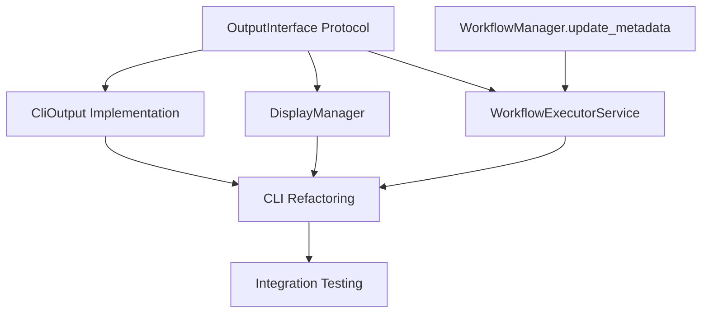

# Task 68 Phase 1: Implementation Plan

## Overview
Phase 1 extracts ~500 lines of execution logic from CLI into reusable services while maintaining 100% backward compatibility. No user-visible changes allowed.

## 1. Comprehensive Task Breakdown

### Files to Create (7 files)
1. `src/pflow/execution/__init__.py` - Module exports
2. `src/pflow/execution/output_interface.py` - Protocol definition
3. `src/pflow/execution/display_manager.py` - UX logic encapsulation
4. `src/pflow/execution/executor_service.py` - Core execution logic (~500 lines)
5. `src/pflow/cli/cli_output.py` - Click-based OutputInterface implementation
6. `tests/test_execution/test_executor_service.py` - Service tests
7. `tests/test_execution/test_display_manager.py` - Display tests

### Files to Modify (2 files)
1. `src/pflow/cli/main.py` - Extract logic to thin wrapper (~1800 lines → ~200 lines)
2. `src/pflow/core/workflow_manager.py` - Add update_metadata() method (~50 lines)

## 2. Dependency Mapping



### Strict Ordering Requirements
1. **Phase A: Foundation** (Must complete first)
   - OutputInterface protocol
   - DisplayManager (uses protocol)
   - CliOutput (implements protocol)

2. **Phase B: Core Service** (Depends on Phase A)
   - WorkflowExecutorService (uses OutputInterface)
   - WorkflowManager.update_metadata()

3. **Phase C: CLI Refactoring** (Depends on Phase B)
   - Extract logic from main.py
   - Wire up to new services
   - Preserve handler signatures

4. **Phase D: Testing** (After all implementation)
   - Unit tests for new components
   - Integration tests
   - Regression testing

## 3. Implementation Steps

### Step 1: Create OutputInterface Protocol (15 min)
```python
# src/pflow/execution/output_interface.py
from typing import Protocol, Optional, Callable

class OutputInterface(Protocol):
    def show_progress(self, message: str, is_error: bool = False) -> None: ...
    def show_result(self, data: str) -> None: ...
    def show_error(self, title: str, details: Optional[str] = None) -> None: ...
    def show_success(self, message: str) -> None: ...
    def create_node_callback(self) -> Optional[Callable]: ...
    def is_interactive(self) -> bool: ...
```

### Step 2: Create DisplayManager (30 min)
- Context-aware message formatting
- Execution vs repair vs resume contexts
- Node progress tracking

### Step 3: Create CliOutput (20 min)
- Wrap OutputController
- Implement OutputInterface
- Handle verbose/format flags

### Step 4: Create WorkflowExecutorService (2-3 hours)
Extract from CLI main.py:
- `_validate_and_load_registry()` logic
- `_setup_workflow_collectors()` logic
- `_compile_workflow_with_error_handling()` logic
- `_prepare_shared_storage()` logic
- Core execution logic from `_execute_workflow_and_handle_result()`
- Output extraction logic

### Step 5: Add WorkflowManager.update_metadata() (30 min)
- Atomic file updates
- Execution count increment
- Timestamp updates

### Step 6: Refactor CLI to Thin Pattern (2-3 hours)
- Replace execute_json_workflow implementation
- Keep handler signatures EXACTLY the same
- Preserve intermediate function
- Wire up to new services

### Step 7: Create Tests (1 hour)
- Unit tests for each new component
- Mock boundaries
- Integration tests

## 4. Risk Identification & Mitigation

### Risk 1: Breaking Handler Signatures
**Impact**: High - Tests will fail
**Probability**: Medium
**Mitigation**:
- Document exact signatures before changing
- Use automated tests to verify
- Keep parameter names and order identical

### Risk 2: Missing Execution Logic
**Impact**: High - Workflows won't execute
**Probability**: Medium
**Mitigation**:
- Systematic extraction with checklist
- Compare line-by-line with original
- Run integration tests frequently

### Risk 3: Output Format Changes
**Impact**: High - Breaks consumers
**Probability**: Low
**Mitigation**:
- Preserve exact JSON structure
- Test with real workflows
- Compare output byte-for-byte

### Risk 4: Test Mock Boundary Violations
**Impact**: High - All tests break
**Probability**: Low
**Mitigation**:
- Don't change compile_ir_to_flow signature
- Keep Registry interface identical
- Preserve mock storage patterns

### Risk 5: Interactive Mode Detection Issues
**Impact**: Medium - Progress display broken
**Probability**: Low
**Mitigation**:
- Keep OutputController logic intact
- Test with different TTY settings
- Verify callback creation

## 5. Testing Strategy

### Unit Testing
Each new component gets dedicated tests:
- **OutputInterface**: Mock implementations
- **DisplayManager**: Message formatting tests
- **CliOutput**: Click integration tests
- **WorkflowExecutorService**: Execution flow tests
- **update_metadata()**: Atomic update tests

### Integration Testing
```bash
# After each major step:
make test

# Specific test suites to watch:
pytest tests/test_cli/ -v  # CLI tests must pass
pytest tests/test_integration/ -v  # End-to-end tests
pytest tests/test_runtime/ -v  # Compilation tests
```

### Regression Verification
1. **Output Comparison**: Save output before/after, diff them
2. **Exit Codes**: Verify 0 for success, 1 for errors
3. **JSON Structure**: Validate all required fields present
4. **Handler Calls**: Verify correct handler invoked
5. **Mock Compatibility**: Ensure test mocks still work

### Progressive Testing Approach
- Test after each component creation
- Don't wait until end for integration testing
- Use real workflows for smoke tests
- Compare execution traces before/after

## 6. Subagent Task Assignments

Since we need to avoid conflicts and work efficiently:

### Single Agent Implementation (Recommended)
One agent (me) implements sequentially to avoid:
- File conflicts
- Import cycles
- Interface mismatches
- Merge conflicts

### Alternative: Parallel with Clear Boundaries
If using multiple agents:
- **Agent 1**: OutputInterface + DisplayManager
- **Agent 2**: CliOutput + WorkflowManager.update_metadata
- **Agent 3**: WorkflowExecutorService (after Agent 1 completes)
- **Main Agent**: CLI refactoring (after all complete)

## 7. Validation Checkpoints

### After Each Component
✓ Component compiles without errors
✓ Imports resolve correctly
✓ Type hints pass mypy
✓ Unit tests for component pass

### After Service Layer Complete
✓ All services instantiate correctly
✓ No circular imports
✓ Interfaces align properly
✓ Integration tests pass

### After CLI Refactoring
✓ All existing tests pass
✓ Output identical to original
✓ Exit codes unchanged
✓ Performance not degraded

### Final Validation
✓ Run full test suite: `make test`
✓ Run linting: `make check`
✓ Manual workflow execution test
✓ Compare traces before/after

## 8. Time Estimates

- **Phase A (Foundation)**: 1 hour
  - OutputInterface: 15 min
  - DisplayManager: 30 min
  - CliOutput: 20 min

- **Phase B (Core Service)**: 3-4 hours
  - WorkflowExecutorService: 3 hours
  - update_metadata(): 30 min

- **Phase C (CLI Refactoring)**: 2-3 hours
  - Extract and refactor: 2 hours
  - Wire up services: 1 hour

- **Phase D (Testing)**: 1-2 hours
  - Unit tests: 1 hour
  - Integration verification: 1 hour

**Total Estimated Time**: 7-10 hours

## 9. Rollback Plan

If issues arise:
1. **Git checkpoint** before starting
2. **Incremental commits** after each component
3. **Feature branch** for all changes
4. **Quick revert** capability if tests fail

## 10. Success Criteria

Phase 1 is complete when:
1. ✅ All existing tests pass without modification
2. ✅ CLI is under 300 lines (excluding imports/docstrings)
3. ✅ Services have no Click dependencies
4. ✅ Output is byte-for-byte identical
5. ✅ Performance is not degraded
6. ✅ Code passes `make check`

## Next Steps

1. Create progress log file
2. Start with OutputInterface protocol
3. Implement components in dependency order
4. Test progressively
5. Validate at checkpoints