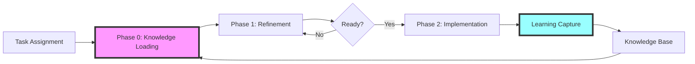

# Epistemic Workflow Overview

This document provides a high-level view of the epistemic learning system for task implementation. The system transforms isolated task execution into a compound learning accelerator.

## The Three-Phase System



### Phase 0: Knowledge Loading (📚 `refine-subtask.md`)
**Purpose**: Start smart by learning from previous implementations
- **For NEW TASKS**: Read task-level reviews from other tasks
- **For SUBTASKS**: Read sibling subtask reviews from current task
- Synthesize patterns and pitfalls
- Build mental model of codebase evolution

### Phase 1: Refinement (🔍 `refine-subtask.md`)
**Purpose**: Transform ambiguous tasks into crystal-clear specifications
- Validate against actual code
- Surface and resolve ALL ambiguities
- Get explicit user decisions
- Create unambiguous specification

### Phase 2: Implementation (🔨 `implement-subtask.md`)
**Purpose**: Execute systematically while capturing learnings in real-time
- Implement the refined specification
- Log discoveries AS THEY HAPPEN
- Extract reusable patterns
- Create comprehensive review
- If last subtask: Create task-level review

## When to Use Which Document

### Start with `refine-subtask.md` when:
- [ ] Beginning any new task or subtask
- [ ] Task description seems unclear
- [ ] You're not sure what's already been tried
- [ ] Dependencies need validation

### Move to `implement-subtask.md` when:
- [ ] ALL ambiguities are resolved
- [ ] Refined specification exists
- [ ] Success criteria are clear
- [ ] `ready-for-implementation` marker exists

### Return to `refine-subtask.md` if:
- [ ] Core assumptions prove false during implementation
- [ ] New ambiguities surface
- [ ] Dependencies don't exist as expected
- [ ] Success criteria can't be met as specified

## The Compound Learning Effect

```
Task 1: 4 hours (no prior knowledge)
  ↓ Discovers authentication pattern
Task 5: 3 hours (reuses auth pattern)
  ↓ Discovers caching approach
Task 10: 2 hours (uses both patterns)
  ↓ Adds error handling pattern
Task 20: 1 hour (applies all patterns)
  ↓ Mostly configuration at this point
```

Each task contributes to a growing knowledge base that makes future tasks progressively easier.

## Example Workflow

### Scenario: Implement Task 5.2 - "Add user authentication to CLI"

#### Phase 0: Knowledge Loading
```
As subtask 5.2 (not the first subtask):
1. Read: .taskmaster/tasks/task_5/subtask_5.1/implementation/review.md
   - Discovers initial auth setup patterns

Creates knowledge-synthesis.md:
- Build on auth foundation from 5.1
- Use JWT pattern mentioned in task_2/task-review.md
- Avoid OAuth complexity noted in task_3/task-review.md
```

#### Phase 1: Refinement
```
1. Use: task-master show --id=5.2
   Output: "Add user authentication to CLI"

2. Create: .taskmaster/tasks/task_5/subtask_5.2/refinement/evaluation.md
   - Ambiguity: Which auth method?
   - Option A: JWT (proven in task 2)
   - Option B: API keys (simpler)
   - User chooses: Option A

3. Create: .taskmaster/tasks/task_5/subtask_5.2/refinement/refined-spec.md
   - Use JWT with refresh tokens
   - Store tokens in ~/.pflow/auth
   - Add login/logout commands
   - Success criteria: User can authenticate

4. Create marker: .taskmaster/tasks/task_5/subtask_5.2/ready-for-implementation
```

#### Phase 2: Implementation
```
1. Write to: .taskmaster/tasks/task_5/subtask_5.2/implementation/progress-log.md
   ## 10:15 - Try to reuse auth module
   Discovery: Module too tightly coupled to web server
   Learning: Need auth abstraction layer

   ## 10:45 - Create auth abstraction
   Success! Clean separation of concerns
   Pattern: AuthProvider interface

2. Create: .taskmaster/tasks/task_5/subtask_5.2/implementation/review.md
   - Extracted AuthProvider pattern
   - Affects Task 6.1 (can use same pattern)
   - Update arch docs with auth abstraction

3. Only at end: task-master set-status --id=5.2 --status=done
```

## File Structure

```
.taskmaster/
├── workflow/                    # How to execute tasks
│   ├── workflow-overview.md     # This document
│   ├── refine-subtask.md        # Phase 0 & 1
│   ├── implement-subtask.md     # Phase 2
│   └── templates/               # Artifact templates
├── tasks/
│   ├── task_1/
│   │   ├── subtask_1.1/
│   │   │   ├── refinement/
│   │   │   │   ├── knowledge-synthesis.md
│   │   │   │   ├── evaluation.md
│   │   │   │   └── refined-spec.md
│   │   │   ├── implementation/
│   │   │   │   ├── plan.md
│   │   │   │   ├── progress-log.md
│   │   │   │   └── review.md
│   │   │   └── ready-for-implementation (marker file)
│   │   ├── subtask_1.2/
│   │   │   └── (same structure)
│   │   └── task-review.md (created after all subtasks complete)
│   └── task_2/
│       └── (same structure)
└── knowledge/                    # Manually maintained
    ├── CLAUDE.md               # Guide for maintaining knowledge
    ├── patterns.md             # All patterns (consolidated)
    ├── pitfalls.md             # All pitfalls (consolidated)
    └── decisions.md            # All architectural decisions
```

## Knowledge Loading Examples

### Example 1: Starting Task 5 (First Subtask)
You're about to work on subtask 5.1 (the first subtask of task 5):

**Read these task reviews**:
- `.taskmaster/tasks/task_1/task-review.md`
- `.taskmaster/tasks/task_2/task-review.md`
- `.taskmaster/tasks/task_3/task-review.md`
- `.taskmaster/tasks/task_4/task-review.md`

**Don't read**: Individual subtask reviews from tasks 1-4 (already summarized in task reviews)

### Example 2: Working on Subtask 5.3
You're working on subtask 5.3 (subtasks 5.1 and 5.2 are complete):

**Read these sibling reviews**:
- `.taskmaster/tasks/task_5/subtask_5.1/implementation/review.md`
- `.taskmaster/tasks/task_5/subtask_5.2/implementation/review.md`

**Don't read**: Task reviews from other tasks (already loaded for 5.1)

## Key Success Factors

### 1. **Actually Read Previous Reviews**
The system only works if you genuinely load knowledge. Skipping Phase 0 breaks the compound effect.

### 2. **Capture Learnings in Real-Time**
Discoveries captured after-the-fact lose critical details. Log AS YOU WORK.

### 3. **Surface Ambiguities Aggressively**
Every assumption is a future bug. Get clarity upfront in refinement.

### 4. **Extract Patterns Immediately**
When something works, document it as a pattern before moving on.

## Quick Reference for AI Agents

### Phase 0: Knowledge Loading
**For new tasks (e.g., starting task 5.1)**:
- Read: `.taskmaster/tasks/task_1/task-review.md`
- Read: `.taskmaster/tasks/task_2/task-review.md`
- Read: `.taskmaster/tasks/task_3/task-review.md`
- Read: `.taskmaster/tasks/task_4/task-review.md`
- Create: `.taskmaster/tasks/task_5/subtask_5.1/refinement/knowledge-synthesis.md`

**For subtasks (e.g., working on 5.3)**:
- Read: `.taskmaster/tasks/task_5/subtask_5.1/implementation/review.md`
- Read: `.taskmaster/tasks/task_5/subtask_5.2/implementation/review.md`
- Update: `.taskmaster/tasks/task_5/subtask_5.3/refinement/knowledge-synthesis.md`

### Phase 1: Refinement
1. Use: `task-master show --id=X.Y` (only task-master command in refinement)
2. Create: `.taskmaster/tasks/task_X/subtask_X.Y/refinement/evaluation.md`
3. Get user decisions
4. Create: `.taskmaster/tasks/task_X/subtask_X.Y/refinement/refined-spec.md`
5. Create: `.taskmaster/tasks/task_X/subtask_X.Y/ready-for-implementation`

### Phase 2: Implementation
1. Verify: `.taskmaster/tasks/task_X/subtask_X.Y/ready-for-implementation` exists
2. Create: `.taskmaster/tasks/task_X/subtask_X.Y/implementation/plan.md`
3. Write to: `.taskmaster/tasks/task_X/subtask_X.Y/implementation/progress-log.md` (continuously)
4. Create: `.taskmaster/tasks/task_X/subtask_X.Y/implementation/review.md`
5. If last subtask: Create `.taskmaster/tasks/task_X/task-review.md`
6. Use: `task-master set-status --id=X.Y --status=done` (only task-master command)

## The Payoff

When this system is followed:
- **No repeated mistakes** - Pitfalls are documented and avoided
- **Faster implementation** - Patterns accelerate development
- **Higher quality** - Ambiguities caught before coding
- **Team learning** - Everyone benefits from discoveries - Humans as well as AI Agents
- **Compound returns** - Each task is easier than the last

## Getting Started

1. Pick a task ID - Assigned by the user or by using `task-master next`
2. Open `.taskmaster/workflow/refine-subtask.md`
3. Start with Phase 0: Knowledge Loading
4. Follow the workflow systematically
5. Watch your velocity increase with each task

---

*"Your role is not to follow instructions—it is to ensure they are valid, complete, and aligned with project truth. And that truth includes the accumulated wisdom of all who came before you."*
