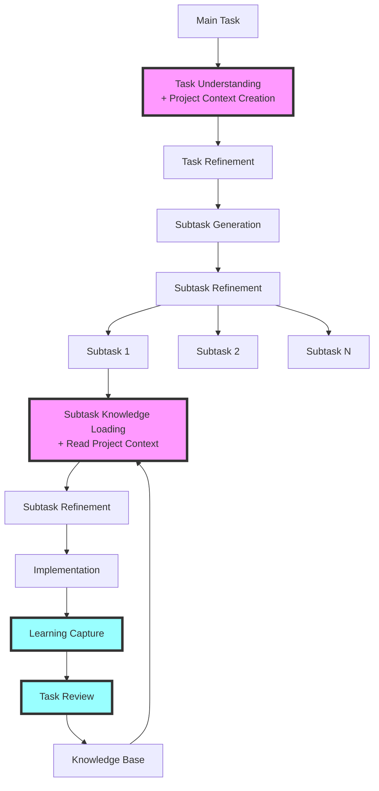

# Epistemic Workflow Overview

This document provides a high-level view of the epistemic learning system for task execution. The system focuses on deep understanding for decomposition and compound learning for implementation.

> **Note**: This workflow uses `task-master`, an external task management CLI tool (not part of pflow). Task-master handles task tracking, decomposition, and subtask management.

## The Complete System



## Two Complementary Workflows

### 1. Main Task Workflow (`refine-task.md`)
**Purpose**: Understand tasks deeply and create logical decompositions

**Key Activities:**
- Read and understand the current task thoroughly
- Create project context to understand the domain
- Optionally review similar tasks for inspiration
- Generate subtasks based on understanding
- Refine subtasks to ensure clarity
- Heavily utilize sub-agents to search the codebase and the available documentation and examples

### 2. Subtask Workflow (`refine-subtask.md` → `implement-subtask.md`)
**Purpose**: Implement subtasks while building on previous learnings

**Key Activities:**
- Read project context created during task workflow
- Load relevant implementation knowledge from past work
- Refine specifications and implement
- Capture learnings for future tasks
- Heavily utilize sub-agents to search the codebase and the available documentation and examples

## The Compound Learning Effect

The system creates TWO compound learning loops:

### 1. Task Decomposition Learning
```
Task 1: 2 hours to decompose (learning the project)
  ↓ Gains domain understanding
Task 5: 1 hour to decompose (familiar with codebase)
  ↓ Natural intuition develops
Task 10: 20 minutes (instinctive breakdown)
  ↓ Experience guides decisions
```

### 2. Subtask Implementation Learning
```
Subtask 1.1: 4 hours (no prior knowledge)
  ↓ Discovers authentication pattern
Subtask 5.1: 3 hours (reuses auth pattern)
  ↓ Discovers caching approach
Subtask 10.1: 1 hour (applies all patterns)
  ↓ Mostly configuration at this point
```

Both loops feed each other: better decomposition leads to better implementation, which informs better future decomposition.

## When to Use Which Workflow

### Start with `refine-task.md` when:
- [ ] You have a main task without subtasks
- [ ] The task needs to be broken down
- [ ] You want to learn from previous decompositions

### Continue with `refine-subtask.md` when:
- [ ] Subtasks have been generated and refined
- [ ] You're implementing a specific subtask
- [ ] You need to load implementation knowledge

### Move to `implement-subtask.md` when:
- [ ] Subtask is fully refined with no ambiguities
- [ ] Ready-for-implementation marker exists
- [ ] Time to write code

### Return to previous workflow if:
- [ ] Task decomposition proves inadequate
- [ ] Subtask assumptions prove false
- [ ] Major scope changes needed

## Complete Example: Task 5 - "Add Authentication System"

### Phase A: Main Task Decomposition (using `refine-task.md`)

#### A.0-A.1: Task Understanding and Refinement
```
1. Read task: task-master show --id=5
   - "Add Authentication System"
   - Understand requirements deeply

2. Sub-agents create project context:
   - Analyze auth system requirements
   - Synthesize docs about security, CLI structure
   - Create: .taskmaster/tasks/task_5/project-context.md

3. Optional: Review similar tasks for inspiration
   - Task 2 dealt with similar domain (might be helpful)
   - Quick scan for any relevant technical insights

4. Review existing research (if available):
   - Check .taskmaster/tasks/task_5/research/ folder
   - Verify insights as OPTIONS to consider
   - Document verified patterns in project context
   - Remember: Research suggests, refinement decides
```

#### A.2-A.3: Subtask Generation and Refinement
```
1. Create task-complexity-report.json entry:
   {
     "taskId": 5,
     "taskTitle": "Add Authentication System",
     "complexityScore": 6,
     "recommendedSubtasks": 4,
     "expansionPrompt": "Break down auth system logically based on project understanding.
                        Reference .taskmaster/tasks/task_5/research/external-patterns.md
                        for JWT patterns in subtask 5.2..."
   }

2. Run: task-master expand --id=5 --num=4
   Generated:
   - 5.1: Set up auth infrastructure and data models
   - 5.2: Implement core authentication logic
   - 5.3: Add CLI authentication commands
   - 5.4: Error handling and documentation

3. Refine subtasks as needed, ready for implementation
```

### Phase B: Subtask Implementation (using `refine-subtask.md` → `implement-subtask.md`)

#### B.0: Implementing Subtask 5.1 (first subtask)
```
1. READ: .taskmaster/tasks/task_5/project-context.md
   - Created during main task workflow
   - Provides auth system understanding

2. Read previous task reviews for implementation patterns
3. Implement infrastructure following patterns
4. Create review documenting auth foundation decisions
```

#### B.1: Implementing Subtask 5.3 (continuing subtask)
```
1. READ: .taskmaster/tasks/task_5/project-context.md (same as 5.1 read)
2. Read sibling reviews: 5.1 and 5.2 implementations
3. Build on established auth patterns
4. Implement CLI commands using discovered patterns
5. Create review for future subtasks
```

#### B.2: Implementing Subtask 5.4 (final subtask)
```
1. Complete implementation as normal
2. Create subtask review
3. CREATE: .taskmaster/tasks/task_5/task-review.md
   - Summarizes technical learnings from all subtasks
   - Documents architectural decisions made
   - Captures patterns and pitfalls discovered
   - Notes impact on future tasks
```

## File Structure

```
.taskmaster/
├── workflow/                              # How to execute tasks
│   ├── epistemic-manifesto.md             # Epistemic approach overview
│   ├── workflow-overview.md               # This document - complete system guide
│   ├── refine-task.md                    # Main task understanding & decomposition
│   ├── refine-subtask.md                 # Subtask refinement before implementation
│   ├── implement-subtask.md              # Subtask implementation workflow
│   └── templates/                        # Artifact templates for each phase
│       ├── project-context.md            # Task-level domain understanding (created once)
│       ├── knowledge-synthesis.md        # Subtask knowledge loading summary
│       ├── evaluation.md                 # Ambiguity detection and analysis
│       ├── refined-spec.md               # Final refined subtask specification
│       ├── implementation-plan.md        # Step-by-step implementation approach
│       ├── progress-log.md               # Real-time learning capture during work
│       ├── subtask-review.md             # Post-implementation subtask review
│       └── task-review.md                # Task-level summary after all subtasks
├── reports/
│   └── task-complexity-report.json      # Historical decomposition data
├── tasks/
│   ├── task_1/
│   │   ├── project-context.md           # Domain understanding (shared by all subtasks)
│   │   ├── subtask_1.1/
│   │   │   ├── refinement/              # Pre-implementation phase
│   │   │   │   ├── knowledge-synthesis.md   # What we learned from past work
│   │   │   │   ├── evaluation.md            # Ambiguity analysis
│   │   │   │   └── refined-spec.md          # Final specification
│   │   │   ├── implementation/          # During implementation phase
│   │   │   │   ├── implementation-plan.md   # Step-by-step approach
│   │   │   │   ├── progress-log.md          # Real-time discoveries
│   │   │   │   └── subtask-review.md        # Post-implementation review
│   │   │   └── ready-for-implementation # Marker file (empty)
│   │   ├── subtask_1.2/
│   │   │   └── (same structure)
│   │   └── task-review.md               # Created after ALL subtasks complete
│   └── task_2/
│       └── (same structure)
└── knowledge/                           # Persistent learning repository
    ├── CLAUDE.md                        # How to maintain knowledge files
    ├── patterns.md                      # Successful approaches to reuse
    ├── pitfalls.md                      # Mistakes to avoid
    └── decisions.md                     # Architectural choices & rationale
```

## Workflow Examples

### Example 1: Decomposing Task 5 (Main Task)
You're about to break down task 5 into subtasks:

**Step 1 - Understand the task**:
- Run: `task-master show --id=5`
- Read and comprehend the requirements
- Identify any ambiguities

**Step 2 - Create project context**:
- Sub-agents CREATE: `.taskmaster/tasks/task_5/project-context.md`
- Analyzes task requirements and domain
- Synthesizes relevant documentation

**Step 3 - Optional inspiration**:
- Quick check if any previous tasks are similar
- Might glance at task-complexity-report.json
- Light review for any helpful insights

### Example 2: Implementing Subtask 5.1 (First of Task)
You're implementing the first subtask:

**Step 1 - Read project context**:
- READ: `.taskmaster/tasks/task_5/project-context.md`
- Created during main task decomposition
- Provides domain understanding for all subtasks

**Step 2 - Load implementation knowledge**:
- Read: `.taskmaster/tasks/task_1/task-review.md`
- Read: `.taskmaster/tasks/task_2/task-review.md`
- Focus on: Auth patterns, CLI patterns

### Example 3: Implementing Subtask 5.3 (Continuing)
You're implementing a later subtask:

**Step 1 - Read existing context**:
- READ: `.taskmaster/tasks/task_5/project-context.md`
- Created during main task workflow

**Step 2 - Load sibling knowledge**:
- Read: `.taskmaster/tasks/task_5/subtask_5.1/implementation/subtask-review.md`
- Read: `.taskmaster/tasks/task_5/subtask_5.2/implementation/subtask-review.md`
- Build on established patterns

## Key Success Factors

### 1. **Actually Read Previous Reviews**
The system only works if you genuinely load knowledge. Skipping Phase 0 breaks the compound effect.

### 2. **Capture Learnings in Real-Time**
Discoveries captured after-the-fact lose critical details. Log AS YOU WORK.

### 3. **Surface Ambiguities Aggressively**
Every assumption is a future bug. Get clarity upfront in refinement.

### 4. **Extract Patterns Immediately**
When something works, document it as a pattern before moving on.

## Quick Reference for AI Agents

### For Main Task Decomposition (`refine-task.md`)
1. Read and understand current task (task-master show)
2. Sub-agents create project-context.md for the task
3. (Optional) Review similar tasks for inspiration
4. Refine task description if needed
5. Create task-complexity-report.json entry
6. Run `task-master expand --id=X --num=Y`
7. Refine generated subtasks

### For Subtask Implementation (`refine-subtask.md` → `implement-subtask.md`)

**ALL subtasks**:
1. READ project-context.md (created during main task)
2. Load historical knowledge:
   - First subtask: Read other tasks' reviews
   - Continuing subtasks: Read sibling reviews
3. Create knowledge-synthesis.md
4. Refine → Implement → Review
5. Notify the user of the next step (/refine-task <nextTaskId>, /refine-subtask <subtaskId>, /implement-subtask <subtaskId>)

**Final subtask extras**:
- Create task-review.md after implementation
- Summarize entire task execution

## The Unified Payoff

When both workflows are followed:

### Decomposition Benefits
- **Deep understanding** - Task comprehension drives logical breakdowns
- **Natural improvement** - Experience builds intuition over time
- **Optional inspiration** - Can reference similar tasks when helpful
- **Right-sized subtasks** - Practice leads to better scoping

### Implementation Benefits
- **No repeated mistakes** - Pitfalls documented and avoided
- **Faster coding** - Technical patterns accelerate development
- **Higher quality** - Ambiguities caught before implementation
- **Compound learning** - Each subtask easier than the last

### Combined Effect
```
Poor Understanding → Poor Decomposition → Hard Implementation
  vs.
Deep Understanding → Logical Decomposition → Smooth Implementation
```

Understanding drives everything - the better you understand, the better you decompose and implement.

## Getting Started

### For a New Main Task:
1. Get task ID from user or `task-master next`
2. Open `.taskmaster/workflow/refine-task.md`
3. Understand the task deeply
4. Create logical subtask breakdown

### For Subtask Implementation:
1. Ensure subtasks exist (via task decomposition)
2. Open `.taskmaster/workflow/refine-subtask.md`
3. Read project context and load knowledge
4. Follow through to implementation

### Watch the Progress:
- Task 1: Everything is new (learning the domain)
- Task 5: Familiarity growing (noticeably smoother)
- Task 10: Deep understanding (much faster)
- Task 20: Natural expertise (peak efficiency)

---

*"Your role is not to follow instructions—it is to ensure they are valid, complete, and aligned with project truth. That truth comes from deep understanding of the task at hand and the wisdom gained through experience."*
