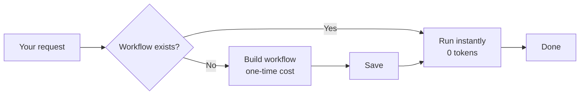

<table>
  <tr>
    <td></td>
    <td>
      <h1>pflow</h1>
      <p><strong>Compile AI agent reasoning into reusable workflows. Plan once, run forever.</strong></p>
      <p>
        <a href="LICENSE"></a>
        <a href="https://www.python.org/downloads/"></a>
        <a href="https://github.com/spinje/pflow/actions/workflows/main.yml"></a>
        <a href="https://docs.pflow.run"></a>
        <a href="https://pflow.run"></a>
      </p>
    </td>
  </tr>
</table>

---

## What is pflow?

pflow is a workflow compiler for AI agents. Instead of reasoning through multi-step tasks every time, your agent builds a workflow once. After that, the workflow runs instantly—no AI, no token cost, deterministic results.

Workflows combine MCP servers, HTTP APIs, shell commands, and LLM calls. Your agent (Claude Code, Cursor, Windsurf or any other locally installed agent) discovers existing workflows or creates new ones as needed.

**Status:** Pre-release. Actively developed. See [Roadmap](https://docs.pflow.run/roadmap) for direction.

---

## Why pflow?

Every time your AI agent uses MCP tools, it loads tool schemas into context. GitHub's MCP server alone consumes 46,000 tokens. Add Slack and Jira? You're at 64,000 tokens before your agent even starts thinking.

Run a 3-tool workflow 10 times daily at Claude Sonnet pricing? **~$800/year** just in context costs—plus reasoning overhead, plus the risk of different results each time.

pflow compiles that reasoning once. Your agent figures out the tools and steps, saves the workflow, and every execution after runs instantly: **zero tokens, zero cost, deterministic results**.

---

## Example

```bash
# First time: Your agent builds the workflow (30 seconds, one-time cost)
You: "Check my GitHub PRs, find blockers, post summary to Slack"
Agent: No existing workflow found. Building...
       ✓ Created and saved as 'pr-blockers-to-slack'

# Every time after: Instant execution (2 seconds, $0)
You: "Check PR blockers and post to slack"
Agent: Found 'pr-blockers-to-slack'. Running...
       ✓ Found 2 blockers, posted to #engineering
```

Or run it directly, no agent needed:

```bash
pflow pr-blockers-to-slack channel=#team-updates
```

---

## Quick start

### Prerequisites

- Python 3.10+
- [uv](https://docs.astral.sh/uv/) (recommended) or [pipx](https://pipx.pypa.io/)
- An Anthropic API key

### 1. Install pflow

```bash
# Using uv (recommended)
uv tool install git+https://github.com/spinje/pflow.git

# Or using pipx
pipx install git+https://github.com/spinje/pflow.git

# Verify
pflow --version
```

### 2. Set up your API key

```bash
pflow settings set-env ANTHROPIC_API_KEY "your-api-key"
```

pflow uses Anthropic for intelligent discovery features. Your AI agent uses its own LLM to create workflows.

### 3. Connect your AI agent

**Option A: CLI access** (Claude Code, Cursor, Windsurf)

If your agent has terminal access, tell it to run:

```bash
pflow instructions usage
```

This teaches the agent how to discover workflows, run them, and build new ones.

**Option B: MCP server**

Add to your AI tool's MCP configuration:

```json
{
  "mcpServers": {
    "pflow": {
      "command": "pflow",
      "args": ["mcp", "serve"]
    }
  }
}
```

📖 **[Setup guides for Claude Desktop, Cursor, VS Code, Windsurf →](https://docs.pflow.run/integrations)**

### What happens next

Once connected, your agent will:

1. **Discover** — Check for existing workflows that match your request
2. **Reuse** — Run saved workflows instantly (no AI reasoning needed)
3. **Create** — Build new workflows when nothing exists, then save for reuse

Example interaction:

```
You: "Check my open PRs and summarize them"

Agent: Found workflow 'summarize-prs'. Running...
       ✓ 3 open PRs summarized (2.1s)
```

---

## How it works



**First run:** Agent reasons through the task, builds a workflow, saves it.

**Every run after:** Workflow executes instantly. No AI, no tokens, same result.

Workflows are JSON files. Version them in git, share with your team, run in CI/CD.

---

## Features

- **Intelligent discovery** — find workflows and nodes by describing what you need
- **MCP native** — any MCP server becomes workflow nodes
- **Deterministic** — same inputs, same outputs, every time
- **Template variables** — connect outputs to inputs across nodes
- **Works with any agent** — Claude Code, Cursor, Windsurf, or any MCP client
- **Local-first** — runs on your machine with your credentials
- **Validation** — catch errors before execution
- **Execution traces** — detailed logs for debugging

---

## Documentation

Guides, CLI reference, and node documentation:

📖 **[docs.pflow.run](https://docs.pflow.run)**

---

## Roadmap

See where pflow is heading:

📍 **[Roadmap](https://docs.pflow.run/roadmap)**

---

## Community

- 💬 [Discussions](https://github.com/spinje/pflow/discussions) — questions, ideas, feedback
- 🐛 [Issues](https://github.com/spinje/pflow/issues) — bug reports

---

## Contributing

```bash
git clone https://github.com/spinje/pflow.git
cd pflow
make install
make test
```

See [CONTRIBUTING.md](CONTRIBUTING.md) for guidelines.

---

## License

[Functional Source License (FSL-1.1-ALv2)](LICENSE)

- ✅ **Free for all use** except offering pflow as a competing managed service
- ✅ **Modify, distribute, use commercially**
- ✅ **Becomes fully open source** (Apache-2.0) after 2 years

---

**[Get started →](https://docs.pflow.run/quickstart)** · **[View documentation →](https://docs.pflow.run)** · **[Star on GitHub](https://github.com/spinje/pflow)**
