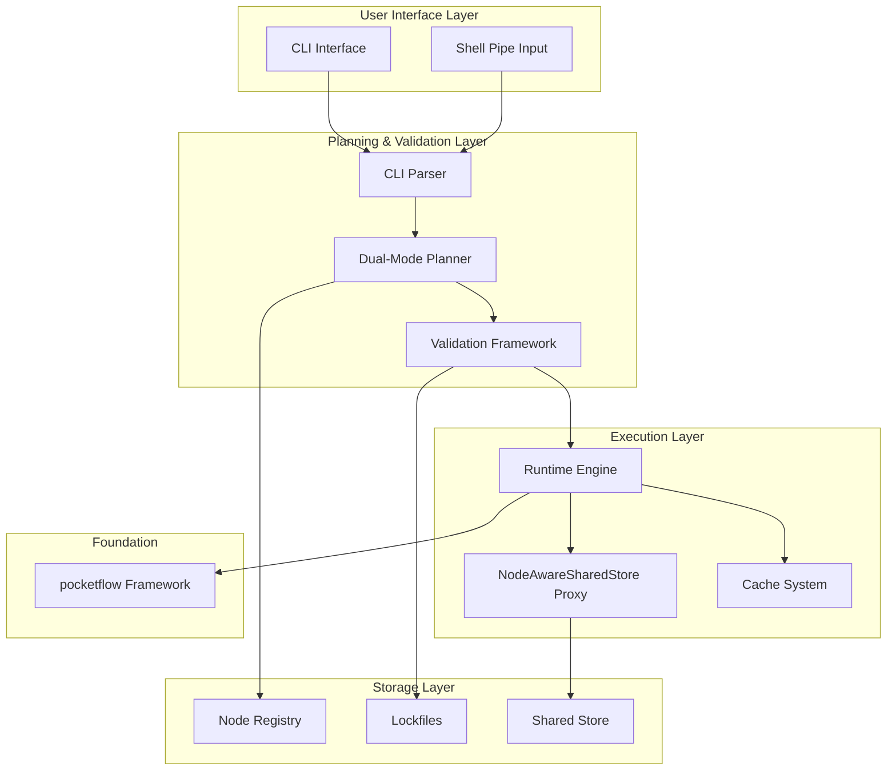

# pflow CLI Architecture Document

## Navigation

**Related Documents:**
- **Core Docs**: [PRD](../prd.md) | [MVP Scope](../features/mvp-scope.md)
- **Patterns**: [Shared Store](../core-concepts/shared-store.md) | [Simple Nodes](../features/simple-nodes.md) | [CLI Runtime](../features/cli-runtime.md)
- **Components**: [Planner](../features/planner.md) | [Runtime](../core-concepts/runtime.md) | [Registry](../core-concepts/registry.md) | [Schemas](../core-concepts/schemas.md)
- **Implementation**: [PocketFlow Integration](./pflow-pocketflow-integration-guide.md) | [Components](./components.md)

## 1. Executive Summary

pflow is a workflow compiler that transforms natural language or CLI pipe syntax into permanent, deterministic, and lightning-fast CLI commands. Unlike traditional AI agents that re-compute solutions on every run, pflow follows a "Plan Once, Run Forever" philosophy - capturing user intent once and compiling it into reproducible workflows.

### Core Value Proposition

- **First Run**: AI plans your workflow (30 seconds, ~$0.10-2.00)
- **Every Run After**: Instant execution (2 seconds, free)

### Key Innovation

The system's primary innovation is the **Shared Store + Natural Interface Pattern** - a design that enables nodes to be written as simple, standalone components using intuitive key names (`shared["text"]`, `shared["url"]`), while complex flow routing is handled transparently at the orchestration level through an optional proxy layer.

### MVP Focus

This document describes the architecture for pflow v0.1 MVP, which prioritizes:
- Local-first CLI execution
- Manual node composition via CLI pipe syntax
- Simple shared store pattern implementation
- Deterministic, reproducible execution

Natural language planning is included in MVP scope but will be built after core infrastructure is established, as it depends on the registry, metadata extraction, and CLI runtime components. Features explicitly deferred to post-MVP include conditional transitions, async execution, and cloud deployment capabilities.

## 2. System Overview & Architecture

### 2.1 High-Level Architecture



### 2.2 Component Responsibilities

- **CLI Interface**: Handles user input, flag parsing, and output presentation
- **Planner**: Validates flows and generates JSON IR (supports both NL and CLI paths; NL planning included in MVP but built after CLI infrastructure)
- **Runtime Engine**: Executes validated flows using the pocketflow framework
- **Node Registry**: Manages discoverable nodes and their metadata
- **Shared Store**: Flow-scoped memory for inter-node communication
- **Proxy Layer**: Optional transparent key mapping for complex flows

### 2.3 Foundation: pocketflow Framework

The entire system is built on a 100-line Python framework that provides:
- Node lifecycle management - see [Node Reference](../reference/node-reference.md#node-lifecycle-implementation)
- Flow orchestration via `>>` operator
- Built-in retry mechanism for fault tolerance
- Action-based transitions (deferred to post-MVP)

## 3. Core Design Patterns & Principles

### 3.1 Design Philosophy

1. **Explicit Over Magic**: All behavior is visible and auditable
2. **Pattern Over Framework Innovation**: Innovation happens in orchestration patterns, not the execution engine
3. **Natural Interfaces Enable Simplicity**: Nodes use intuitive key names without orchestration knowledge
4. **Planning-Execution Separation**: Intent capture is separate from deterministic execution
5. **Purity-First Safety Model**: Nodes are impure by default; optimization is opt-in via `@flow_safe`
6. **Progressive Complexity**: Simple flows need no mappings; complex flows use transparent proxy

### 3.2 The Shared Store Pattern

The shared store is pflow's primary innovation for inter-node communication, enabling nodes to use natural, intuitive interfaces.

> For complete pattern definition, examples, and architectural rationale, see [Shared Store + Proxy Design Pattern](../core-concepts/shared-store.md)

In the context of the CLI architecture, the shared store:
- Receives data from CLI flags and shell pipes
- Flows through the execution pipeline
- Supports template variable resolution
- Enables natural key access in nodes (e.g., `shared["text"]`, `shared["url"]`)

### 3.3 Node Autonomy Principle

Nodes are "dumb pipes" - isolated computation units with:
- No awareness of other nodes or flow context
- No flow introspection capabilities
- Single, well-defined responsibility
- Natural interface using intuitive key names

### 3.4 Smart Exception: General-Purpose LLM Node

While pflow follows a "one node, one purpose" philosophy, the `llm` node is a smart exception that prevents proliferation of similar prompt-based nodes:

```python
# Instead of many specific nodes:
# analyze-code, write-content, explain-concept, review-text...

# Use the general LLM node:
llm --prompt="Analyze this code for potential issues"
llm --prompt="Write an introduction paragraph about AI"
llm --prompt="Explain this concept in simple terms"
```

**Benefits:**
- **Reduces Node Clutter**: One flexible node vs dozens of specific prompt nodes
- **Future Simon Willison Integration**: Will wrap the `llm` CLI for model management
- **Consistent Interface**: Always reads `shared["prompt"]`, writes `shared["response"]`
- **Simple for MVP**: Just `--prompt` parameter, templates can come later

### 3.5 Proxy Pattern for Complex Flows

When natural interfaces don't align, the `NodeAwareSharedStore` proxy provides transparent translation.

> See [NodeAwareSharedStore Proxy](../core-concepts/shared-store.md#proxy-pattern) for implementation details

```python
# Node always uses natural interface
node.prep(shared)  # Reads shared["text"]

# With proxy mapping (only when needed)
proxy = NodeAwareSharedStore(
    shared,
    input_mappings={"text": "raw_content"}
)
node.prep(proxy)  # Still reads "text", proxy maps to "raw_content"
```

## 4. MVP Scope Definition

### 4.1 Included in MVP

**Core Functionality:**
- CLI pipe syntax execution (`pflow node1 => node2`)
- Manual node composition and parameter passing
- Shared store with direct access pattern
- Basic simple node types (llm, read-file, write-file, github-get-issue)
- Shell pipe integration (`cat file | pflow llm --prompt="Summarize this"`)
- JSON IR generation and validation
- Deterministic execution with lockfiles
- Simple caching for `@flow_safe` nodes
- Basic error handling and tracing

**User Experience:**
- "Type flags; engine decides" CLI resolution
- Comprehensive execution traces
- Clear error messages with suggestions

### 4.2 Excluded from MVP

**Post-MVP (v2.0):**
- Natural language planning with LLM
- Conditional transitions (`node - "fail" >> handler`)
- CLI autocomplete with shadow store suggestions
- Async nodes and flows
- Complex error recovery patterns

**Future Cloud Platform (v3.0):**
- Multi-user authentication
- Remote node discovery from MCP servers
- Namespaced/versioned node resolution
- Cloud execution and job queues
- Web UI and dashboards
- Interactive prompting for missing inputs

## 5. Component Architecture

### 5.1 CLI Layer

#### 5.1.1 CLI Resolution Algorithm

The CLI follows a **context-aware parameter resolution** rule: **"Type flags; engine decides based on context"**

```mermaid
graph TD
    A[CLI Flag: --key=value] --> B{Data Flag?}
    B -->|Yes| C[Data Injection to shared store]
    B -->|No| D{Behavior Flag?}
    D -->|Yes| E[Parameter Override via node.set_params()]
    D -->|No| F{Execution Config?}
    F -->|Yes| G[Execution Configuration]
    F -->|No| H[ERROR: Unknown Flag]
```

**Context-Aware Resolution Examples:**
```bash
# Data flags → shared store (flow data)
--issue=1234 → shared["issue_number"] = "1234"
--url=https://example.com → shared["url"] = "https://example.com"

# Behavior flags → node parameters (node behavior)
--temperature=0.3 → node.set_params({"temperature": 0.3})
--model=gpt-4 → node.set_params({"model": "gpt-4"})
```

#### 5.1.2 Template Resolution System

The CLI supports **$ variable substitution** for dynamic content access, enabling sophisticated template-driven workflows.

> For complete template variable syntax, resolution rules, and examples, see [Template Variable Resolution](../core-concepts/shared-store.md#template-variable-resolution)

**Quick Reference:**
- Template syntax: `$variable` → `shared["variable"]` at runtime
- Enables dynamic prompts: `--prompt="Analyze: $issue"`
- Missing variables detected and prompt user for input
- Full resolution process documented in the shared store pattern

**Example:**
```bash
pflow github-get-issue --issue=1234 => \
  claude-code --prompt="Fix this issue: $issue" => \
  git-commit --message="$commit_message"
```

#### 5.1.3 CLI Command Structure

```bash
# Basic syntax
pflow <node> [--flags] => <node> [--flags]

# Template-driven examples
pflow github-get-issue --issue=1234 => \
  claude-code --prompt="$comprehensive_fix_instructions" => \
  git-commit --message="$commit_message"

# Traditional examples (still supported)
pflow yt-transcript --url=VIDEO => llm --prompt="Summarize this transcript"
cat article.md | pflow llm --prompt="Summarize this in 150 words"
```

#### 5.1.4 Shell Pipe Integration

When input is piped via stdin:
1. Content is automatically placed in `shared["stdin"]`
2. First node can consume this data naturally or via IR mapping
3. Piped content is hashed and included in execution traces

### 5.2 Planning & Validation Pipeline

#### 5.2.1 Sophisticated Dual-Mode Planner

The planner operates in two modes with enhanced capabilities for template-driven workflows.

> See [Planner Specification](../features/planner.md) for complete details

**CLI Pipe Path (MVP Priority):**
1. Parse CLI syntax and detect template variables
2. Validate all nodes exist in registry
3. Check interface compatibility
4. Generate mappings if needed
5. **Generate sophisticated prompts and parameter values**
6. Resolve template variables at runtime
7. Create validated JSON IR
8. Direct execution with template resolution

**Natural Language Path (MVP Included):**
1. Extract metadata from registry
2. **Generate comprehensive, context-aware instructions**
3. LLM selects appropriate nodes based on intent
4. **Create template variables and prompt mappings**
5. Generate flow structure with template integration
6. Validate and create mappings
7. Show CLI preview with template variables
8. User approval triggers template-driven execution

#### 5.2.2 JSON IR Structure

```json
{
  "$schema": "https://pflow.dev/schemas/flow-0.1.json",
  "ir_version": "0.1.0",
  "metadata": {
    "created": "2025-01-01T12:00:00Z",
    "description": "YouTube video summary pipeline",
    "planner_version": "1.0.0"
  },
  "nodes": [
    {
      "id": "fetch-transcript",
      "registry_id": "core/yt-transcript",
      "version": "1.0.0",
      "params": {"language": "en"},
      "execution": {"max_retries": 2, "wait": 1.0}
    }
  ],
  "edges": [
    {"from": "fetch-transcript", "to": "summarize"}
  ],
  "mappings": {
    "summarize": {
      "input_mappings": {"text": "transcript"}
    }
  }
}
```

### 5.3 Node System & Registry

#### 5.3.1 Node Structure

All nodes inherit from `pocketflow.BaseNode` (or `pocketflow.Node`):

```python
For a complete example of node implementation including the LLMNode, see [Node Implementation Examples](../reference/node-reference.md#common-implementation-patterns).
```

#### 5.3.2 Node Metadata

Extracted from docstrings and stored as JSON:

```json
{
  "id": "llm",
  "description": "General-purpose LLM processing",
  "inputs": ["prompt"],
  "outputs": ["response"],
  "params": {
    "model": {"type": "string", "default": "gpt-4"},
    "temperature": {"type": "float", "default": 0.7},
    "system": {"type": "string", "optional": true}
  },
  "purity": "impure"
}
```

#### 5.3.3 Registry Structure

### MVP Registry Structure

```
src/pflow/nodes/              # Platform nodes (scanned on startup)
├── llm.py
├── read_file.py
├── write_file.py
└── github_get_issue.py

~/.pflow/registry.json        # Persistent registry cache
```

The registry.json contains:
```json
{
  "nodes": [
    {
      "id": "llm",
      "module": "pflow.nodes.llm",
      "class_name": "LLMNode",
      "name": "llm",
      "metadata": { ... }
    }
  ],
  "last_updated": "2025-01-01T12:00:00Z"
}
```

#### 5.3.4 Node Discovery (MVP)

In the MVP, node discovery:
1. Scans only `src/pflow/nodes/` directory on startup
2. Loads each Python file and finds BaseNode/Node subclasses
3. Extracts metadata from docstrings
4. Stores results in `~/.pflow/registry.json` for fast access
5. Uses class.name attribute or kebab-case class name for node ID

### 5.4 Execution Engine

For detailed execution engine implementation, including execution flow and runtime integration, see [Execution Reference](../reference/execution-reference.md).

## 6. Data Flow & State Management

> For detailed CLI integration and runtime behavior, see [CLI Runtime Specification](../features/cli-runtime.md)

### 6.1 Shared Store Lifecycle

The shared store is:
- Created fresh for each flow execution
- Populated by CLI data injection and node outputs
- Accessible to all nodes in the flow
- Destroyed after flow completion
- Never persisted between runs

### 6.2 Data Flow Example

```bash
# CLI command
pflow yt-transcript --url=VIDEO => llm --prompt="Summarize this transcript"
```

**Step 1: CLI Resolution**
```python
shared = {
    "url": "VIDEO",                               # From --url flag
    "prompt": "Summarize this transcript"         # From --prompt flag
}
```

**Step 2: First Node Execution**
```python
# yt-transcript node
prep: url = shared["url"]
exec: transcript = fetch_transcript(url)
post: shared["transcript"] = transcript
```

**Step 3: Second Node Execution**
```python
# llm node (with proxy mapping)
# IR defines: {"input_mappings": {"prompt": "transcript_prompt"}}
# where transcript_prompt is built from transcript + prompt template
prep: prompt = shared["prompt"]  # Proxy provides templated prompt
exec: response = call_llm(prompt)
post: shared["response"] = response
```

**Final State:**
```python
shared = {
    "url": "VIDEO",
    "prompt": "Summarize this transcript",
    "transcript": "...",
    "response": "..."
}
```

### 6.3 Parameter vs Data Distinction

- **Shared Store**: Primary data flow between nodes
- **Params**: Node configuration that doesn't flow between nodes
- **Execution Config**: Runtime behavior (retries, caching)

## 7. Integration Points

### 7.1 Shell Integration

Native support for Unix pipes:
- Detect non-TTY stdin with content
- Place content in `shared["stdin"]`
- First node consumes via natural interface or mapping
- Full compatibility with standard Unix tools

### 7.2 MCP Integration (v2.0)

MCP tools will be wrapped as native pflow nodes:
- Auto-generate Node subclasses from MCP manifests
- Translate MCP schemas to natural interfaces
- Full participation in validation and orchestration
- Unified registry for all node types

### 7.3 Future CLI Autocomplete

Foundation for dynamic suggestions:
- Parse command context on TAB press
- Query registry for available nodes/flags
- Leverage metadata for intelligent suggestions
- Support discovery of natural interfaces

## 8. Security & Trust Model

### 8.1 Node Purity Model

**Default: Impure**
- Nodes may have side effects
- Not cacheable or retryable
- Require user confirmation

**Opt-in: Pure (`@flow_safe`)**
- Deterministic and idempotent
- No external side effects
- Eligible for caching and retries
- Must pass validation

### 8.2 Trust Levels

| Origin | Trust Level | Cache Eligible |
|--------|-------------|----------------|
| Planner (reused flow) | trusted | Yes |
| Planner (new flow) | trusted | Yes (after first run) |
| User modified IR | mixed | No |
| Manual Python code | untrusted | No |

### 8.3 Security Principles

- Environment variables for sensitive data
- No credentials in IR or lockfiles
- User confirmation for all executions
- Explicit side-effect declaration via `@flow_safe`

## 9. Performance & Optimization

### 9.1 Caching Strategy

For detailed caching implementation including cache key computation and eligibility rules, see [Caching and Safety](../core-concepts/runtime.md#caching-strategy).

### 9.2 Performance Targets (MVP)

| Metric | Target | Notes |
|--------|--------|-------|
| 3-node flow overhead | ≤ 2s vs raw Python | Execution overhead |
| Cache hit performance | ≤ 50ms per node | Cache restoration |
| Validation speed | ≤ 100ms | IR validation |
| Registry lookup | ≤ 10ms | Metadata access |

### 9.3 Optimization Strategies

- Lazy loading of registry metadata
- Validation result caching
- Minimal node instantiation overhead
- Efficient shared store operations

## 10. Component Architecture

> For comprehensive MVP vs future component breakdown, see [Component Architecture](./components.md)

## 11. Testing & Validation Strategy

### 11.1 Node Testing Pattern

```python
def test_llm_node():
    # Simple, natural test setup
    node = LLMNode()
    node.set_params({"model": "gpt-4", "temperature": 0.5})

    shared = {"prompt": "Summarize this: Long content..."}
    node.run(shared)

    assert "response" in shared
    assert len(shared["response"]) > 0
```

### 11.2 Flow Testing

```python
def test_video_summary_flow():
    flow = create_video_summary_flow()
    shared = {
        "url": "https://youtu.be/test",
        "prompt": "Summarize this transcript"
    }

    flow.run(shared)

    assert "response" in shared
```

### 11.3 Validation Framework

- JSON schema validation for IR
- Node interface compatibility checking
- Execution configuration validation
- Comprehensive error reporting

## 12. Development Roadmap & Implementation Priorities

### 12.1 Phase 1: Foundation (Current MVP Focus)
- ✅ pocketflow integration
- ✅ Basic shared store implementation
- 🔄 Node registry system
- 🔄 CLI parsing and resolution
- 🔄 JSON IR generation

### 12.2 Phase 2: Core Execution
- Proxy mapping system
- Basic caching for pure nodes
- Retry logic integration
- Comprehensive tracing

### 12.3 Phase 3: Polish
- Error messages and suggestions
- Performance optimization
- Documentation and examples
- Testing framework

### 12.4 Post-MVP Phases
- Natural language planning
- Conditional transitions
- MCP integration
- CLI autocomplete
- Cloud deployment

## 13. Future Extensibility

### 13.1 Planned Extensions (Post-MVP)

**Natural Language Planning:**
- LLM-driven node selection
- Semantic flow matching
- User approval workflow

**Advanced Flow Control:**
- Action-based transitions
- Conditional execution paths
- Complex error recovery

**Enhanced Developer Experience:**
- CLI autocomplete
- Visual flow builder
- Interactive debugging

### 13.2 Architecture Extensibility Points

- Plugin system for custom nodes
- Alternative execution engines
- Custom proxy implementations
- Extended metadata schemas
- Cloud execution adapters

## 14. Technical Decisions & Rationale

### 14.1 Why pocketflow?

- Minimal, proven 100-line framework
- Natural flow syntax (`=>` operator)
- Built-in retry mechanism
- No heavy abstractions
- Enables focus on patterns over framework

### 14.2 Why Shared Store + Proxy?

- **Simplicity**: Nodes remain simple with natural interfaces
- **Flexibility**: Complex routing without node changes
- **Testability**: Direct, intuitive testing
- **Composability**: Same nodes work in different contexts
- **Progressive**: No proxy needed for simple flows

### 14.3 Why JSON IR?

- Machine-readable and validatable
- Version-controlled flow definitions
- Clean separation of planning and execution
- Enables future GUI tools
- Supports structural analysis and transformation

### 14.4 Why "Type Flags; Engine Decides"?

- Single, simple mental model
- No complex flag categorization for users
- Natural progression from exploration to mastery
- Consistent with Unix philosophy
- Reduces cognitive load

### 14.5 Why Opt-in Purity?

- Safe by default (assumes side effects)
- Explicit optimization points
- Clear contract for caching/retries
- Matches real-world node behavior
- Enables trust model integration

## Appendices

### A. Glossary

- **Shared Store**: Flow-scoped dictionary for inter-node communication
- **Natural Interface**: Intuitive key names nodes use (e.g., `shared["text"]`)
- **Proxy Mapping**: Transparent key translation for flow compatibility
- **JSON IR**: Intermediate Representation defining executable flows
- **@flow_safe**: Decorator marking pure, cacheable nodes
- **Dual-Mode Planner**: Handles both NL and CLI input paths

### B. File Structure

```
pflow/
├── cli/              # CLI interface and parsing
├── planner/          # Validation and IR generation
├── runtime/          # Execution engine
├── registry/         # Node discovery and metadata
├── nodes/            # Built-in node implementations
├── pocketflow/       # Core framework (100 lines)
└── tests/            # Test suite
```

### C. Example Flows

**Simple Flow:**
```bash
pflow read-file --path=data.csv => csv-to-json => write-file --output=result.json
```

**With Proxy Mapping:**
```json
{
  "mappings": {
    "csv-to-json": {
      "input_mappings": {"data": "file_content"}
    }
  }
}
```

**With Shell Pipe:**
```bash
kubectl logs my-pod | pflow extract-errors => llm --prompt="Summarize these errors" => slack-send-message --channel=ops
```

---

*This architectural document defines the pflow CLI v0.1 MVP. It prioritizes simplicity, deterministic execution, and a clear path to future extensibility while maintaining focus on delivering a working system quickly.*
