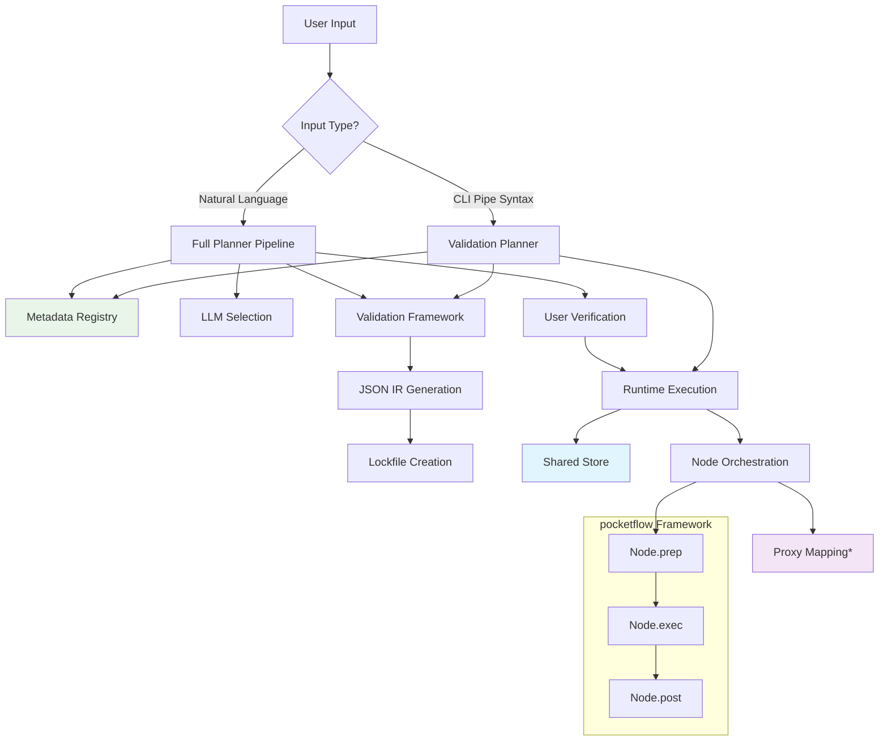
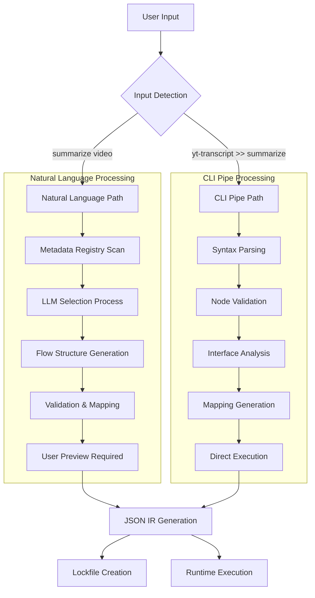
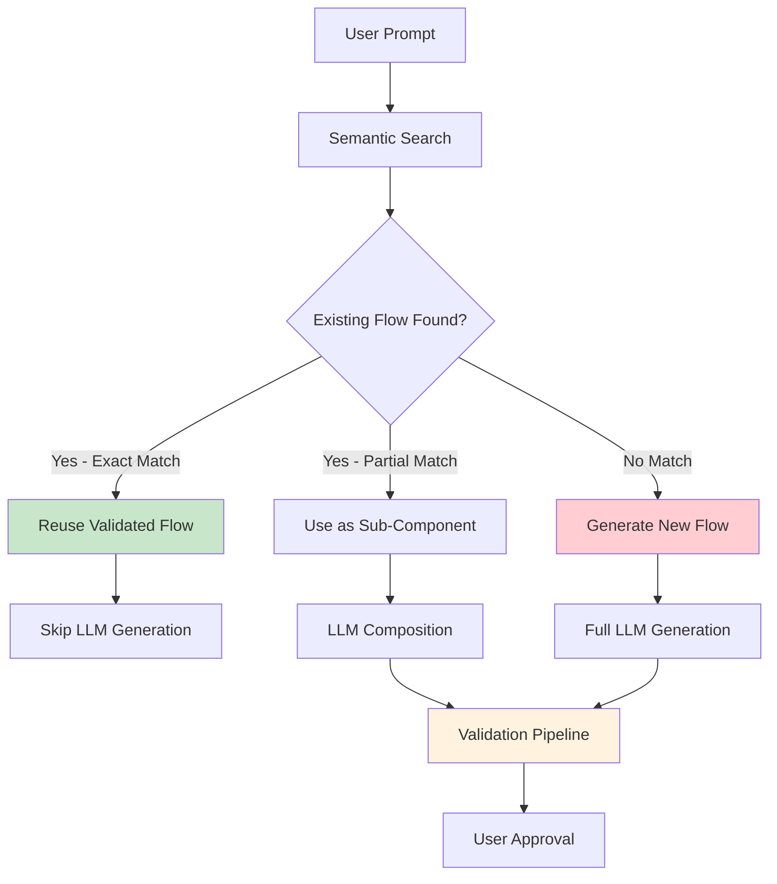
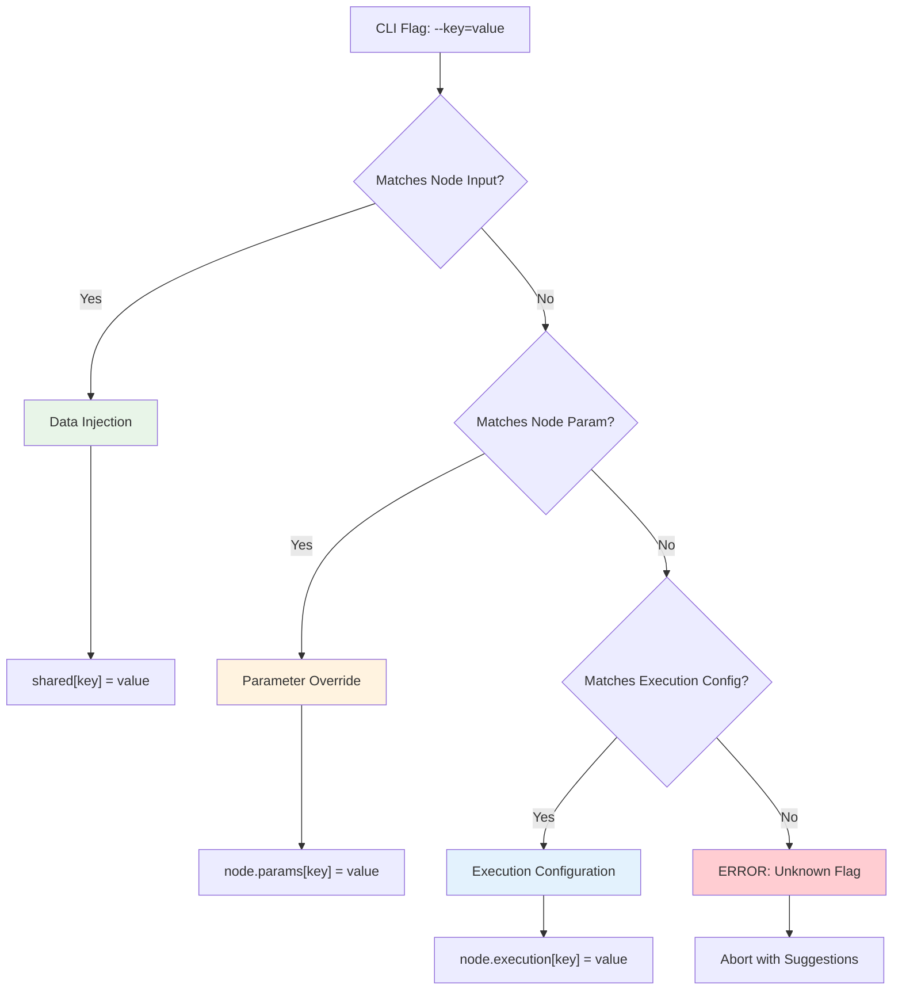
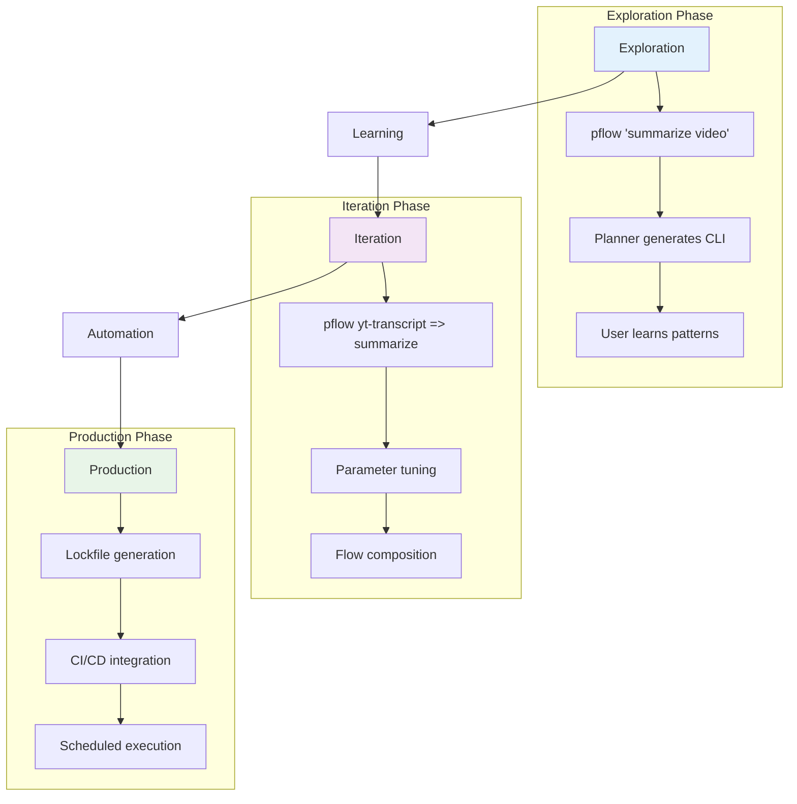
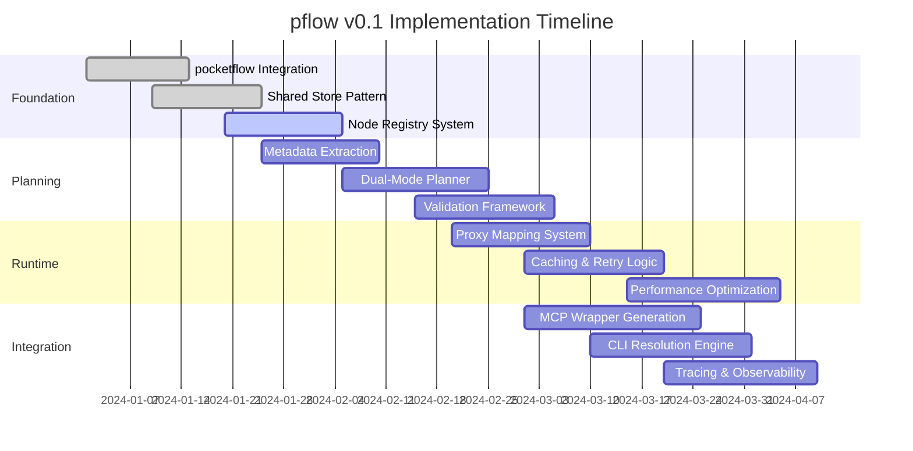

# Product Requirements Document: pflow CLI (Master Edition)

*A shell-native engine for deterministic, memory-aware, agent-planned flows using reusable Python nodes with future MCP integration.*

## Navigation

**Related Documents:**
- **Implementation**: [Architecture](./architecture/architecture.md) | [MVP Scope](./features/mvp-scope.md)
- **Patterns**: [Shared Store](./core-concepts/shared-store.md) | [Simple Nodes](./features/simple-nodes.md) | [CLI Runtime](./features/cli-runtime.md)
- **Components**: [Planner](./features/planner.md) | [Runtime](./core-concepts/runtime.md) | [Registry](./core-concepts/registry.md) | [Components](./architecture/components.md)
- **Guides**: [PocketFlow Integration](./architecture/pflow-pocketflow-integration-guide.md) | [Workflow Analysis](./features/workflow-analysis.md)

---

## 1 · Vision & Strategic Positioning

> **pflow** transforms natural language into explicit, replayable DAGs through a shared store pattern with optional proxy mapping.
>
> Unlike chat-only agents (Claude Desktop) or heavyweight orchestration stacks (Airflow, LangChain), pflow is a **minimal, traceable, node-based runtime** built on a 100-line framework that emphasizes **structured composition** first, with agent planning and MCP interoperability as enabling layers.

pflow's defining promise: a one-line natural-language prompt compiles—through a deterministic, auditable planning pipeline—into the same lock-file-backed DAG a power-user would hand-write. Intuitive intent is preserved **without** sacrificing deterministic execution, caching discipline, or traceability.

**Primary differentiator** → **Shared store + natural interface pattern** with intelligent planning.
**Core innovation** → The execution pattern, not the framework itself.

### 1.1 Strategic Differentiators

| Differentiator | Description | Implementation |
|---|---|---|
| **Transparent Execution** | Every node's data, config, and errors are trace-logged and replayable | CLI `--trace`, JSON IR → run log schema, deterministic replay via `.lock.json` |
| **Shared Store + Natural Interfaces** | Nodes communicate through intuitive key names (`shared["url"]`, `shared["text"]`) with zero coupling | pocketflow framework + natural key conventions (see [Shared Store](./core-concepts/shared-store.md)) |
| **Proxy-Enabled Marketplace Compatibility** | Same nodes work in different flow schemas through transparent key mapping | `NodeAwareSharedStore` proxy pattern |
| **Dual-Mode Planning Architecture** | Natural language and CLI pipes use same validation pipeline with different entry points | Planner handles both NL→IR and CLI→IR paths |
| **Metadata-Driven Selection** | LLM selects nodes from extracted interface metadata, not code inspection | Docstring→JSON extraction + registry system |
| **Deterministic Reproducibility** | Execution behavior locked across environments and time through version pinning | IR versioning, semver nodes, lockfiles, param/data separation |
| **Opt-In Performance Optimization** | Caching and retries only for explicitly pure nodes | `@flow_safe` decorator + eligibility validation |
| **Action-Based Flow Control** | Conditional transitions through node return values, not exceptions | `node - "error" >> handler` syntax |
| **Future MCP Integration** | MCP tools will appear as native nodes through wrapper generation (v2.0) | Single registry design, natural interfaces, proxy compatibility |
| **Framework Simplicity** | 100-line execution engine with pattern-based complexity | pocketflow core + orchestration layers |

### 1.2 Design Philosophy

**Explicit Over Magic**
Nothing is implicit. All I/O, bindings, side-effects, and caching constraints are declared in the JSON IR and visible in the CLI.

**Shared Store as Primary Communication**
Nodes communicate through a flow-scoped shared store using natural key names (`shared["url"]`, `shared["summary"]`). Params are secondary, used mainly for node configuration and batch operations.

**Natural Interfaces Enable Simplicity**
Node authors use intuitive shared store keys. Complex flow routing handled by optional proxy mappings without node complexity.

**Planning-Execution Separation**
Natural language is never interpreted directly. A separate, deterministic planner flow transforms NL into CLI syntax, which is then validated and compiled to executable IR.

**Purity-First Safety Model**
All nodes are impure by default. Only explicitly marked `@flow_safe` nodes can be cached or retried. Safety is opt-in and verified.

**Round-Trippable Intent**
All flows carry `description` metadata reflecting original user intent. Flows can be explained, searched, and reused through semantic matching.

**Pattern Over Framework Innovation**
The 100-line pocketflow framework is stable. Innovation happens in the shared store pattern, proxy mappings, planning pipeline, and MCP integration.

**Native Shell Integration**
Input from Unix shell pipes (`stdin`) is seamlessly integrated for direct use in flows, enhancing composability with standard command-line tools.

### 1.3 Architectural Overview



**Key Insight**: The planner operates in dual-mode, handling both natural language and CLI pipe inputs through the same validation and IR generation pipeline. The shared store + proxy pattern enables natural node interfaces while supporting complex flow routing when needed.

---

## 2 · Out-of-Scope for MVP

For complete MVP boundaries including what's included and excluded, see [MVP Scope](./features/mvp-scope.md).

---

## 3 · Core Concepts

### 3.1 The pocketflow Foundation

pflow is built on a **100-line Python framework** that provides the execution engine. For integration guidance, see [PocketFlow Integration Guide](./architecture/pflow-pocketflow-integration-guide.md):

```python
class Node(BaseNode):
    def prep(self, shared):     # Extract data from shared store
        pass
    def exec(self, prep_res):   # Process data (pure business logic)
        pass
    def post(self, shared, prep_res, exec_res):  # Write results back
        pass

# Simple flow syntax
node_a >> node_b >> node_c          # Sequential composition
```

**Framework Characteristics:**

- **Lightweight**: Minimal abstraction over Python functions
- **Stable**: Core execution patterns don't change
- **Simple**: Sequential node composition with clear data flow
- **Retry-enabled**: Configurable retry with `max_retries` parameter

### 3.2 Shared Store Pattern

The **shared store** is pflow's primary innovation—a flow-scoped memory that enables natural node interfaces. For detailed information about the shared store pattern, proxy mappings, and implementation examples, see [Shared Store](./core-concepts/shared-store.md).

**Key Concepts:**
- Primary data flow mechanism between nodes
- Natural, intuitive key naming conventions
- Optional proxy mappings for complex flows
- Clear separation from node parameters

### 3.2.1 Visualizing Shared Store Data Flow

The following diagram illustrates how data flows through the shared store during pflow execution. For complete shared store documentation and examples, see [Shared Store](./core-concepts/shared-store.md).

```mermaid
graph LR
    subgraph "pflow Runtime Execution Example"
        direction LR
        UserInput["User Input (CLI Flags/Pipe)"] --> SharedStore_Init["Shared Store (Initial)"]

        subgraph NodeA ["Node A Execution (Direct Access)"]
            direction TB
            NodeAParams["Node A.params<br>(node-specific config)"]
            SharedStore_Init -->|reads via natural interface| A_prep["A.prep()"]
            A_prep --> A_exec["A.exec()"]
            A_exec --> A_post["A.post()"]
            A_post -->|writes via natural interface| SharedStore_Mid["Shared Store (After Node A)"]
        end
        SharedStore_Init -.-> NodeAParams


        subgraph NodeB ["Node B Execution (via Proxy for Mapped Keys)"]
            direction TB
            NodeBParams["Node B.params<br>(node-specific config)"]
            SharedStore_Mid --> Proxy["NodeAwareSharedStore Proxy<br>(Translates 'flow_key' to 'nodeB_natural_key')"]
            Proxy --> |reads 'nodeB_natural_key'| B_prep["B.prep()"]
            B_prep --> B_exec["B.exec()"]
            B_exec --> B_post["B.post()"]
            B_post --> |writes 'nodeB_natural_key'| Proxy
            Proxy -.-> SharedStore_Final["Shared Store (After Node B)"]
        end
        SharedStore_Mid -.-> NodeBParams
    end

    style Proxy fill:#f3e5f5,stroke:#333,stroke-width:2px
```



*Caption*: Illustrative data flow showing direct shared store access (Node A) and proxied access (Node B) for key mapping, with node-specific params.

### 3.3 Natural Interfaces

Nodes use **intuitive key names** that match human expectations:

```python
# Natural interface examples
shared["url"]           # Input: web address
shared["text"]          # Input: content to process
shared["query"]         # Input: search terms
shared["stdin"]         # Input: shell input
shared["summary"]       # Output: generated summary
shared["results"]       # Output: search results
shared["transcript"]    # Output: video transcript
```

**Benefits:**

- **Intuitive**: Key names match domain concepts
- **Discoverable**: Easy for LLM to understand and select
- **Maintainable**: Self-documenting interfaces
- **Reusable**: Same patterns across different nodes

### 3.4 Proxy Mapping for Complex Flows

When natural interfaces don't align (e.g., marketplace compatibility), **proxy mappings** provide transparent translation. For detailed proxy mapping documentation and examples, see [Shared Store](./core-concepts/shared-store.md#proxy-pattern).

```python
# Without proxy: direct natural interface (zero overhead)
node.prep(shared)  # reads shared["text"]

# With proxy: transparent key mapping (only when needed)
proxy = NodeAwareSharedStore(
    shared,
    input_mappings={"text": "raw_content"}
)
node.prep(proxy)  # still reads shared["text"], proxy maps to shared["raw_content"]
```

**JSON IR Mapping Definition:**

```json
{
  "mappings": {
    "llm": {
      "input_mappings": {"prompt": "formatted_prompt"},
      "output_mappings": {"response": "article_summary"}
    }
  }
}
```

**Key Insight**: Nodes always use natural interfaces regardless of proxy presence. Proxy mappings enable complex flow routing without modifying node code.

### 3.5 Node Safety and Purity

pflow uses an **opt-in purity model** for performance and safety:

```python
from pocketflow import Node, flow_safe

# Default: impure (no caching or retries)
class SendSlackMessage(Node):
    # May have side effects, not cacheable
    pass

# Explicit: pure (cacheable and retryable)
@flow_safe
class ExtractTextSummary(Node):
    # Deterministic, no side effects
    # Eligible for caching and retries
    pass
```

**Safety Rules:**

- **Impure by default**: Nodes may have side effects
- **Explicit purity**: `@flow_safe` decorator required for optimization
- **Validation enforced**: Cache and retry only allowed for pure nodes
- **User confirmation**: All flows shown before execution

### 3.6 Action-Based Flow Control

Nodes return **action strings** for conditional flow routing:

```python
class ValidateInput(Node):
    def post(self, shared, prep_res, exec_res):
        if exec_res.is_valid:
            shared["validated_data"] = exec_res.data
            return "default"  # Continue normal flow
        else:
            shared["error_message"] = exec_res.error
            return "validation_failed"  # Branch to error handler

# Flow definition with conditional transitions
validator >> processor              # Default path
validator - "validation_failed" >> error_handler  # Error path
```

**Benefits:**

- **Clear logic**: Explicit conditional branching
- **Composable**: Actions can be reused across flows
- **Debuggable**: Flow paths visible in IR and traces
- **Flexible**: Complex error handling without exceptions

### 3.7 Version Resolution and Namespacing

Nodes are **versioned and namespaced** for reproducible execution:

```
<namespace>/<name>@<version>
core/yt-transcript@1.0.0
mcp/github-search@2.1.0
```

**Resolution Rules:**

- **Explicit versions**: `@1.0.0` uses exact version
- **Major hints**: `@1` uses highest `1.x.x`
- **Lockfile pinning**: Deterministic resolution across environments
- **No implicit latest**: Prevents silent breaking changes

---

## 4 · Planning Pipeline Architecture

pflow's **planner** operates in dual-mode, handling both natural language prompts and CLI pipe syntax through a unified validation and IR generation pipeline. For complete planner details, see [Planner](./features/planner.md).

### 4.1 Dual-Mode Operation



**Key Insight**: Both paths converge on validated JSON IR, ensuring consistent execution semantics regardless of input method.

### 4.2 Natural Language Path (Full Planning)

The planner provides comprehensive natural language understanding to transform user intent into executable flows. For detailed planning pipeline stages and implementation, see [Planner Specification](./features/planner.md).

**Key Features:**
- Metadata-driven node selection
- Automatic interface compatibility checking
- Proxy mapping generation when needed
- User verification before execution

### 4.3 CLI Pipe Path (Validation Planning)

Direct CLI syntax bypasses LLM planning for immediate execution. For complete CLI syntax and resolution details, see [CLI Reference](./reference/cli-reference.md).

**Example CLI Processing:**

```bash
Input: pflow yt-transcript --url=X => llm --prompt="Summarize" --temperature=0.9
↓
Parsing: [yt-transcript{url=X}, llm{prompt="Summarize", temperature=0.9}]
↓
Validation: Both nodes exist, versions resolved
↓
Interface Check: transcript → prompt (via mapping)
↓
IR Generation: Complete JSON with params and execution config
↓
Direct Runtime Execution
```

### 4.4 Metadata-Driven Selection

The planner uses extracted node metadata for intelligent selection. For details on metadata extraction and schema, see [Schemas](./core-concepts/schemas.md#node-metadata-schema) and [Metadata Extraction](./implementation-details/metadata-extraction.md).

**Benefits:**

- **Fast planning**: JSON metadata loads instantly
- **Rich context**: Descriptions enable semantic matching
- **Interface validation**: Type checking without code execution
- **Version awareness**: Multiple versions discoverable

### 4.5 Retrieval-First Strategy

The planner follows **retrieval-first** to maximize stability:



**Retrieval Benefits:**

- **Stability**: Proven flows reused without regeneration
- **Performance**: Skip LLM calls when possible
- **Quality**: Validated flows preferred over new generation
- **Learning**: System improves through successful flow accumulation

### 4.6 Validation Framework

**Validation-first approach**: pflow validates at every stage to catch errors immediately before they can cause execution failures. **Comprehensive validation** occurs at multiple checkpoints:

```python
# Validation stages (conceptual)
def validate_flow(ir_draft):
    # 1. Structural validation
    validate_dag_structure(ir_draft.nodes, ir_draft.edges)
    validate_action_coverage(ir_draft.edges, ir_draft.nodes)

    # 2. Interface validation
    validate_shared_store_compatibility(ir_draft.nodes)
    validate_proxy_mappings(ir_draft.mappings)

    # 3. Execution validation
    validate_purity_constraints(ir_draft.nodes)
    validate_retry_eligibility(ir_draft.execution)

    # 4. Schema validation
    validate_json_schema(ir_draft)
    validate_version_compatibility(ir_draft.metadata)
```

**Validation Errors → Automatic Retry:**

- **LLM feedback**: Specific errors fed back to planner LLM
- **Retry budget**: Maximum 4 attempts per planning stage
- **Graceful degradation**: Simpler flows attempted on complex failures
- **User escalation**: Clear diagnostics when retry budget exhausted

### 4.7 Provenance and Auditability

Every planned flow includes **complete provenance**:

```json
{
  "metadata": {
    "planner_version": "1.0.0",
    "planner_run_id": "plan_2024-01-01_12:00:00_abc123",
    "llm_model": "claude-sonnet-4-20250514",
    "created_at": "2024-01-01T12:00:00Z",
    "prompt": "summarize this youtube video",
    "retry_count": 1,
    "retrieval_hit": false
  }
}
```

**Audit Trail Benefits:**

- **Reproducibility**: Complete planning context captured
- **Debugging**: Trace failures back to planning decisions
- **Performance**: Monitor planning success rates and latency
- **Evolution**: Track how prompts map to flows over time

**Key Takeaways for Product Managers & Architects:**

- Dual-mode planning (NL and CLI) ensures pflow caters to both novice users seeking ease-of-use and power-users demanding explicit control, all while benefiting from the same robust validation pipeline.
- Rich, structured node metadata is the cornerstone of effective Natural Language planning; its quality and comprehensiveness directly impact the planner's ability to discover and correctly utilize nodes.
- The retrieval-first strategy for planning is a key differentiator that enhances stability, performance, and predictability over time by prioritizing proven, validated flows over LLM regeneration.
- Comprehensive validation at each stage of the planning pipeline is critical for de-risking AI-generated flows and ensuring that all executed flows (regardless of origin) are sound, safe, and efficient.
- Detailed provenance and auditability of the planning process itself are essential for debugging, continuous improvement of planning prompts/logic, and building trust in the system.

---

## 5 · CLI Surface & Parameter Resolution

pflow's CLI follows a **single resolution rule**: "Type flags; engine decides." The engine automatically categorizes CLI flags as data injection, parameter overrides, or execution configuration. For complete CLI runtime details, see [CLI Runtime](./features/cli-runtime.md).

### 5.1 Core CLI Commands

| Command | Purpose | Example |
|---------|---------|---------|
| `pflow "<natural language>"` | Natural language planning with user confirmation | `pflow "summarize this youtube video"` |
| `pflow <node> => <node>` | Direct CLI pipe execution | `pflow yt-transcript --url=X => summarize` |
| `pflow trace <run-id>` | Inspect execution details and shared store state | `pflow trace run_2024-01-01_abc123` |
| `pflow registry list` | Show available nodes and their interfaces | `pflow registry list --filter mcp` |
| `pflow explain <flow>` | Reverse-engineer flow description from IR/lockfile | `pflow explain my-flow.lock.json` |

### 5.2 "Type Flags; Engine Decides" Algorithm

The engine automatically categorizes every CLI flag using this decision tree:



**Resolution Examples:**

### MVP Implementation (Natural Language)
```bash
# Everything after 'pflow' is sent to the LLM as natural language
pflow "get youtube transcript from https://youtu.be/abc123"
pflow "use temperature 0.9 for the summary"
pflow "fetch data with 3 retries"
echo "content" | pflow "summarize this content"
```

### Future v2.0 (Direct CLI Parsing)
```bash
# Direct parsing with specific resolution rules
# Data injection (shared store)
pflow yt-transcript --url=https://youtu.be/abc123
# Result: shared["url"] = "https://youtu.be/abc123"

# Parameter override (node config)
pflow llm --temperature=0.9
# Result: node.params["temperature"] = 0.9

# Execution configuration
pflow fetch-data --max-retries=3 --wait=1.0
# Result: node.execution = {"max_retries": 3, "wait": 1.0}

# Pipe stdin (reserved key)
echo "content" | pflow llm --prompt="Summarize this content"
# Result: shared["stdin"] = "content"
```

> **Note**: In MVP, all input is processed as natural language. Direct CLI parsing with specific resolution rules is a v2.0 optimization.

### 5.3 Natural Flag Naming

CLI flags use **natural, intuitive names** that match human expectations:

```bash
# Natural data flags
--url                # Web addresses
--text               # Content to process
--query              # Search terms
--file               # File paths
--message            # Communication content

# Natural parameter flags
--temperature        # LLM creativity (0.0-1.0)
--max-tokens         # Output length limits
--language           # Language codes (en, es, fr)
--format             # Output formats (json, markdown, csv)

# Natural execution flags
--max-retries        # Retry attempts for failures
--timeout            # Maximum execution time
--use-cache          # Enable result caching
--wait               # Delay between retries
```

### 5.4 Advanced CLI Patterns

**Pipe Composition:**

```bash
# Multi-stage pipeline
pflow yt-transcript --url=$VIDEO => \
      llm --prompt="Summarize this transcript" --temperature=0.7 => \
      write-file --path=summary.md

# Simple sequential processing
pflow read-file --path=$FILE --max-retries=3 => \
      llm --prompt="Extract key points" => \
      write-file --path=summary.txt
```

**Saved Flow References:**

```bash
# Reference pre-built flows by name
pflow video-summary-pipeline --url=$VIDEO => format-report

# Flow composition
pflow my-data-pipeline => analysis-flow => reporting-flow
```

**Interactive vs. Batch Mode:**

### MVP Implementation (Natural Language)
```bash
# Natural language handling of missing data
pflow "get youtube transcript and summarize it"
# LLM prompts: "I need a YouTube URL to fetch the transcript. Please provide it."
```

### Future v2.0 (Direct CLI Parsing)
```bash
# Interactive: missing data prompts user
pflow yt-transcript => summarize-text
# Prompt: "Please provide --url for yt-transcript"

# Batch/CI: missing data fails fast
pflow yt-transcript => summarize-text
# Error: "MISSING_INPUT: --url required for yt-transcript"
```

### 5.5 CLI Parameter Categories

#### Data Injection (Shared Store)

- **Purpose**: Populate shared store with input data
- **Scope**: Flow-wide, accessible to all nodes
- **Persistence**: Exists for entire flow execution
- **Examples**: `--url`, `--text`, `--query`, `--file`

### MVP Implementation (Natural Language)
```bash
pflow "get transcript from https://youtu.be/abc123 and summarize it"
# LLM understands the URL and generates appropriate workflow
```

### Future v2.0 (Direct CLI Parsing)
```bash
pflow yt-transcript --url=https://youtu.be/abc123 => summarize-text
# shared["url"] available to yt-transcript
# shared["transcript"] written by yt-transcript, read by summarize-text
```

#### Parameter Override (Node Configuration)

- **Purpose**: Configure node behavior and algorithms
- **Scope**: Node-specific, isolated per node
- **Persistence**: Applied during node execution only
- **Examples**: `--temperature`, `--max-tokens`, `--language`, `--format`

```bash
pflow summarize-text --temperature=0.9 --max-tokens=150
# node.params = {"temperature": 0.9, "max-tokens": 150}
# Does not affect other nodes in pipeline
```

#### Execution Configuration (Runtime Behavior)

- **Purpose**: Control retry, caching, and execution behavior
- **Scope**: Node-specific execution settings
- **Persistence**: Affects how node executes, not what it computes
- **Examples**: `--max-retries`, `--wait`, `--timeout`, `--use-cache`

```bash
pflow fetch-url --url=$URL --max-retries=3 --wait=1.0 --use-cache
# node.execution = {"max_retries": 3, "wait": 1.0, "use_cache": true}
# Only valid for @flow_safe nodes (cache/retry eligibility enforced)
```

### 5.6 Reserved Keywords and Special Handling

**Reserved Shared Store Keys:**

- `stdin`: Pipe input automatically injected
- `stdout`: Reserved for final output (future)
- `stderr`: Reserved for error context (future)

**Special CLI Flags:**

- `--trace`: Enable detailed execution logging
- `--dry-run`: Validate without execution
- `--planner-model`: Override LLM model for natural language planning
- `--no-lock`: Skip lockfile generation
- `--reset-cache`: Invalidate cache before execution

### 5.7 Error Handling and User Feedback

**Unknown Flag Resolution:**

```bash
pflow summarize-text --invalid-flag=value
# Error: Unknown flag '--invalid-flag'
# Suggestions: Did you mean '--temperature', '--max-tokens', or '--format'?
# Available flags: --text (data), --temperature (param), --max-tokens (param)
```

**Missing Required Data:**

```bash
pflow yt-transcript => summarize-text
# Interactive: Prompt for --url
# Batch: Error with clear requirements

# Error: MISSING_INPUT for yt-transcript
# Required: --url (YouTube video URL)
# Example: pflow yt-transcript --url=https://youtu.be/abc123
```

**Validation Failures:**

```bash
pflow fetch-url --max-retries=5  # Only @flow_safe nodes support retries
# Error: fetch-url is not marked @flow_safe, retry not allowed
# Suggestion: Use --max-retries only with pure nodes
```

### 5.8 CLI Evolution and Extensibility

**Natural Language Integration:**

- CLI syntax is generated from natural language planning
- Users learn CLI patterns through planner output
- CLI and NL paths produce identical execution semantics

**Node Discovery:**

- `pflow registry list` shows all available flags per node
- Help text generated from node metadata
- New nodes automatically extend CLI surface

**Future Enhancements:**

- Interactive flag builders for complex nodes
- Template-based CLI generation for common patterns

### 5.9 CLI Autocompletion

`pflow` provides interactive command-line autocompletion to improve usability and reduce composition errors.

*   **Setup**: `pflow completion <shell_name>` generates shell-specific completion scripts
*   **Scope**: Node names, flags, parameter values, action names, and flow operators
*   **Architecture**: Leverages existing Node Registry and metadata for intelligent suggestions

This feature makes `pflow` syntax discoverable directly in the terminal, supporting the progressive learning philosophy.

---

## 6 · JSON IR & Schema Governance

pflow's **Intermediate Representation (IR)** is a complete JSON specification that captures executable flows with full provenance and validation. For detailed schema specifications, see [Schemas](./core-concepts/schemas.md).

### 5.1 Document Structure

```json
{
  "$schema": "https://pflow.dev/schemas/flow-0.1.json",
  "ir_version": "0.1.0",
  "metadata": {
    "created": "2025-01-01T12:00:00Z",
    "description": "YouTube video summary pipeline",
    "planner_version": "1.0.0",
    "planner_run_id": "plan_abc123",
    "locked_nodes": {
      "core/yt-transcript": "1.0.0",
      "core/llm": "1.0.0"
    }
  },
  "nodes": [...],
  "edges": [...],
  "mappings": {...}
}
```

**Key Components:**

- **Schema URL**: Validates against formal JSON schema
- **IR Version**: Semantic versioning for format evolution
- **Metadata**: Complete provenance and planning context
- **Locked Nodes**: Version pinning for reproducible execution
- **Edges**: Action-based transitions between nodes
- **Mappings**: Optional proxy configurations for complex routing

### 5.2 Node Definitions

```json
{
  "id": "fetch-transcript",
  "registry_id": "core/yt-transcript",
  "version": "1.0.0",
  "params": {
    "language": "en",
    "timeout": 30
  },
  "execution": {
    "max_retries": 2,
    "use_cache": true,
    "wait": 1.0
  }
}
```

**Field Specifications:**

- **id**: Flow-scoped unique identifier
- **registry_id**: References node in unified registry
- **version**: Semantic version for reproducibility
- **params**: Node behavior configuration (never contains shared store keys)
- **execution**: Runtime behavior (retries, caching, timing)

### 5.3 Edge Definitions and Action-Based Transitions

```json
{
  "edges": [
    {"from": "fetch-transcript", "to": "create-summary"},
    {"from": "fetch-transcript", "to": "error-handler", "action": "video_unavailable"},
    {"from": "validator", "to": "processor", "action": "default"},
    {"from": "processor", "to": "validator", "action": "continue"}
  ]
}
```

**Edge Rules:**

- **Default transitions**: Omit `"action"` field (most common case)
- **Named actions**: Enable conditional flow control
- **DAG validation**: Cycle detection enforced
- **Action coverage**: All declared actions must have defined transitions

### 5.4 Proxy Mapping Schema

```json
{
  "mappings": {
    "summarize-text": {
      "input_mappings": {"text": "raw_transcript"},
      "output_mappings": {"summary": "article_summary"}
    },
    "notification-sender": {
      "input_mappings": {"message": "article_summary", "channel": "alerts"}
    }
  }
}
```

**Mapping Purpose:**

- **Marketplace compatibility**: Same nodes work with different flow schemas
- **Complex routing**: Enable sophisticated data flow patterns
- **Node isolation**: Nodes always use natural interfaces
- **Optional**: Most simple flows don't need mappings

### 5.5 Validation Pipeline

The IR undergoes comprehensive validation before execution. For detailed validation stages and requirements, see [Execution Reference](./reference/execution-reference.md#validation-pipeline) and [Schemas](./core-concepts/schemas.md#schema-validation-requirements).

### 5.6 Lockfile Generation

Validated IR generates **lockfiles** for deterministic execution:

```json
{
  "ir_hash": "sha256:abc123def456...",
  "node_versions": {
    "core/yt-transcript": "1.0.0",
    "core/llm": "1.0.0"
  },
  "signature": "valid",
  "created_by": "planner-v1.0.0",
  "execution_ready": true
}
```

**Lockfile Benefits:**

- **Reproducibility**: Identical execution across environments
- **Version stability**: No implicit upgrades or changes
- **CI/CD integration**: Reliable automation pipelines
- **Audit trails**: Complete execution provenance

**Key Takeaways for Product Managers & Architects:**

- The standardized JSON IR is fundamental for **interoperability and tooling**; it allows pflow to integrate with future GUI builders, visualizers, linters, and analytical tools, creating a richer ecosystem.
- **Reproducibility and reliability** in automated systems (like CI/CD) are directly enabled by versioned IR schemas and deterministic lockfiles, which are core to pflow's value proposition.
- JSON IR acts as a **stable contract** between the planning, validation, and execution phases of pflow. This decoupling simplifies system evolution, as components can be upgraded independently as long as they adhere to the IR schema.
- The structured nature of the IR, including detailed metadata and versioning, is crucial for **debugging, auditability, and governance**, allowing teams to understand flow history and manage changes effectively.
- Clear schema governance and validation rules for the IR are essential for maintaining system integrity and ensuring that all flows, whether human-authored or AI-generated, are **structurally sound and executable**.

---

## 7 · Runtime Behavior & Performance

pflow's runtime implements **opt-in performance optimization** through explicit purity declarations and configurable execution behavior. For complete runtime details, see [Runtime](./core-concepts/runtime.md).

### 6.1 Node Purity Model

```python
# Default: Impure (no optimizations)
class SendSlackMessage(Node):
    """Send message to Slack channel.
    - May write to external systems
    - Not cacheable or retryable
    - Requires user confirmation for execution
    """
    pass

# Explicit: Pure (eligible for optimizations)
@flow_safe
class ExtractTextSummary(Node):
    """Generate text summary using LLM.
    - Deterministic with same inputs
    - No external side effects
    - Safe for caching and retries
    """
    pass
```

**Purity Benefits:**

- **Caching eligible**: Results stored for expensive operations
- **Retry safe**: Automatic retry on transient failures
- **Performance optimization**: Skip execution on cache hit
- **Trust verified**: User confirmation of safety claims

### 6.2 Caching Strategy

**Cache Key Computation:**

```
cache_key = node_hash ⊕ effective_params ⊕ input_data_sha256
```

Where:

- `node_hash`: Node type + version identifier
- `effective_params`: Runtime parameters from `node.params`
- `input_data_sha256`: Hash of shared store values read by node

**Cache Eligibility Requirements (ALL must be true):**

1. Node marked with `@flow_safe` decorator
2. Flow origin trust level ≠ `mixed` (user-modified IR)
3. Node version matches cache entry
4. Effective params match cache entry
5. Input data hash matches cache entry

**Critical**: ALL five conditions must be satisfied simultaneously—`@flow_safe` alone is not sufficient for caching.

**Cache Behavior:**

```python
# Cache hit: skip execution, restore results
if cache_hit and node.is_flow_safe():
    shared.update(cached_outputs)
    return cached_action

# Cache miss: execute and store
result = node.exec(prep_data)
cache_store(cache_key, {
    "outputs": shared_store_changes,
    "action": result_action,
    "timestamp": execution_time
})
```

### 6.3 Retry Configuration

**Built-in pocketflow Integration:**

```json
{
  "id": "fetch-url",
  "execution": {
    "max_retries": 3,
    "wait": 1.0
  }
}
```

**Retry Rules:**

- **Purity required**: Only `@flow_safe` nodes can specify retries
- **Same inputs**: Identical prep data used for all attempts
- **Exponential backoff**: Optional via `wait` parameter
- **Failure logging**: Complete retry history in trace

For detailed retry implementation and patterns, see [Execution Reference](./reference/execution-reference.md#retry-mechanisms).

### 6.4 Failure Semantics

**Fail-Fast by Default:**

- Any node failure aborts entire flow
- Complete trace written including failure context
- No downstream nodes executed after failure
- Shared store state preserved for debugging

**Error Recovery Patterns:**

```python
# Action-based error handling
validator - "validation_failed" >> error_handler >> retry_validator
fetcher - "rate_limited" >> exponential_backoff >> fetcher
processor - "timeout" >> timeout_handler
```

**Trace Generation:**

```json
{
  "run_id": "run_2024-01-01_abc123",
  "status": "FAILED",
  "failure_node": "fetch-url",
  "failure_reason": "ConnectionTimeout",
  "shared_store_snapshot": {...},
  "retry_attempts": 2,
  "execution_timeline": [...]
}
```

### 6.5 Performance Characteristics

**Target Performance Metrics:**

| Metric | Target | Measurement |
|--------|--------|-------------|
| **End-to-end latency** (3-node pure flow) | ≤ 2s overhead vs raw Python | Execution time comparison |
| **Cache hit performance** | ≤ 50ms per cached node | Time to restore from cache |
| **Planning latency** (local LLM) | ≤ 800ms average | NL prompt → validated IR |
| **Validation speed** | ≤ 100ms for typical flows | IR validation pipeline |
| **Registry lookup** | ≤ 10ms for metadata access | Node discovery time |

**Optimization Strategies:**

- **Metadata caching**: Registry data cached until source changes
- **Validation caching**: IR validation results cached by hash
- **Parallel execution**: Independent nodes can run concurrently (future)
- **Lazy loading**: Registry data loaded on-demand

### 6.6 Trust Model Integration

**Flow Origin Trust Levels:**

| Origin | Trust Level | Cache Eligible | Validation Required |
|--------|-------------|----------------|-------------------|
| **Planner (reused flow)** | `trusted` | Yes | IR validation only |
| **Planner (new flow)** | `trusted` | Yes, after first run | Complete validation |
| **User modified IR** | `mixed` | No | Full re-validation required |
| **Manual Python code** | `untrusted` | No | Complete validation + manual review |

**Cache Safety Integration:**

```python
def is_cache_eligible(node, flow_origin):
    return (
        node.is_flow_safe() and
        flow_origin != "mixed" and
        cache_entry_valid(node) and
        input_hash_matches(node)
    )
```

### 6.7 Observability and Debugging

**Comprehensive Tracing:**

- **Node execution timeline**: Prep/exec/post timing for each node
- **Shared store snapshots**: State before/after each node
- **Cache hit/miss ratios**: Performance optimization tracking
- **Retry attempts**: Complete failure and recovery history
- **Parameter resolution**: CLI flag → shared store/params mapping

**Debug Commands:**

```bash
# Inspect complete execution details
pflow trace run_2024-01-01_abc123

# Show shared store evolution
pflow trace run_2024-01-01_abc123 --shared-store

# Cache analysis
pflow trace run_2024-01-01_abc123 --cache-stats
```

**Key Takeaways for Product Managers & Architects:**

- The **opt-in `@flow_safe` purity model** is a critical design choice that balances developer simplicity (impure by default) with the system's need for performance and reliability (explicit purity for caching/retries). Clear guidelines and validation for `@flow_safe` are essential for node developers.
- **Intelligent caching** significantly enhances user experience for flows with expensive, deterministic operations. This feature reinforces the value of creating and using pure, `@flow_safe` nodes.
- **Configurable retries** for pure nodes improve flow resilience against transient issues, which is crucial for building robust automation for critical tasks. This reduces manual intervention and increases trust in automated processes.
- The **fail-fast default** combined with comprehensive tracing provides a clear and debuggable system, even when complex error recovery patterns (like action-based handling) are employed.
- The **trust model** for flow origins is a key security and stability feature, ensuring that user-modified or untrusted flows do not compromise cache integrity or bypass necessary validations.

---

## 8 · MCP Integration & Unified Registry (v2.0 Feature)

> **Note**: This feature is deferred to v2.0. See MVP scope for current implementation.

pflow integrates **Model Context Protocol (MCP)** tools as native nodes through automatic wrapper generation and unified registry management. For registry details, see [Registry](./core-concepts/registry.md). For MCP integration specifics, see [MCP Integration](./features/mcp-integration.md).

### 8.1 Unified Registry Approach

**Single Registry System** (eliminates standalone `mcp.json`):

```bash
# Unified registry commands
pflow registry add-mcp --server github --tool search_code --command "mcp-github"
pflow registry list --filter mcp
pflow registry describe mcp-github-search-code

# MCP nodes appear alongside manual nodes
pflow registry list
# core/yt-transcript@1.0.0          Fetches YouTube transcript
# mcp/github-search-code@1.2.0      Search code in repositories via MCP
# core/summarize-text@2.1.0          Generate text summary using LLM
```

**Registry Entry Structure:**

```json
{
  "node_id": "mcp-github-search-code",
  "type": "mcp_wrapper",
  "namespace": "mcp",
  "description": "Search code in GitHub repositories via MCP",
  "mcp_config": {
    "server_id": "github-server",
    "tool_name": "search_code",
    "transport": "stdio",
    "command": "mcp-github",
    "version": "1.2.0",
    "manifest_hash": "sha256:abc123..."
  },
  "interface": {
    "inputs": ["query", "language"],
    "outputs": ["search_results"],
    "params": {"max_results": 10},
    "actions": ["default", "rate_limited", "auth_failed"]
  },
  "purity": "impure"  # MCP tools marked impure by default for security
}
```

### 8.2 Wrapper Node Generation

MCP tools become **indistinguishable from manual nodes**:

```python
# Generated wrapper follows complete pflow pattern
class McpGithubSearchCode(Node):
    """Search code in GitHub repositories via MCP.

    Interface:
    - Reads: shared["query"]: str  # Search query string
    - Reads: shared["language"]: str  # Programming language filter (optional)
    - Writes: shared["search_results"]: list  # Array of code search results
    - Params: max_results: int  # Maximum results to return (default: 10)
    - Actions: default (success), rate_limited, auth_failed, resource_missing

    MCP Source: github-server/search_code v1.2.0
    """

    def prep(self, shared):
        query = shared.get("query")
        if not query:
            raise ValueError("Missing required 'query' in shared store")
        return {
            "query": query,
            "language": shared.get("language"),
            "max_results": self.params.get("max_results", 10)
        }

    def exec(self, prep_res):
        try:
            response = self._mcp_executor.call_tool("search_code", prep_res)
            return response["results"]
        except McpRateLimitError:
            return "rate_limited"  # Action for flow control
        except McpAuthError:
            return "auth_failed"

    def post(self, shared, prep_res, exec_res):
        if isinstance(exec_res, str):  # Action string
            return exec_res
        shared["search_results"] = exec_res  # Natural interface
        return "default"
```

### 8.3 Natural Interface Mapping

**MCP Schema → Natural Keys:**

```python
# MCP tool: get_weather
# Natural interface:
shared["location"]     # Input: city/coordinates
shared["units"]        # Input: temperature units
shared["weather_data"] # Output: weather information

# MCP tool: send_slack_message
# Natural interface:
shared["message"]      # Input: message content
shared["channel"]      # Input: destination channel
shared["message_id"]   # Output: sent message ID
```

**Translation Rules:**

- MCP parameter names → direct shared store keys when intuitive
- Complex nested parameters → flattened with natural naming
- Single primary output per tool when possible
- Optional parameters handled gracefully

### 8.4 Action-Based Error Handling

MCP wrapper nodes participate in **pflow's action-based flow control**:

```bash
# Flow with MCP error handling
pflow mcp-github-search-code --query="auth bugs" => summarize-text
# Automatic transitions:
# - "default" → continue to summarize-text
# - "rate_limited" → could route to exponential backoff
# - "auth_failed" → could route to credential refresh
```

**Error Action Mapping:**

```python
MCP_ERROR_ACTIONS = {
    "rate_limited": "rate_limited",
    "unauthorized": "auth_failed",
    "not_found": "resource_missing",
    "timeout": "timeout",
    "server_error": "server_error"
}
```

### 8.5 Planner Integration

**Seamless LLM Selection:**

- MCP wrapper nodes appear in planner's metadata context
- LLM can select MCP tools naturally during flow generation
- Same validation pipeline applies to MCP and manual nodes
- Proxy mappings work transparently with MCP wrappers

**Example Planning:**

```
User: "find Python authentication bugs on GitHub and post summary to Slack"
↓
Planner Discovery: [mcp-github-search-code, summarize-text, mcp-slack-send, ...]
↓
LLM Selection: mcp-github-search-code => summarize-text => mcp-slack-send
↓
Generated Flow: Complete action-based error handling included
```

### 8.6 Security and Transport

**Supported Transports:**

- **stdio**: Local development and trusted tools
- **sse**: Remote HTTP servers with real-time streaming
- **uds**: Unix domain sockets for high-performance IPC
- **pipe**: Windows named pipes for Windows-native communication

**Security Model:**

- **Environment variables**: Tokens and credentials via env-vars only
- **HTTPS required**: Remote transports must use encrypted connections
- **Host allowlist**: Optional validation of remote server certificates
- **Impure by default**: MCP tools marked as side-effect-bearing

### 8.7 CLI Integration

MCP wrapper nodes follow **identical CLI patterns**:

```bash
# Same CLI resolution rules apply
pflow mcp-github-search-code --query="test patterns" --language=python => summarize-text

# Natural pipe composition
echo "security vulnerability" | \
  pflow mcp-github-search-code --language=python => \
  summarize-text --temperature=0.3 => \
  mcp-slack-send-message --channel=security-alerts
```

**MCP-Specific Registry Commands:**

```bash
# Add MCP server to registry
pflow registry add-mcp --server github --tool search_code --command "mcp-github" --transport stdio

# Refresh MCP tool manifests
pflow registry refresh --mcp-server github

# Validate MCP connections
pflow registry test-mcp-connections
```

**Key Takeaways for Product Managers & Architects:**

- The **unified registry** makes MCP tools first-class citizens within the pflow ecosystem, dramatically expanding pflow's out-of-the-box capabilities without requiring users to manage separate configurations or learn different integration patterns.
- **Natural interface mapping** for MCP tools is a significant UX win, as it allows users and planners to interact with external MCP services using the same intuitive shared store semantics as native pflow nodes, lowering the barrier to entry for using these powerful tools.
- Extending pflow's **action-based error handling** to MCP tools provides a consistent and robust mechanism for building resilient flows that can gracefully manage failures and conditional logic, regardless of whether the underlying node is native or an MCP wrapper.
- Seamless integration with the **planner** means that users can benefit from LLM-assisted discovery and composition of flows that incorporate MCP tools, making sophisticated, multi-service automations more accessible.
- The standardized approach to **security and transport** for MCP integration ensures that pflow can connect to a variety of external services while maintaining a consistent security posture and allowing administrators to manage egress and authentication.

---

## 9 · User Experience & Workflows

pflow supports **progressive complexity** from natural language exploration to production automation pipelines. For detailed component breakdown, see [Components](./architecture/components.md).

### 9.1 User Journey Progression



### 9.2 Exploration: Natural Language Discovery

**Goal**: Discover pflow capabilities through conversational interface.

```bash
# Natural language exploration
pflow "get the weather for Stockholm and Oslo and summarize differences"

# Exploration with piped input
cat my_notes.txt | pflow "summarize this text"
```

**Planner Output:**

```
Generated flow:
pflow mcp-weather-get --location="Stockholm" => \
      mcp-weather-get --location="Oslo" => \
      compare-weather-data => \
      summarize-text --temperature=0.7

Execute this flow? [Y/n]
```

**Learning Outcomes:**

- **Node discovery**: Learn about available MCP weather tools
- **CLI patterns**: See natural parameter naming (`--location`, `--temperature`)
- **Flow composition**: Understand pipe syntax and data flow
- **Parameter tuning**: Observe how temperature affects output style

### 9.3 Learning: CLI Pattern Absorption

**Goal**: Transition from natural language to direct CLI usage.

```bash
# Direct CLI iteration based on learned patterns
pflow mcp-weather-get --location="Stockholm" --units=metric => \
      summarize-text --temperature=0.5 --max-tokens=100

# Using piped input with CLI
echo "This is some text to be summarized." | pflow summarize-text --temperature=0.6

# Parameter experimentation
pflow yt-transcript --url=$VIDEO --language=es => \
      translate-text --target=en => \
      summarize-text --temperature=0.9
```

**Advanced Patterns:**

```bash
# Saved flow reuse
pflow weather-comparison-flow --cities="Stockholm,Oslo" => format-report

# Flow composition
pflow my-data-pipeline => analysis-flow => reporting-flow
```

### 9.4 Iteration: Parameter Tuning and Flow Evolution

**Goal**: Refine flows for specific use cases and optimize results.

**Parameter Optimization:**

```bash
# Temperature tuning for different content types
pflow summarize-text --temperature=0.3  # Technical content
pflow summarize-text --temperature=0.7  # Creative content
pflow summarize-text --temperature=0.9  # Brainstorming

# Performance optimization
pflow fetch-data --max-retries=3 --wait=1.0 --use-cache => process-data
```

**Flow Evolution:**

```bash
# Basic version
pflow yt-transcript => summarize-text

# Enhanced with error handling (when action syntax supported)
pflow yt-transcript => summarize-text
# Potential: yt-transcript - "video_unavailable" >> fallback-message

# Production-ready with caching and retries
pflow yt-transcript --max-retries=2 --use-cache => \
      summarize-text --use-cache => \
      save-markdown --file=summary.md
```

### 9.5 Automation: Lockfile and CI/CD Integration

**Goal**: Create reliable, reproducible automation pipelines.

**Lockfile Generation:**

```bash
# Generate deterministic lockfile
pflow lock
# Creates: flow.lock.json with pinned versions

# Version-controlled flows
git add flow.lock.json
git commit -m "Add video summary automation"
```

**CI/CD Integration:**

```bash
# Automated execution in CI
pflow run my_flow.lock.json --use-cache --batch-mode

# Scheduled execution
0 * * * * pflow run hourly_summary.lock.json --use-cache --reset-cache
```

### 9.6 Production: Monitoring and Observability

**Goal**: Monitor, debug, and optimize production flows.

**Execution Monitoring:**

```bash
# Comprehensive trace analysis
pflow trace run_2024-01-01_abc123
# Shows: node timeline, shared store evolution, cache hits, retry attempts

# Performance analysis
pflow trace run_2024-01-01_abc123 --cache-stats
# Shows: cache hit ratios, performance gains, optimization opportunities
```

**Error Debugging:**

```bash
# Failed execution analysis
pflow trace run_2024-01-01_def456 --failure-analysis
# Shows: failure node, error context, shared store state at failure
```

### 9.7 Advanced Patterns and Future Features

**Complex Flow Composition (Future):**

```bash
# Conditional branching based on data content
pflow analyze-content => \
      branch-by-type => \
      [text-processing, image-processing, video-processing] => \
      merge-results

# Parallel execution for independent operations
pflow parallel-fetch --urls=$URL_LIST => merge-data => analyze-trends
```

**Flow Marketplace Integration (Future):**

```bash
# Install flows from marketplace
pflow marketplace install video-analysis-suite

# Publish flows to marketplace
pflow marketplace publish my-flow.lock.json --description="YouTube analysis pipeline"
```

### 8.8 Support and Learning Resources

**Built-in Help:**

```bash
# Node documentation
pflow registry describe yt-transcript
# Shows: interface, parameters, examples, version history

# Flow explanation
pflow explain my-flow.lock.json
# Reverse-engineers natural language description from IR

# Interactive help
pflow --help
pflow registry --help
pflow trace --help
```

**Error Guidance:**

```bash
# Smart error messages with suggestions
pflow yt-transcript --invalid-flag=value
# Error: Unknown flag '--invalid-flag'
# Did you mean: --url, --language, or --max-retries?
# Available flags: --url (data), --language (param), --max-retries (execution)
```

### 8.9 User Mental Model

**Simplified Conceptual Framework:**

pflow operates on a simple mental model that abstracts away complex orchestration details:

> "A flow is a sequence of steps. Each step does something with data and passes it forward. I don't need to manage how data is routed between steps—pflow handles that for me, but can show me exactly what's happening if I want to understand."

**User's Conceptual Layers:**

1. **Flows are pipelines** - Connect steps using `>>` like Unix pipes
2. **Steps are generic tools** - Each expects input, produces output
3. **System handles wiring** - Data routing managed automatically
4. **Inspection available** - Can examine data flow when needed

**What Users Don't Need to Know:**
- Internal `shared` store mechanics
- Key routing and mapping details
- Memory layout and scoping
- Flow schema construction

**Progressive Disclosure:**
- Beginners: Use natural language and generated CLI
- Intermediate: Learn CLI patterns and composition
- Advanced: Understand shared store and proxy patterns when needed

---

## 10 · MVP Acceptance Criteria

These metrics define success for pflow v0.1, emphasizing reliability, performance, and user experience over feature breadth.

### 9.1 Core Functionality Metrics

For complete MVP acceptance criteria and scope, see [MVP Scope](./features/mvp-scope.md).

| Metric | Target | Measurement Method |
|--------|--------|-------------------|
| **End-to-end flow latency** (3-node pure flow) | ≤ 2s overhead vs raw Python | Execution time comparison |
| **Planning latency** (local LLM) | ≤ 800ms average | NL prompt → validated IR |
| **Cache hit performance** | ≤ 50ms per cached node | Time to restore from cache |
| **Validation accuracy** | 0 critical misses in test suite | JSON IR validation false-negative rate |
| **CLI flag resolution** | 100% correct categorization | Data vs params vs execution flags |

### 9.2 Planning System Success Rates

| Metric | Target | Context |
|--------|--------|---------|
| **NL prompt → validated lockfile** | ≥ 95% within ≤ 4 planner retries | Default planner prompts |
| **Retrieval hit-rate** (repeated prompts) | ≥ 90% | Semantic flow reuse |
| **Planner generation passes validation** | ≥ 95% within retry budget | Full validation pipeline |
| **Interface compatibility detection** | ≥ 98% | Auto-mapping generation |
| **User approval rate** | ≥ 90% | Generated CLI previews |

### 9.3 Reproducibility & Reliability

| Metric | Target | Validation |
|--------|--------|------------|
| **Reproducibility** | Same lockfile → identical outputs | Pure nodes across machines |
| **Version resolution** | 100% deterministic | No ambiguous resolutions |
| **Trace correctness** | 100% accurate | Node order, params, cache & retry info |
| **MCP wrapper generation** | ≥ 95% success rate | `/tools/list` entries wrap without edits |
| **Registry consistency** | 0 metadata/code mismatches | Extracted metadata accuracy |

### 9.4 Integration & Ecosystem

| Metric | Target | Quality Gate |
|--------|--------|-------------|
| **Node interface compliance** | 100% | All nodes follow natural interface patterns |
| **MCP transport coverage** | stdio, sse, uds, pipe | All major transport types supported |
| **Documentation coverage** | 100% core features | Quick-start reproduces examples in <5 min |
| **Error message quality** | ≥ 90% actionable | Clear next steps provided |
| **CLI discoverable help** | 100% coverage | All commands and flags documented |

### 9.5 Performance Benchmarks

**System Limits (MVP):**

- **Concurrent flows**: 10 simultaneous executions
- **Registry size**: 100+ nodes discoverable efficiently
- **Flow complexity**: 20 node flows without performance degradation
- **Cache efficiency**: ≥ 95% metadata cache hit rate

**User Experience Targets:**

- **Time to first success**: <10 minutes from install to working flow
- **Learning curve**: CLI patterns learnable through planner output
- **Error recovery**: <3 retries average for planning failures

### 9.6 Quality Gates

**Pre-Release Requirements:**

1. **All acceptance criteria met** with 7-day stability window
2. **No critical security vulnerabilities** in MCP integration or node execution
3. **Complete test coverage** for planning, validation, and execution pipelines
4. **Documentation completeness** with working examples for all major features
5. **Performance regression tests** passing consistently

**Go/No-Go Criteria:**

- Planning success rate below 90% → Block release for prompt engineering
- Cache correctness issues → Block for trust model fixes
- MCP integration failures → Block for security review
- User journey breaks → Block for UX improvements

---

## 11 · Implementation Roadmap

### 11.1 Development Phases



### 10.2 Phase 1: Foundation (Weeks 1-4)

**pocketflow Integration & Shared Store** (see [Architecture](./architecture/architecture.md) for implementation details)

- Complete pocketflow framework assessment and minimal extensions
- Implement shared store pattern with natural interface conventions
- Build node registry system with metadata extraction
- Create basic CLI parsing and flag resolution

**Deliverables:**

- Working shared store with proxy mapping capability
- Node registry with version resolution
- Basic CLI with "Type flags; engine decides" algorithm

### 10.3 Phase 2: Planning Pipeline (Weeks 4-8)

**Dual-Mode Planner Implementation** (see [Planner](./features/planner.md) for specifications)

- Build metadata-driven node discovery system
- Implement LLM integration for natural language planning
- Create validation framework with retry logic
- Develop CLI pipe syntax parsing and validation

**Deliverables:**

- Complete planning pipeline for both NL and CLI inputs
- Validation framework with comprehensive error detection
- JSON IR generation with full provenance

### 10.4 Phase 3: Runtime & Performance (Weeks 8-12)

**Execution Engine & Optimization** (see [Runtime](./core-concepts/runtime.md) for details)

- Implement proxy mapping system for complex flows
- Build caching system with purity-based eligibility
- Create retry logic with exponential backoff
- Develop comprehensive tracing and observability

**Deliverables:**

- Production-ready execution engine
- Performance optimization with caching and retries
- Complete observability and debugging tools

### 10.5 Phase 4: MCP Integration (Weeks 10-14)

**Unified Registry & Wrapper Generation** (see [Registry](./core-concepts/registry.md) and [MCP Integration](./features/mcp-integration.md))

- Eliminate standalone MCP configuration
- Implement automatic wrapper node generation
- Create unified registry with MCP tool discovery
- Build comprehensive MCP transport support

**Deliverables:**

- Complete MCP integration indistinguishable from manual nodes
- Unified registry system with all node types
- Security model for remote MCP tools

### 10.6 Phase 5: Polish & Launch (Weeks 14-16)

**User Experience & Documentation**

- Complete CLI help system and error messages
- Build comprehensive documentation and examples
- Performance optimization and testing
- User acceptance testing and feedback integration

**Deliverables:**

- Production-ready pflow CLI with complete documentation
- Performance meeting all acceptance criteria
- User journey validated through testing

---

## 12 · Risk Management & Mitigation

### 12.1 Technical Risks

**High Priority Risks:**

| Risk | Impact | Probability | Mitigation Strategy |
|------|--------|-------------|-------------------|
| **Planning hallucinations** | High | Medium | Validation-first pipeline, user confirmation, retry budget |
| **Cache poisoning** | High | Low | Strict purity validation, trust model, manual review |
| **MCP security vulnerabilities** | High | Medium | Environment-only secrets, HTTPS requirement, allowlists |
| **Performance degradation** | Medium | Medium | Early benchmarking, optimization focus, MVP limits |
| **Registry corruption** | Medium | Low | Version pinning, lockfiles, registry validation |

**Technical Mitigation Strategies:**

**Planning Reliability:**

- Comprehensive validation before execution prevents most hallucinations
- User preview of generated CLI provides human oversight
- Retry budget with structured feedback improves success rates
- Retrieval-first strategy reduces generation dependency

**Security Model:**

- Environment variable-only credentials prevent secret leakage
- Opt-in purity model prevents accidental side effect caching
- User confirmation required for all flow execution
- MCP tools marked impure by default

**Performance Assurance:**

- Early performance testing with realistic workloads
- Cache effectiveness monitoring and optimization
- Registry indexing for fast metadata access
- Lazy loading to minimize startup overhead

### 12.2 Product Risks

**Market & Adoption Risks:**

| Risk | Impact | Mitigation |
|------|--------|------------|
| **Ecosystem fragmentation** | Medium | Namespacing, strong registry UX, documentation standards |
| **Learning curve too steep** | High | Progressive complexity, planner-generated CLI education |
| **Node quality inconsistency** | Medium | Purity validation, manual review process, community guidelines |
| **Competition from established tools** | Medium | Focus on unique value proposition, gradual migration paths |

**User Experience Risks:**

- **Complex natural interfaces**: Mitigated by intuitive key naming conventions
- **CLI complexity**: Mitigated by single resolution rule and planner-generated examples
- **Error message quality**: Comprehensive error taxonomy with actionable suggestions
- **Documentation gaps**: User journey-driven documentation with working examples

### 12.3 Operational Risks

**Deployment & Maintenance:**

| Risk | Mitigation |
|------|------------|
| **LLM service dependency** | Local model fallback, multiple provider support |
| **Registry maintenance burden** | Automated validation, community contribution guidelines |
| **Version compatibility issues** | Semantic versioning, lockfile discipline, migration tools |
| **Support complexity** | Comprehensive tracing, self-diagnostic tools |

**Scaling Considerations:**

- **Registry growth**: Efficient indexing and search capabilities
- **Planning latency**: Local LLM support, caching strategies
- **Community management**: Clear contribution guidelines, automated testing

### 12.4 Contingency Plans

**Major Issue Response:**

**Planning System Failure:**

- Fallback to CLI-only mode while planning issues resolved
- Manual flow library as interim solution
- Community contribution of validated flows

**Security Incident:**

- Immediate disable of affected MCP transports
- Security patch deployment with backward compatibility
- User notification and remediation guidance

**Performance Degradation:**

- Feature flags to disable problematic optimizations
- Graceful degradation to simpler execution modes
- User-configurable performance vs. functionality trade-offs

---

## 13 · Conclusion

pflow represents a **paradigm shift** in CLI automation by combining the best aspects of:

- **Natural language planning** with **explicit execution**
- **Simple node interfaces** with **complex flow routing**
- **AI-assisted discovery** with **deterministic reproducibility**
- **Lightweight framework** with **sophisticated orchestration**

### 13.1 Key Innovations

**The Shared Store + Proxy Pattern:**

- Natural interfaces enable intuitive node development
- Proxy mappings provide marketplace compatibility without complexity
- Same nodes work in simple and complex flow contexts

**Dual-Mode Planning Architecture:**

- Natural language and CLI paths converge on identical execution semantics
- Metadata-driven selection provides fast, accurate node discovery
- Validation-first approach prevents execution errors

**Framework vs. Pattern Innovation:**

- 100-line pocketflow framework remains stable
- Innovation happens in orchestration patterns and integrations
- Complexity managed through clear architectural separation

### 13.2 Competitive Advantages

**vs. Chat-Only Agents (Claude Desktop):**

- **Structured composition**: Reusable, versioned, auditable flows
- **Reproducible execution**: Lockfiles enable reliable automation
- **Performance optimization**: Caching and retry for expensive operations

**vs. Heavyweight Orchestration (Airflow, LangChain):**

- **Minimal complexity**: 100-line framework vs. massive abstractions
- **Natural interfaces**: Intuitive shared store vs. complex bindings
- **User-centric**: CLI-first with agent assistance vs. code-first

**vs. Traditional CLI Tools:**

- **Intelligent discovery**: LLM-assisted node selection and flow planning
- **Natural language entry**: Conversational interface for exploration
- **Ecosystem integration**: MCP tools as native components

### 13.3 Success Metrics Alignment

pflow v0.1 success will be measured by:

**Technical Excellence:**

- ≥95% planning success rate with reliable validation
- ≤800ms planning latency enabling interactive usage
- 0 critical validation misses ensuring execution safety

**User Experience:**

- ≥90% user approval of generated flows
- <10 minute time-to-first-success for new users
- Progressive complexity supporting exploration → production

**Ecosystem Health:**

- ≥95% MCP tool integration success
- 100+ discoverable nodes in unified registry
- Clear migration path from exploration to automation

### 13.4 Long-Term Vision

**pflow v0.1** establishes the foundation for:

**Enterprise Adoption:**

- Reliable automation pipelines with full audit trails
- Performance optimization through intelligent caching
- Security model supporting production environments

**Ecosystem Growth:**

- Marketplace for validated flows and nodes
- Community-driven node development with quality standards
- Integration with existing developer workflows

**AI Integration Evolution:**

- Advanced planning with constraint satisfaction
- Automatic optimization based on execution patterns
- Intelligent error recovery and flow adaptation

**Future Data Processing Enhancements:**

- **JSON Field Extraction**: Potential automatic mapping of complex JSON outputs to simple node inputs (e.g., `api_response.data.content` → `shared["text"]`), though this requires careful consideration of pflow's "explicit over magic" philosophy. Alternative approaches include dedicated JSON processing nodes or enhanced planner intelligence for better mapping suggestions.

**Core Philosophy Maintained:**

- **Explicit over magic**: All behavior visible and configurable
- **Pattern over framework**: Innovation in orchestration, not execution
- **User agency**: Agent assistance enhances rather than replaces human control

pflow delivers on the promise of **intelligent CLI automation** while preserving the transparency, reproducibility, and reliability that production systems demand.

---

## Appendix A: Glossary of Key Terms

- **`Action-Based Transitions`**: The mechanism for conditional flow control in pflow. Nodes can return string "actions" from their `post()` method, and these actions are used in the flow definition (e.g., `node_a - "error_condition" >> error_handler_node`) to direct execution to different subsequent nodes based on the outcome of the current node. This allows for explicit, non-exceptional branching and error handling paths.

- **`CLI Autocomplete`**: Interactive command-line completion providing real-time suggestions for nodes, flags, and syntax. Enabled via `pflow completion <shell_name>`.

- **`@flow_safe`**: A Python decorator applied to a `pocketflow.Node` subclass. It signifies that the node is pure, meaning it is deterministic (same inputs always produce same outputs) and idempotent (multiple identical calls have the same effect as one), and has no observable side effects outside of mutations to the `shared` store. Nodes marked `@flow_safe` are eligible for performance optimizations like caching and automated retries on failure.

- **`JSON IR (Intermediate Representation)`**: The structured JSON format that serves as the canonical definition of an executable pflow. It includes the list of nodes, their parameters, execution configurations (like retries and caching flags), the edges defining connections and action-based transitions between nodes, and any proxy mappings. The planner generates this IR, and the runtime executes it. It is designed to be machine-readable, versioned, and auditable.

- **`Lockfile`**: A file, typically named `flow.lock.json`, generated by pflow after a flow has been successfully planned and validated. It contains a hash of the validated JSON IR and explicitly pins the versions of all nodes used in the flow. This ensures deterministic and reproducible execution of the flow across different environments and times by preventing unexpected changes due to node updates or planner variations.

- **`MCP Wrapper Node`**: An automatically generated `pocketflow.Node` subclass that exposes an external tool (compatible with the Model Context Protocol) as a native pflow node. These wrappers translate the MCP tool's interface into pflow's natural interface and shared store conventions, allowing MCP tools to be seamlessly integrated into pflow flows, discovered by the planner, and orchestrated like any other node.

- **`Metadata-Driven Selection`**: The process by which the pflow planner selects appropriate nodes for a task. Instead of inspecting node source code, the planner relies on structured JSON metadata extracted from node docstrings (or provided by MCP tool manifests for wrapper nodes). This metadata describes the node's purpose, inputs, outputs, parameters, and actions, enabling fast and efficient discovery and compatibility checking.

- **`Natural Interface`**: The pflow convention for node communication, where nodes read inputs from and write outputs to the `shared` store using intuitive, human-readable key names (e.g., `shared["url"]` for a URL input, `shared["summary"]` for a summary output). This simplifies node development, as authors don't need to deal with complex data binding configurations within the node code itself.

- **`NodeAwareSharedStore (Proxy)`**: An optional mapping layer that sits between a node and the `shared` store. When a flow's IR defines input or output mappings for a node (e.g., to adapt to a different shared store schema for marketplace compatibility), this proxy transparently translates the keys. The node's code continues to use its declared natural interface keys, while the proxy ensures data is read from and written to the correct keys in the actual `shared` store as defined by the flow-level mappings.

- **`Params`**: Node-specific configuration values (e.g., `temperature` for an LLM node, `max_tokens`, `file_path`) that are passed to the node during its initialization via `self.params`. These are distinct from the primary data that flows through the `shared` store and are typically used to control the behavior or operational aspects of a node rather than being its main input/output data.

- **`Planner (Dual-Mode)`**: The core pflow component responsible for converting user intent into executable JSON IR. It operates in two modes: 1) The Natural Language Path, which uses an LLM and metadata-driven selection to generate a flow from a user prompt, and 2) The CLI Pipe Path, which parses a user-provided CLI command string, validates it, and compiles it into IR. Both paths utilize the same underlying validation and IR generation logic.

- **`pocketflow Framework`**: The underlying lightweight (approximately 100 lines of Python code) execution engine that pflow is built upon. It provides the `Node` base class, the `prep()`, `exec()`, `post()` execution lifecycle for nodes, the `>>` and `- "action" >>` operators for flow orchestration, and the basic mechanisms for handling the `shared` store and `params`.

- **`Shared Store`**: A flow-scoped, in-memory Python dictionary that serves as the primary mechanism for data communication between nodes in a pflow. Nodes read their main inputs from keys in the `shared` store (as defined by their natural interface) during their `prep()` phase and write their main outputs back to keys in the `shared` store during their `post()` phase.

- **`Unified Registry`**: The central system in pflow for discovering, managing, and versioning all available nodes. This includes manually written Python nodes and automatically generated MCP Wrapper Nodes. The planner queries this registry to find nodes based on metadata, and the runtime uses it to resolve and load specific node versions for execution.

---

*End of PRD*
