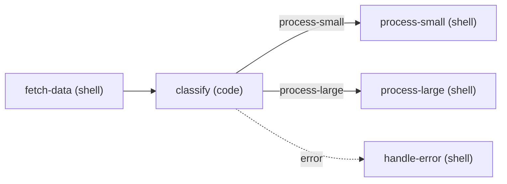

pflow provides a CLI for running workflows, managing MCP servers, and configuring settings.

<Note>
  **Who runs these commands?** Most pflow commands are run by your AI agent, not by you directly. You handle setup (installation, API keys, MCP servers), then your agent uses pflow to build and run workflows. This reference documents all commands so you understand what your agent is doing. See [Using pflow](/guides/using-pflow) for what to expect day-to-day.
</Note>

## Command structure

```bash
pflow [command] [options] [arguments]
```

## Command groups

<Columns cols={2}>
  <Card title="pflow (default)" icon="circle-play" href="#main-command">
    Run workflows by name or file
  </Card>
  <Card title="pflow workflow" icon="workflow" href="/reference/cli/workflow">
    List, describe, discover, and save workflows
  </Card>
  <Card title="pflow skill" icon="wand-magic-sparkles" href="/reference/cli/skill">
    Publish workflows as AI agent skills
  </Card>
  <Card title="pflow registry" icon="box" href="/reference/cli/registry">
    Browse and test available nodes
  </Card>
  <Card title="pflow mcp" icon="plug" href="/reference/cli/mcp">
    Manage MCP server connections
  </Card>
  <Card title="pflow settings" icon="file-cog" href="/reference/cli/settings">
    Configure API keys and node filtering
  </Card>
  <Card title="pflow visualize" icon="git-graph" href="#visualize-command">
    Generate Mermaid flowchart from a workflow
  </Card>
  <Card title="pflow instructions" icon="book-open" href="#instructions-command">
    Get AI agent usage guidance
  </Card>
</Columns>

## Main command

The default `pflow` command runs workflows. Your agent uses this to run saved workflows or workflow files it has created.

### Run a saved workflow

```bash
pflow my-workflow input=data.txt threshold=0.5
```

### Run from a file

```bash
pflow ./workflow.pflow.md
pflow ~/workflows/analysis.pflow.md param=value
```

<Info>
  **No built-in natural language mode.** pflow executes workflow files and saved workflows. Your AI agent builds workflows using pflow's MCP tools or CLI primitives — pflow doesn't have its own natural language interface.
</Info>

## Global options

| Option | Description |
|--------|-------------|
| `--version` | Show pflow version |
| `-v, --verbose` | Show detailed execution output |
| `-o, --output-key KEY` | Specific shared store key to output |
| `--output-format text\|json` | Output format (default: text) |
| `-p, --print` | Force non-interactive output |
| `--no-trace` | Disable workflow trace saving |
| `--cache/--no-cache` | Enable/disable memoization cache reads (default: enabled) |
| `--only NODE` | Run workflow through this node then stop |
| `--validate-only` | Validate workflow without running |
| `--help` | Show help message |

<Note>
  Older natural-language workflow generation flags have been removed. Use the current global options shown above, or let your AI agent build `.pflow.md` workflows directly.
</Note>

## Parameter syntax

Pass parameters to workflows using `key=value` syntax:

```bash
pflow my-workflow input=data.txt count=10 enabled=true
```

**Type inference:**
- `true` / `false` → boolean
- `10` → integer
- `3.14` → float
- `'["a","b"]'` → JSON array
- `'{"key":"val"}'` → JSON object
- Everything else → string

## Stdin input

Pipe data into workflows that declare an input with `stdin: true`:

```bash
echo "test content" | pflow my-workflow
cat data.csv | pflow csv-analyzer
```

The workflow must have an input marked to receive stdin:

```markdown
## Inputs

### data

Data input from stdin pipe.

- type: string
- required: true
- stdin: true
```

Piped data routes to this input automatically. CLI parameters override stdin if both are provided:

```bash
# CLI parameter wins - "override" is used, not piped content
echo "piped" | pflow my-workflow data="override"
```

For workflow chaining, use the `-p` flag to output results for the next workflow:

```bash
pflow -p step1 | pflow -p step2 | pflow step3
```

## Output modes

### Text mode (default)

Human-readable output with progress indicators in interactive terminals:

```bash
pflow my-workflow
```

### JSON mode

Structured output for parsing:

```bash
pflow --output-format json my-workflow | jq '.result'
```

<Expandable title="JSON output structure">

**Success response:**

```json
{
  "success": true,
  "result": {
    "summary": "Analysis complete",
    "count": 42
  },
  "duration_ms": 456.78,
  "total_cost_usd": 0.02,
  "nodes_executed": 3,
  "execution": {
    "duration_ms": 456.78,
    "nodes_executed": 3,
    "nodes_total": 3,
    "cache_hits": 2,
    "steps": [
      {
        "node_id": "fetch-data",
        "status": "completed",
        "duration_ms": 0,
        "cached": true
      },
      {
        "node_id": "read-data",
        "status": "completed",
        "duration_ms": 50.12,
        "cached": false
      }
    ]
  },
  "metrics": {
    "workflow": {
      "duration_ms": 456.78,
      "nodes_executed": 3,
      "nodes_cached": 0
    },
    "total": {
      "duration_ms": 456.78,
      "total_cost_usd": 0.02,
      "total_tokens": 1500,
      "llm_calls": 1
    }
  }
}
```

**Error response:**

```json
{
  "success": false,
  "error": "Workflow failed with action: error",
  "errors": [
    {
      "source": "runtime",
      "category": "api_validation",
      "message": "Missing required parameter: 'repo'",
      "node_id": "fetch-issues",
      "fixable": true,
      "available_fields": ["user_input", "stdin"]
    }
  ],
  "execution": {
    "steps": [
      {"node_id": "fetch-issues", "status": "failed", "duration_ms": 120.5}
    ]
  }
}
```

**Key fields:**

| Field | Description |
|-------|-------------|
| `success` | `true` if workflow completed, `false` if failed |
| `result` | Workflow output (object, string, or array based on declared outputs) |
| `duration_ms` | Total execution time in milliseconds |
| `total_cost_usd` | LLM API cost (0.0 if no LLM calls) |
| `execution.cache_hits` | Number of nodes served from memoization cache |
| `errors[].available_fields` | Valid fields for template variables - helps agents fix errors |

</Expandable>

### Print mode

Clean output for piping (no progress indicators):

```bash
pflow -p my-workflow > output.txt
```

## Validation mode

Validate a workflow without running it:

```bash
pflow --validate-only workflow.pflow.md
pflow --validate-only my-saved-workflow
```

Agents use this to check workflows before running them — pflow catches template errors, type mismatches, and missing inputs during validation, so problems surface immediately instead of after step 5 fails. Exit code 0 means valid.

## Iteration and caching

pflow caches node outputs automatically. When your agent re-runs a workflow file, unchanged nodes return instantly from a persistent cache — only nodes whose configuration or inputs changed will re-execute.

```bash
# First run: all nodes execute
pflow ./workflow.pflow.md title=hello

# Second run (same inputs): all nodes served from cache
pflow ./workflow.pflow.md title=hello

# Changed input: only affected nodes re-execute
pflow ./workflow.pflow.md title=different
```

The cache is content-addressed — same node config plus same resolved inputs produces the same cache key, regardless of when or how the workflow was run. Cache entries expire after 24 hours. The cache lives at `~/.pflow/cache/cache.db`.

### Run a single node

The `--only` flag runs the workflow through the named node and stops. Upstream nodes are served from cache if available, downstream nodes don't execute:

```bash
pflow ./workflow.pflow.md --only process-data
```

This is how agents iterate on a specific node without re-running the full workflow.

### Bypass caching

Use `--no-cache` to force fresh execution. Cache writes still happen, so the next run without `--no-cache` benefits from the results:

```bash
pflow ./workflow.pflow.md --no-cache
```

Use this when a node has external side effects (API calls, file writes) that should always run, or when cached results seem stale.

### Per-node opt-out

For nodes that read runtime state (`git branch`, `date`, environment variables), use `- cache: false` to permanently skip caching for that node. Unlike `--no-cache`, this skips both cache reads and writes:

```markdown
### get-branch

Detect the current git branch.

- type: shell
- cache: false

```shell command
git branch --show-current
```
```

Validation warns when a shell node has no template inputs and no `cache: false` — a sign its cached results may go stale across runs.

## Traces and reports

By default, pflow saves execution traces to `~/.pflow/debug/`:

- **Workflow traces**: `workflow-trace-{name}-{timestamp}.json`

Generate a structured execution report (one markdown file per node):

```bash
# During execution
pflow my-workflow --report

# Custom output directory
pflow my-workflow --report-dir ./my-report/

# From an existing trace (most recent)
pflow trace report

# From a specific trace
pflow trace report ~/.pflow/debug/workflow-trace-my-workflow-20260323-160000.json
```

Reports include rendered prompts, responses, cost data, error summaries with fix suggestions, and anomaly warnings.

Disable traces with `--no-trace` for faster execution (the `--report` flag overrides `--no-trace`).

## Visualize command

Generate a [Mermaid](https://mermaid.js.org/) flowchart from a workflow. Shows the graph topology — nodes, edges, conditional branches, error routes — that's otherwise scattered across individual node directives in the `.pflow.md` file.

```bash
pflow visualize workflow.pflow.md
pflow visualize my-saved-workflow
```

The command validates the workflow first (same checks as `--validate-only`). On validation failure, it shows diagnostics and exits with code 1. On success, it outputs Mermaid syntax to stdout.

```bash
# Save to file
pflow visualize workflow.pflow.md -o diagram.mmd

# Or pipe to clipboard
pflow visualize workflow.pflow.md | pbcopy
```

Mermaid renders natively in GitHub, VS Code, and most markdown viewers — no extra tooling needed.

| Option | Description |
|--------|-------------|
| `-o, --output FILE` | Write Mermaid output to file instead of stdout |
| `--depth N` | Sub-workflow expansion depth (default: 5, 0 = no expansion) |
| `--direction LR\|TD` | Graph direction: left-to-right or top-down (default: LR) |

Sub-workflow nodes (`type: workflow`) expand into `subgraph` blocks showing their internal structure. Use `--depth 0` to render them as opaque nodes, or `--depth 2` to expand nested sub-workflows:

```bash
# No sub-workflow expansion
pflow visualize workflow.pflow.md --depth 0

# Expand two levels deep, top-down layout
pflow visualize workflow.pflow.md --depth 2 --direction TD
```

<Expandable title="Example output">

For a workflow with conditional branching:



Edge styles: `-->` for normal flow, `-->|action|` for named branches, `-.->|error|` for error routes.

</Expandable>

## Instructions command

The `pflow instructions` command provides guidance for AI agents using pflow.

```bash
pflow instructions <SUBCOMMAND>
```

| Subcommand | Description |
|------------|-------------|
| `usage` | Basic usage guide for AI agents (~100 lines) |
| `create` | Comprehensive workflow creation guide (~1600 lines) |

**Example:**

```bash
# Get usage instructions (AI agents should run this first)
pflow instructions usage

# Get detailed workflow creation guide
pflow instructions create
```

<Note>
  AI agents should run `pflow instructions usage` when first connecting to pflow. This provides optimized guidance for agent-driven workflow building.
</Note>

## Related

- [Workflow commands](/reference/cli/workflow) - Manage saved workflows
- [Skill commands](/reference/cli/skill) - Publish workflows as AI agent skills
- [Registry commands](/reference/cli/registry) - Browse available nodes
- [MCP commands](/reference/cli/mcp) - Manage MCP servers
- [Settings commands](/reference/cli/settings) - Configure pflow
