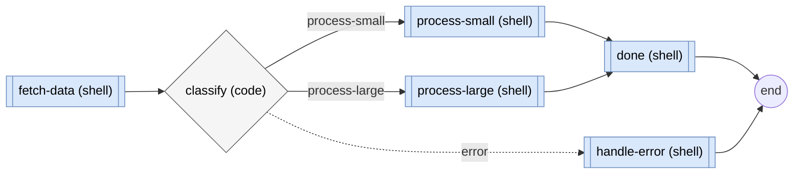

pflow provides a CLI for running workflows, managing MCP servers, and configuring settings.

<Note>
  **Who runs these commands?** Most pflow commands are run by your AI agent, not by you directly. You handle setup (installation, API keys, MCP servers), then your agent uses pflow to build and run workflows. This reference documents all commands so you understand what your agent is doing. See [Using pflow](/guides/using-pflow) for what to expect day-to-day.
</Note>

## Command structure

```bash
pflow [command] [options] [arguments]
```

## Command groups

<Columns cols={2}>
  <Card title="pflow (default)" icon="circle-play" href="#main-command">
    Run workflows by name or file
  </Card>
  <Card title="pflow list / find / describe" icon="workflow" href="/reference/cli/list">
    Find and inspect saved workflows
  </Card>
  <Card title="pflow skill" icon="wand-magic-sparkles" href="/reference/cli/skill">
    Publish workflows as AI agent skills
  </Card>
  <Card title="pflow guide / probe" icon="box" href="/reference/cli/guide">
    Learn the surface and test single nodes
  </Card>
  <Card title="pflow mcp" icon="plug" href="/reference/cli/mcp">
    Manage MCP server connections
  </Card>
  <Card title="pflow settings" icon="file-cog" href="/reference/cli/settings">
    Configure API keys and node filtering
  </Card>
  <Card title="pflow ui" icon="app-window" href="#ui-command">
    Interactive browser canvas for a workflow
  </Card>
  <Card title="pflow mermaid" icon="git-graph" href="#mermaid-command">
    Generate a Mermaid flowchart from a workflow
  </Card>
  <Card title="pflow guide" icon="book-open" href="/reference/cli/guide">
    Get AI agent entry guidance
  </Card>
</Columns>

## Main command

The default `pflow` command runs workflows. Your agent uses this to run saved workflows or workflow files it has created.

### Run a saved workflow

```bash
pflow my-workflow input=data.txt threshold=0.5
```

### Run from a file

```bash
pflow ./workflow.pflow.md
pflow ~/workflows/analysis.pflow.md param=value
```

<Info>
  **No built-in natural language mode.** pflow executes workflow files and saved workflows. Your AI agent builds workflows using pflow's MCP tools or CLI primitives — pflow doesn't have its own natural language interface.
</Info>

## Resume a failed run

When a run fails partway — an LLM/HTTP/MCP step times out, a transient error survives retries — `pflow resume` continues from the failed step instead of re-running the whole workflow. It restores the already-completed upstream steps' outputs from the saved trace (it does not re-run them) and walks forward from the failed step.

```bash
pflow resume 7a9e4afb-2095-447e-8043-0660438104f9   # resume that exact failed attempt
pflow resume my-workflow                             # resume the newest failed run of a workflow
pflow resume my-workflow api_url=https://fixed.example.com   # override an input while resuming
```

The failed run prints the exact command to use (`To resume from the failed step: pflow resume <execution-id>`). A resumed run is a new run with its own trace, linked to the original.

| Option | Description |
|--------|-------------|
| `--force` | Bypass the side-effect confirmation and the edited-workflow check |
| `--dry-run` | Preview the resumed tail's cost and cache plan (from the failed step onward) without running |
| `KEY=VALUE` | Override the original run's inputs |

The failed step runs again from the start, so if it already partly side-effected (an HTTP POST that sent but timed out on the response), resuming re-fires it — at-least-once execution. A side-effecting step (`shell`/`code`/`claude-code`/file-ops/`mcp`) asks for confirmation at a terminal and refuses for non-interactive agents unless you pass `--force`; an idempotent `llm` step resumes silently. See [`pflow guide resume`](/reference/cli/guide) for the full behavior (loop restart, gate re-prompting, top-level granularity, interrupted-run handling).

## Global options

| Option | Description |
|--------|-------------|
| `--version` | Show pflow version |
| `-v, --verbose` | Show detailed execution output |
| `-o, --output-key KEY` | Specific shared store key to output |
| `--output-format text\|json` | Output format (default: text) |
| `-p, --print` | Minimal output: suppress header, summary, and warnings |
| `--no-trace` | Disable workflow trace saving |
| `--cache/--no-cache` | Enable/disable memoization cache reads (default: enabled) |
| `--only NODE` | Re-run just this node against a snapshot of the last full run (upstream restored, not re-executed; needs a prior full run) |
| `--auto-approve NODE` | Pre-approve one approval gate by step name (repeatable; no approve-all form). See [Approval gates](/how-it-works/approval-gates) |
| `--validate-only` | Validate workflow without running |
| `--dry-run` | Preview which nodes would run or serve from cache, without executing |
| `--help` | Show help message |

<Note>
  Older natural-language workflow generation flags have been removed. Use the current global options shown above, or let your AI agent build `.pflow.md` workflows directly.
</Note>

## Parameter syntax

Pass parameters to workflows using `key=value` syntax:

```bash
pflow my-workflow input=data.txt count=10 enabled=true
```

**Type inference:**
- `true` / `false` → boolean
- `10` → integer
- `3.14` → float
- `'["a","b"]'` → JSON array
- `'{"key":"val"}'` → JSON object
- Everything else → string

## Stdin input

Pipe data into workflows that declare an input with `stdin: true`:

```bash
echo "test content" | pflow my-workflow
cat data.csv | pflow csv-analyzer
```

The workflow must have an input marked to receive stdin:

```markdown
## Inputs

### data

Data input from stdin pipe.

- type: string
- required: true
- stdin: true
```

Piped data routes to this input automatically. CLI parameters override stdin if both are provided:

```bash
# CLI parameter wins - "override" is used, not piped content
echo "piped" | pflow my-workflow data="override"
```

For workflow chaining, use the `-p` flag to output results for the next workflow:

```bash
pflow -p step1 | pflow -p step2 | pflow step3
```

## Stdout output

Workflows that declare multiple outputs mark one with `stdout: true` to pick which output lands on process stdout in text mode:

```markdown
## Outputs

### message

Primary result — streams to stdout on redirect or pipe.

- source: ${emit.stdout}
- stdout: true

### length

Secondary metadata. Available via `-o length` or `--output-format json`.

- source: ${count.stdout}
```

Redirecting or piping the CLI in text mode now writes only the marked output to stdout:

```bash
pflow stdout-result.pflow.md > result.txt       # file contains the message only
pflow stdout-result.pflow.md | next-step        # message streams to the next command
pflow stdout-result.pflow.md -o length          # override: emit length instead
pflow stdout-result.pflow.md --output-format json   # emit all outputs as structured JSON
```

Single-output workflows don't need the marker — their one output is unambiguous. Workflows with multiple declared outputs and no `stdout: true` stream the first declared output and print a warning on stderr naming the other outputs and the three ways to change the routing: add the marker, pass `-o`, or switch to JSON mode. The validator enforces that at most one output per workflow is marked.

## Output modes

### Text mode (default)

Human-readable output with live progress streamed to stderr and results on stdout. Works the same way in a terminal, CI log, agent bash tool, or subprocess capture:

```bash
pflow workflow.pflow.md
```

Progress lines and execution summary go to stderr. Declared workflow outputs go to stdout.

### JSON mode

Structured output on stdout for machine parsing:

```bash
pflow --output-format json workflow.pflow.md
```

All workflow results, metrics, and errors serialize to a single JSON object on stdout. Progress and execution summary go to stderr (suppressed with `-p`).

<Expandable title="JSON output structure">

**Success response:**

```json
{
  "success": true,
  "result": {
    "summary": "Analysis complete",
    "count": 42
  },
  "duration_ms": 456.78,
  "total_cost_usd": 0.02,
  "nodes_executed": 3,
  "execution": {
    "duration_ms": 456.78,
    "nodes_executed": 3,
    "nodes_total": 3,
    "cache_hits": 2,
    "steps": [
      {
        "node_id": "fetch-data",
        "status": "completed",
        "duration_ms": 0,
        "cached": true
      },
      {
        "node_id": "read-data",
        "status": "completed",
        "duration_ms": 50.12,
        "cached": false
      }
    ]
  },
  "metrics": {
    "workflow": {
      "duration_ms": 456.78,
      "nodes_executed": 3,
      "nodes_cached": 0
    },
    "total": {
      "duration_ms": 456.78,
      "total_cost_usd": 0.02,
      "total_tokens": 1500,
      "llm_calls": 1
    }
  }
}
```

**Error response:**

```json
{
  "success": false,
  "error": "Workflow failed with action: error",
  "errors": [
    {
      "source": "runtime",
      "category": "api_validation",
      "message": "Missing required parameter: 'repo'",
      "node_id": "fetch-issues",
      "fixable": true,
      "available_fields": ["user_input", "stdin"]
    }
  ],
  "execution": {
    "steps": [
      {"node_id": "fetch-issues", "status": "failed", "duration_ms": 120.5}
    ]
  }
}
```

**Key fields:**

| Field | Description |
|-------|-------------|
| `success` | `true` if workflow completed, `false` if failed |
| `result` | Workflow output (object, string, or array based on declared outputs) |
| `duration_ms` | Total execution time in milliseconds |
| `total_cost_usd` | LLM API cost (0.0 if no LLM calls) |
| `execution.cache_hits` | Number of nodes served from memoization cache |
| `errors[].available_fields` | Valid fields for template variables - helps agents fix errors |

</Expandable>

### Print mode (`-p`)

Minimal stderr output when you want the cleanest possible data stream:

```bash
pflow -p workflow.pflow.md | jq '.data'
```

Suppresses the "Workflow output:" header, the execution summary, and stderr warnings. Data still goes to stdout (same as default mode). Useful for piping into tools that should only see the result.

## Exit codes

| Code | Meaning |
|------|---------|
| `0` | Workflow completed, including runs that completed with warnings (`status: "degraded"`) |
| `1` | Workflow failed |
| `130` | Workflow interrupted |

Runtime warnings remain visible in stderr, JSON output, traces, and reports; they do not make a completed workflow a process failure.

## Validation mode

Validate a workflow without running it:

```bash
pflow --validate-only workflow.pflow.md
pflow --validate-only my-saved-workflow
```

Agents use this to check workflows before running them — pflow catches template errors, type mismatches, and missing inputs during validation, so problems surface immediately instead of after step 5 fails. Exit code 0 means valid.

## Dry-run mode

Preview what a workflow would do without running it. `--dry-run` walks the graph using the same cache lookup the engine uses at runtime, but never invokes a node — no shell commands, LLM calls, HTTP requests, file writes, or trace files:

```bash
pflow ./workflow.pflow.md --dry-run topic=hello
```

Cached nodes render with `↻`, would-execute nodes with `▸`, and a divider marks the cache boundary:

```
Dry-run for workflow.pflow.md: 2 nodes

  ↻ fetch  (1m ago)
  ─── cache boundary: 'summarize' ───
  ▸ summarize  [code]

Summary: 1 cached · 1 would execute (1 code)
Estimated duration: ~1ms  (historical, actual may vary)
```

When everything is cached, there's no boundary. When nothing is cached, the divider reads `nothing cached — full run`.

For would-execute LLM nodes, the plan surfaces the cost from the most recent cache entry — labeled `≈` because pricing may have drifted. Per-node duration annotations appear on any would-execute node whose last run took at least 1 second; faster nodes stay bare:

```
▸ summarize  [LLM]   ≈ $0.02 (last run 15m ago)
▸ upload     [shell] ~1.5s (last run 2m ago)
```


### JSON output

```bash
pflow ./workflow.pflow.md --dry-run --output-format json topic=hello
```

Top-level shape: `{workflow, plan, summary, diagnostics}`.

<Expandable title="Summary and plan entry fields">

**Summary fields agents use for cost gating:**

| Field | Description |
|-------|-------------|
| `estimated_cost_usd` | Sum of historical LLM costs across would-execute nodes |
| `estimated_duration_ms` | Sum of historical durations across would-execute nodes |
| `cost_basis` | `"exact"` for linear plans; `"upper_bound"` when branches are enumerated |
| `cache_boundary` | Node ID of the first cache miss, or `null` when everything is cached |
| `execute_by_type` | Count of would-execute nodes by type: `{"LLMNode": 1, "ShellNode": 2}` |
| `nodes_without_history` | Would-execute LLM nodes missing cost data — non-zero means the estimate is incomplete |
| `opaque_count` | Sub-workflows the planner couldn't resolve (e.g. `workflow: ${dynamic-ref}`) — their cost is excluded |

**Plan entry fields:** `node_id`, `node_type`, `status` (`cached`, `execute`, `sub_workflow`, `opaque`, `routing_error`), `cause`, `last_cost_usd`, `last_duration_ms`, `age_sec`.

Agents cost-gating on `estimated_cost_usd` should check `opaque_count == 0` and `nodes_without_history == 0` first — otherwise the estimate is missing data.

</Expandable>

### Flag combinations

| Flag | With `--dry-run` |
|------|------------------|
| `--validate-only` | Rejected with exit 1 — different audiences, different exit contracts |
| `--report`, `--report-dir` | Rejected with exit 1 — no execution means no report |
| `--no-cache` | Every node shows as would-execute |
| `--only NODE` | Plan stops at the named node |
| `--no-trace`, `-p`, `-o` | Accepted silently — dry-run writes no traces, and the plan itself is the result |

Exit 0 on a successful plan, 1 on planner-level failures (missing input, compile error, unresolvable sub-workflow, cycle, max depth exceeded).

## Iteration and caching

pflow caches node outputs automatically. When your agent re-runs a workflow file, unchanged nodes return instantly from a persistent cache — only nodes whose configuration or inputs changed will re-execute.

```bash
# First run: all nodes execute
pflow ./workflow.pflow.md title=hello

# Second run (same inputs): all nodes served from cache
pflow ./workflow.pflow.md title=hello

# Changed input: only affected nodes re-execute
pflow ./workflow.pflow.md title=different
```

The cache is content-addressed — same node config plus same resolved inputs produces the same cache key, regardless of when or how the workflow was run. Cache entries expire after 24 hours. The cache lives at `~/.pflow/cache/cache.db`.

### Run a single node

The `--only` flag runs just the named node against a frozen snapshot of the most recent full run. Every other node's output is restored from that run — not re-executed — so a side-effecting upstream node like `shell: git push` does **not** run again. It needs a prior full run to snapshot from (otherwise it errors). Targeting a node inside a sub-workflow is not supported.

```bash
pflow ./workflow.pflow.md            # full run once (records the snapshot)
pflow ./workflow.pflow.md --only process-data   # re-run just this node
```

Without `-o`, `--only` streams the targeted node's result to stdout instead of the workflow's full-run outputs. Pass `-o <key>` when you need a specific named output.

This is how agents iterate on a specific node without re-running the full workflow.

### Bypass memo cache reads

Use `--no-cache` to bypass pflow memo-cache reads, so nodes execute again. Memo cache writes still happen, so the next run without `--no-cache` benefits from the results:

```bash
pflow ./workflow.pflow.md --no-cache
```

Use this when a node has external side effects (API calls, file writes) that should run again, or when memoized results seem stale. It does not disable LLM provider prompt caching declared with `## Cache` / `prompt_cache:`, OpenAI automatic prompt caching, or Gemini implicit caching.

### Per-node caching

Only `llm` nodes cache by default — their output is purely a function of their declared inputs. Every other node type (`shell`, `code`, `http`, file ops, `mcp`, `claude-code`) defaults to NOT caching, because they side-effect or read external state (`git branch`, `date`, environment variables, files, network). So a node like `git branch --show-current` re-runs every time with no annotation needed:

```markdown
### get-branch

Detect the current git branch.

- type: shell

```shell command
git branch --show-current
```
```

Use `- cache: true` to opt a node INTO caching when its output is purely a function of its declared inputs (no filesystem reads, no clock, no env vars, no network state). Most shell/code/http/file/mcp nodes do not qualify. `- cache: false` is the explicit opt-out — redundant for non-`llm` nodes under the default, but useful for documenting intent. Both skip cache reads and writes for that node, unlike `--no-cache` which is run-wide.

## Traces and reports

By default, pflow saves execution traces to `~/.pflow/debug/`:

- **Workflow traces**: `workflow-trace-{name}-{timestamp}.json`

Generate a structured execution report (one markdown file per node):

```bash
# During execution
pflow my-workflow --report

# Custom output directory
pflow my-workflow --report-dir ./my-report/

# From an existing trace (most recent)
pflow report

# From a specific trace
pflow report ~/.pflow/debug/workflow-trace-my-workflow-20260323-160000.json
```

Reports include rendered prompts, responses, cost data, error summaries with fix suggestions, and anomaly warnings.

Report output directories are replaced as generated snapshots. Custom report
directories must be empty or already contain pflow's `.pflow-report.json`
marker.

Disable traces with `--no-trace` for faster execution (the `--report` flag overrides `--no-trace`).

## UI command

Serve an interactive browser canvas for a workflow — the visual counterpart to [`pflow mermaid`](#mermaid-command). Where `mermaid` emits static text, `pflow ui` opens a local browser canvas: collapsible sub-workflow, batch, and loop containers, click-to-read prompts and params, `${ref}` data-flow lines, and a source pane.

```bash
pflow ui workflow.pflow.md          # open straight to a workflow
pflow ui my-saved-workflow          # a saved workflow by name
pflow ui                            # the catalog of saved workflows
pflow ui focus my-saved-workflow fetch-data
pflow ui user-activity my-saved-workflow
```

The canvas updates in place — no page reload — as the workflow's `.pflow.md` is edited on disk, so you can watch it take shape (while keeping the current zoom and selection) as you, or an AI agent, build it. An edit that doesn't validate is held: the last valid version stays on screen with an error banner until the source parses again. The server blocks until `Ctrl+C`, so run it in the background while you edit.

The canvas also shows runs in progress. Run a workflow in another terminal — or have your agent run it — and the open canvas lights each node as it starts and finishes: running, succeeded, cached, failed, or stopped, with a hover chip showing that node's duration and cost. It works the same for a finished run: open the run selector to replay any past run on the graph, or click a node to see what that run produced — its resolved inputs, output, cost, and tokens. With no workflow argument, the catalog marks which workflows are running now and when each last ran.

Runs on a standard install. If `pflow ui` reports a missing dependency, add the server extra: `uv tool install 'pflow-cli[ui]'`.

| Option | Description |
|--------|-------------|
| `--port N` | Port to serve on (default: 8765) |
| `--no-open` | Don't open a browser window |
| `--no-auto-update` | Freeze the view — don't live-update when the source changes |

The full view is described by the URL, so you can share or screenshot an exact state — for example `?workflow=<name-or-path>&focus=<node-id>&direction=TD`. `focus=` highlights a node and reveals its connections; `node=` centers the camera on it.

An agent can interact with every open Viewer showing a workflow:

```bash
pflow ui focus <workflow> <target> [--open] [--say TEXT]  # focus and reveal a step, input/output, or connection
pflow ui frame <workflow> <target> [--say TEXT]           # move the camera without changing focus
pflow ui clear-focus <workflow>
pflow ui user-activity [workflow]             # recent deliberate clicks and view changes
```

Name a target the way it reads in the `.pflow.md`: a step, input, or output by its name (`process_content`, `source_file`), or a connection as `source -> target` (`gen.response -> summarize.prompt`) — there's no separate notation to learn. If a name matches more than one thing — the same step inside two sub-workflows, or an input and output that share a name — the command lists qualified addresses to pick from instead of guessing, and an unknown name returns the closest real matches. So you point, read the reply, and re-point.

`--say "text"` narrates the point aloud in every open Viewer with a persistent on-canvas caption (text-to-speech via the configured `tts_model`/`tts_voice`; needs a Gemini API key). Delivery direction goes in `[brackets]` — e.g. `--say "[excited] this is the LLM call"` — bracketed tags shape the voice and are stripped from the caption; everything outside brackets is spoken and shown. If synthesis fails (no key, network), the point and caption still land and the reason appears in the report as `narration unavailable: ...`.

These commands target port 8765 by default (pass `--port N` for another instance). Point commands exit nonzero when the target is unresolved/ambiguous or no Viewer received the command. `focus --open` opens a Viewer only when no window for that workflow is connected.

## Mermaid command

Generate a [Mermaid](https://mermaid.js.org/) flowchart from a workflow. Shows the graph topology — nodes, edges, conditional branches, error routes, inputs, outputs — that's otherwise scattered across individual node directives in the `.pflow.md` file. For an interactive, collapsible canvas instead of static text, see the [UI command](#ui-command).

```bash
pflow mermaid workflow.pflow.md
pflow mermaid my-saved-workflow
```

The command validates the workflow first (same checks as `--validate-only`). On validation failure, it shows diagnostics and exits with code 1. On success, it outputs Mermaid syntax to stdout.

```bash
# Save to file (raw Mermaid syntax)
pflow mermaid workflow.pflow.md -o diagram.mmd

# Save as markdown with title, optional description, and fenced mermaid block
pflow mermaid workflow.pflow.md -o diagram.md

# Or pipe to clipboard
pflow mermaid workflow.pflow.md | pbcopy
```

Mermaid renders natively in GitHub, VS Code, and most markdown viewers — no extra tooling needed. The `.md` output wraps the diagram in a markdown document with the workflow's title and description, ready to commit or share.

| Option | Description |
|--------|-------------|
| `-o, --output FILE` | Write to file. `.md` extension wraps in markdown with title and fenced code block. Any other extension writes raw Mermaid syntax. |
| `--depth N` | Sub-workflow expansion depth (default: 5, 0 = no expansion) |
| `--direction LR\|TD` | Graph direction: left-to-right or top-down (default: LR) |
| `--descriptions` | Add first sentence of each node's purpose to its label |

Sub-workflow nodes (`type: workflow`) expand into `subgraph` blocks showing their internal structure. Use `--depth 0` to render them as opaque nodes, or `--depth 2` to expand nested sub-workflows:

```bash
# No sub-workflow expansion
pflow mermaid workflow.pflow.md --depth 0

# Expand two levels deep, top-down layout
pflow mermaid workflow.pflow.md --depth 2 --direction TD

# Include node descriptions in labels
pflow mermaid workflow.pflow.md --descriptions
```

<Expandable title="Example output">

For a workflow with conditional branching:



Node shapes indicate type: `[["shell"]]` rectangles for shell, `{"code"}` diamonds for decision nodes, `(["output"])` stadiums for outputs. Edge styles: `-->` for normal flow, `-->|action|` for named branches, `-.->|error|` for error routes.

Workflow inputs and outputs render as dashed-border groups. Batch nodes show as subgraphs with their items. Sub-workflows expand into nested subgraphs with input/output wrappers showing data flow across boundaries.

</Expandable>

## Guide command

The `pflow guide` command provides the entry guidance for AI agents using pflow.

```bash
pflow guide
pflow guide http llm
```

Without topics it renders the same entry content as `pflow --help`. Topic composition is introduced in Task 77.

## Related

- [Workflow commands](/reference/cli/list) - Find and manage saved workflows
- [Skill commands](/reference/cli/skill) - Publish workflows as AI agent skills
- [Guide and probe](/reference/cli/guide) - Learn the surface and test single nodes
- [MCP commands](/reference/cli/mcp) - Manage MCP servers
- [Settings commands](/reference/cli/settings) - Configure pflow
