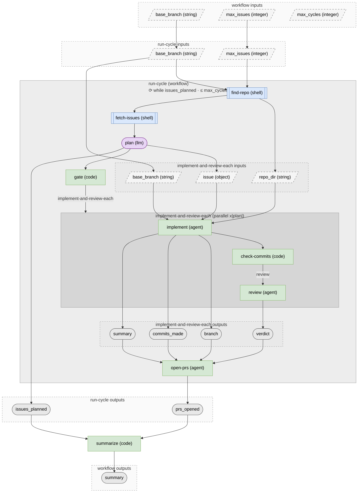

# Parallel Planner with Review

Autonomous loop that triages open GitHub issues, implements and reviews the
unblocked ones in parallel, opens a PR for each that passes review, then repeats
— picking up newly-unblocked work each cycle — until nothing is left or a cycle
cap is hit. This file is the entry point; every node's description explains its
own role and why it is that node type.
**The loop.** The orchestrator repeats the whole `run-cycle` sub-workflow with a
declarative `loop:` block until the cycle reports no planned issues, or
`max_cycles` caps it. It converges because `run-cycle`'s `open-prs` step strips
the `agent-ready` label from handled issues, shrinking the pool each cycle until
empty.
**Before running.** `gh` authenticated with push + PR rights on `origin`; the
labels `agent-ready` and `agent-needs-human` must exist. Opt issues in by
labelling them `agent-ready` — if none are, the loop correctly no-ops on cycle
one. Launch from anywhere inside the repo (`find-repo` resolves the root via
`git rev-parse`).
**How it composes.** Three nested workflows: this orchestrator →
`run-cycle/run-cycle.pflow.md` (one plan→implement→review→open-PRs cycle) →
`run-cycle/implement-and-review-one/` (the per-issue body, fanned out in parallel).
**Two caveats.** (1) Work opens a *PR*, not a merge — a dependency isn't resolved
until a human merges its PR, so cross-cycle unblocking is weaker than
merge-to-main (best for independent issues). (2) Each issue is attempted once; a
review requesting changes relabels it `agent-needs-human` rather than
re-attempting, so the swarm never spins on a hard problem.

