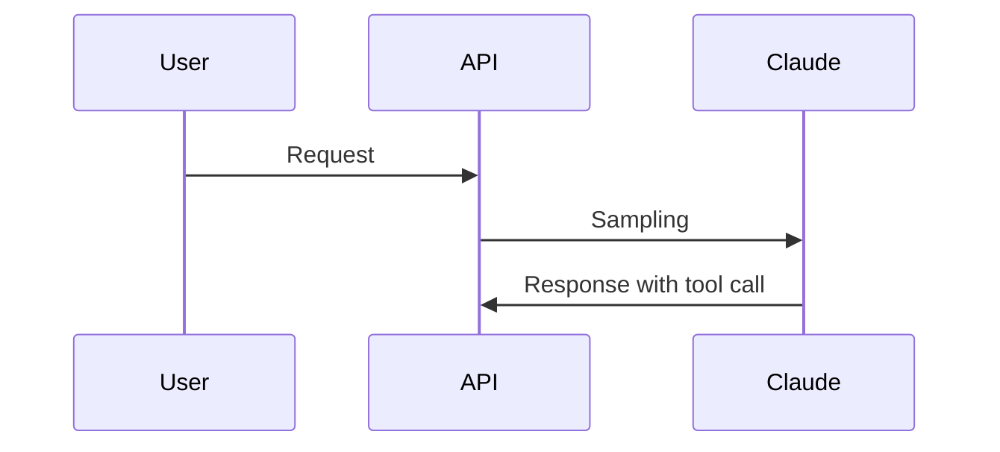

# Real-World Workflow Examples

Production-ready workflows demonstrating pflow capabilities.

## Webpage to AI-Readable Markdown

Converts any webpage into clean markdown with image content extracted via vision AI. Unlike basic scrapers that lose visual information, this workflow makes diagrams, charts, and screenshots fully accessible to AI agents.

**The problem**: Built-in web fetch tools give summaries. AI agents working on implementation need the full picture—every code example, every diagram explained.

**The solution**: Use Jina Reader for the commodity work (free, instant), then add intelligence with vision AI to extract information from images.

### Quick Start

```bash
pflow examples/real-workflows/webpage-to-markdown/workflow.json \
  target_url="https://www.anthropic.com/engineering/building-effective-agents"
```

### How It Works

```
┌─────────────┐    ┌─────────────────┐    ┌──────────────┐
│  HTTP Node  │───▶│ Extract Images  │───▶│ Vision AI    │
│ (Jina API)  │    │ (grep/jq)       │    │ (parallel)   │
└─────────────┘    └─────────────────┘    └──────────────┘
       │                                         │
       ▼                                         ▼
┌─────────────────────────────────────────────────────────┐
│              Markdown + Image Details Section           │
└─────────────────────────────────────────────────────────┘
```

7 nodes. No inline Python. Simple enough for an AI agent to create.

### Example Output

The workflow appends an "Image Details" section with extracted content:

**Diagrams → Mermaid code:**


**Charts → Data values:**
```
Context Usage Comparison:
- Traditional: 77.2k/200k tokens (61.4% free)
- With Tool Search: 8.7k/200k tokens (95.65% free)
```

### Performance

| Article | Images | Time | Cost |
|---------|--------|------|------|
| [Advanced Tool Use](https://www.anthropic.com/engineering/advanced-tool-use) | 2 | 7s | $0.006 |
| [Building Effective Agents](https://www.anthropic.com/engineering/building-effective-agents) | 8 | 18s | $0.033 |
| [Claude Think Tool](https://www.anthropic.com/engineering/claude-think-tool) | 2 | 45s | $0.008 |
| [Contextual Retrieval](https://www.anthropic.com/engineering/contextual-retrieval) | 6 | 29s | $0.048 |

*Using gemini-3-flash-preview. Jina fetch is free.*

### Parameters

| Parameter | Type | Required | Default | Description |
|-----------|------|----------|---------|-------------|
| `target_url` | string | yes | - | Webpage URL to convert |
| `output_file` | string | no | `auto` | Output file path, or `auto` to generate from URL with date prefix |
| `describe_images` | boolean | no | `true` | Use vision AI to extract content from images |

**Skip image analysis** (faster, free):
```bash
pflow examples/real-workflows/webpage-to-markdown/workflow.json \
  target_url="https://example.com/article" \
  describe_images=false
```

### Why This Workflow?

**vs. just using `curl r.jina.ai/URL`:**
- Jina gives you markdown—but images are just URLs
- This workflow extracts what's IN the images via vision AI
- Diagrams become mermaid code, charts become data values

**vs. the complex 13-node version:**
- Same result, 7 nodes instead of 13
- $0.006 instead of $0.11
- Leverages Jina instead of reinventing scraping

### Files

```
webpage-to-markdown/
├── workflow.json    # The 7-node workflow
└── prompt.md        # Prompt to reproduce this workflow
```

Example outputs (in parent folder):
- `output-example.md` - Advanced Tool Use article
- `output-building-effective-agents.md` - 8 diagrams with mermaid
- `output-contextual-retrieval.md` - Charts with data extraction
- `jina-output-example.md` - Raw Jina output for comparison
