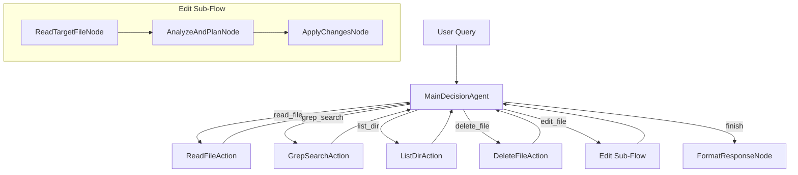

# Tutorial-Cursor Pattern Analysis for pflow

## Executive Summary

This analysis examines the Tutorial-Cursor codebase to extract patterns and architectural insights relevant to pflow's implementation needs. The focus is on identifying patterns that directly support pflow's high-priority tasks, particularly around deterministic execution, CLI-friendly interfaces, and simple node design.

**Key Finding**: Tutorial-Cursor demonstrates a sophisticated **agent-based workflow pattern** using PocketFlow that can be adapted for pflow's needs, particularly for implementing the Natural Language Planner (Task 13) and the execution engine (Task 3).

## 1. Project Structure

### Organization Strategy
```
Tutorial-Cursor/
├── flow.py           # Main flow orchestration (786 lines)
├── main.py          # CLI entry point (48 lines)
├── utils/           # Utility modules for node operations
│   ├── call_llm.py      # LLM integration
│   ├── read_file.py     # File reading operations
│   ├── replace_file.py  # File editing operations
│   ├── delete_file.py   # File deletion
│   ├── grep_search.py   # Pattern searching
│   └── dir_ops.py       # Directory operations
└── project/         # Example workspace for agent operations
```

**pflow Applicability**:
- **Helps Task 5 (Node Discovery)**: Clear separation of nodes (utils/) from orchestration (flow.py)
- **Helps Task 11 (File Nodes)**: Utility pattern provides template for simple file operations
- Clean module separation enables easy node discovery via filesystem scanning

### Key Insights:
1. **Utilities as Proto-Nodes**: Each utility function is essentially a simple operation that could become a pflow node
2. **Single Responsibility**: Each utility has one clear purpose (read, write, search, etc.)
3. **Consistent Return Pattern**: All utilities return `(success, result)` tuples for predictable error handling

## 2. Flow Architecture

### Main Flow Structure
```python
# Simplified view of the main flow
main_agent = MainDecisionAgent()
read_action = ReadFileAction()
grep_action = GrepSearchAction()
edit_agent = create_edit_agent()  # Sub-flow
format_response = FormatResponseNode()

# Action-based routing
main_agent - "read_file" >> read_action
main_agent - "grep_search" >> grep_action
main_agent - "edit_file" >> edit_agent
main_agent - "finish" >> format_response

# Loop back to main agent
read_action >> main_agent
grep_action >> main_agent
```

**pflow Applicability**:
- **Helps Task 4 (IR-to-Flow Converter)**: Shows how to build complex flows with action-based transitions
- **Helps Task 3 (Execute Workflow)**: Demonstrates flow execution with shared state
- **Pattern**: Central decision node with action-specific branches

### Node Count & Complexity
- **7 primary nodes** in main flow
- **3 nodes** in edit sub-flow
- **Total: 10 nodes** with clear separation of concerns
- Manageable complexity through hierarchical flow composition

### Visual Flow Diagram


## 3. State Management

### Shared Store Initialization
```python
shared = {
    "user_query": user_query,
    "working_dir": args.working_dir,
    "history": [],      # Action history tracking
    "response": None    # Final response
}
```

### Key Flow Pattern
1. **History-Based State**: Actions are recorded in `shared["history"]` with full context
2. **Last Action Pattern**: Nodes read parameters from the last history entry
3. **Result Recording**: Each action updates its history entry with results

**pflow Applicability**:
- **Helps Task 3 (Shared Store Init)**: Shows practical shared store initialization pattern
- **Helps Task 9 (Proxy Mapping)**: History pattern could inspire state tracking for debugging
- **Pattern**: Audit trail built into shared store

### State Flow Example
```python
# MainDecisionAgent adds to history:
shared["history"].append({
    "tool": "read_file",
    "reason": "Need to read config",
    "params": {"target_file": "config.json"},
    "result": None  # Filled by action node
})

# ReadFileAction updates result:
history[-1]["result"] = {
    "success": True,
    "content": file_content
}
```

## 4. Key Patterns

### 4.1 Agent-Based Decision Making
```python
class MainDecisionAgent(Node):
    def exec(self, inputs):
        # LLM decides next action based on:
        # 1. User query
        # 2. Action history
        # 3. Available tools
        decision = call_llm(prompt)
        return decision["tool"]  # Returns action name
```

**pflow Applicability**:
- **CRITICAL for Task 13 (Natural Language Planning)**: This pattern is exactly what pflow needs for its planner
- Shows how to use LLM for intelligent node selection
- Demonstrates metadata-driven tool discovery

### 4.2 YAML-Based LLM Communication
```python
# Instead of JSON, uses YAML for LLM responses
prompt = """
Respond with a YAML object containing:
```yaml
tool: read_file
reason: |
  Need to read the configuration file
params:
  target_file: config.json
```
"""
```

**pflow Benefits**:
- More readable for LLMs than JSON
- Supports multi-line strings naturally
- Less prone to formatting errors

### 4.3 History-Driven Parameter Passing
```python
class ReadFileAction(Node):
    def prep(self, shared):
        # Get params from last history entry
        last_action = shared["history"][-1]
        file_path = last_action["params"]["target_file"]
        return file_path
```

**pflow Applicability**:
- **Helps Task 9 (Shared Store Validation)**: Pattern for parameter validation
- Ensures nodes always have required parameters
- Creates audit trail automatically

### 4.4 Sub-Flow Composition
```python
def create_edit_agent() -> Flow:
    read_target = ReadTargetFileNode()
    analyze_plan = AnalyzeAndPlanNode()
    apply_changes = ApplyChangesNode()

    read_target >> analyze_plan >> apply_changes
    return Flow(start=read_target)
```

**pflow Benefits**:
- Shows how to create reusable workflow components
- Demonstrates hierarchical flow organization
- Pattern for complex multi-step operations

## 5. Dependencies & Performance

### External Services
- **LLM API**: All intelligent decisions via `call_llm()`
- **File System**: Direct file operations (no abstractions)
- **OS Operations**: Path handling, directory traversal

### Performance Optimizations
1. **Batch Operations**: `ApplyChangesNode` extends `BatchNode` for multiple edits
2. **Reverse Order Editing**: Edits applied bottom-to-top to preserve line numbers
3. **Single File Read**: File content cached in history to avoid re-reading

## 6. pflow Applicability

### Patterns Directly Applicable to pflow Tasks

#### Task 3: Execute Hardcoded Workflow
```python
# Tutorial-Cursor pattern adapted for pflow
def execute_workflow(ir_json, shared_store):
    flow = compile_ir_to_flow(ir_json)  # Task 4
    shared_store["history"] = []         # Audit trail
    flow.run(shared_store)
    return shared_store
```

#### Task 5: Node Discovery
```python
# Pattern: Utilities as discoverable nodes
utils/
├── read_file.py    -> discovers ReadFileNode
├── write_file.py   -> discovers WriteFileNode
└── grep_search.py  -> discovers GrepSearchNode
```

#### Task 9: Shared Store Validation
```python
# Pattern: Fail-fast validation
if not last_action["params"].get("target_file"):
    raise ValueError("Missing target_file parameter")
```

#### Task 11: Simple File Nodes
```python
# Pattern: Consistent utility interface
def read_file(path):
    try:
        with open(path, 'r') as f:
            return f.read(), True
    except Exception as e:
        return str(e), False
```

#### Task 13: Natural Language Planning
```python
# CRITICAL PATTERN: LLM-based action selection
class Planner(Node):
    def exec(self, user_intent):
        # 1. Get available nodes from registry
        # 2. Format as YAML for LLM
        # 3. LLM selects and connects nodes
        # 4. Return executable flow
```

### Adaptations Needed for pflow

1. **Remove Agent Loop**: pflow needs deterministic execution, not iterative agents
2. **Simplify History**: Use for debugging/tracing, not parameter passing
3. **Direct Parameters**: Use IR-defined parameters, not history-based
4. **Type Safety**: Add Pydantic models for parameter validation

## 7. Task Mapping

### High Priority Task Support

| Task ID | Task Title | Tutorial-Cursor Pattern | Adaptation for pflow |
|---------|------------|------------------------|---------------------|
| **3** | Execute Workflow | `flow.run(shared)` pattern | Direct implementation |
| **4** | IR-to-Flow Converter | Flow construction with `>>` | Add IR parsing layer |
| **5** | Node Discovery | Utils directory structure | Scan for Node subclasses |
| **9** | Shared Store Proxy | History-based state | Simplify to key mapping |
| **11** | File I/O Nodes | Utility functions | Wrap as Node classes |
| **12** | LLM Node | `call_llm()` utility | General-purpose node |
| **13** | Natural Language Planner | MainDecisionAgent | **CRITICAL PATTERN** |

### Code Examples for High Priority Tasks

#### For Task 13: Natural Language Planner
```python
class NaturalLanguagePlanner(Node):
    def prep(self, shared):
        return shared["user_intent"], shared["available_nodes"]

    def exec(self, inputs):
        intent, nodes = inputs

        # Format available nodes as YAML
        nodes_yaml = format_nodes_metadata(nodes)

        prompt = f"""
        User wants to: {intent}

        Available nodes:
        {nodes_yaml}

        Create a workflow using these nodes:
        ```yaml
        nodes:
          - id: n1
            type: github-get-issue
            params:
              issue_number: 1234
          - id: n2
            type: llm
            params:
              prompt: Analyze this issue
        edges:
          - from: n1
            to: n2
        ```
        """

        response = call_llm(prompt)
        return parse_yaml_to_ir(response)
```

#### For Task 3: Workflow Execution
```python
class WorkflowExecutor:
    def execute(self, ir_json, initial_store=None):
        # Initialize shared store
        shared = initial_store or {}
        shared["_execution_id"] = generate_id()
        shared["_trace"] = []

        # Compile and run
        flow = self.compile_ir_to_flow(ir_json)
        flow.run(shared)

        return shared
```

## 8. Key Takeaways for pflow

### Must-Have Patterns
1. **YAML for LLM Communication**: More reliable than JSON
2. **Action-Based Routing**: Clean pattern for conditional execution
3. **Fail-Fast Validation**: Clear error messages for missing parameters
4. **Sub-Flow Composition**: Reusable workflow components

### Avoid These Patterns
1. **Agent Loops**: pflow needs deterministic, not iterative execution
2. **History-Based Parameters**: Use direct IR parameters instead
3. **Complex State Management**: Keep shared store simple

### Innovation Opportunities
1. **Metadata-Driven Discovery**: Tutorial-Cursor manually defines tools; pflow can auto-discover
2. **Type Safety**: Add Pydantic validation that Tutorial-Cursor lacks
3. **CLI Integration**: Tutorial-Cursor is Python-first; pflow is CLI-first

## Conclusion

Tutorial-Cursor provides excellent patterns for pflow's implementation, particularly for:
- **Task 13 (Natural Language Planning)**: The MainDecisionAgent pattern is directly applicable
- **Task 3 (Workflow Execution)**: Shows practical flow execution with shared state
- **Task 11 (File Nodes)**: Utility patterns for simple, single-purpose operations

The key insight is that Tutorial-Cursor's agent-based architecture can be simplified into pflow's deterministic workflow compiler by:
1. Removing the iterative loop
2. Using IR for parameter definition instead of history
3. Focusing on one-shot workflow generation rather than multi-step reasoning

This codebase demonstrates that PocketFlow is capable of supporting pflow's ambitious goals while maintaining simplicity and clarity.
