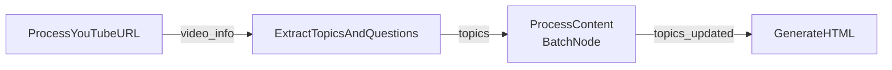

# PocketFlow Tutorial Analysis: YouTube Made Simple

## Executive Summary

This analysis examines the "YouTube Made Simple" tutorial to extract patterns applicable to pflow's CLI-first workflow compiler. The tutorial demonstrates a 4-node flow that processes YouTube videos into ELI5 summaries, showcasing patterns for deterministic execution, simple node design, and effective state management through PocketFlow's shared store.

**Key Finding**: The tutorial's architecture directly supports pflow's MVP tasks, particularly Tasks 5 (Node Discovery), 11 (Simple Nodes), 12 (LLM Node), and 17 (Workflow Generation).

## 1. Project Structure

### Module Organization
```
Tutorial-Youtube-Made-Simple/
├── flow.py              # Main flow definition (orchestration)
├── main.py              # CLI entry point
├── utils/               # Utility modules (separation of concerns)
│   ├── call_llm.py     # LLM integration
│   ├── youtube_processor.py  # External service integration
│   └── html_generator.py     # Output formatting
└── docs/
    └── design.md        # Clear architecture documentation
```

**pflow Applicability (Task 2: CLI Setup)**:
- Clean separation between CLI entry (`main.py`) and flow logic (`flow.py`)
- Utilities isolated in dedicated module
- Pattern for pflow: `src/pflow/cli/main.py` calls flow execution engine

### Configuration Management
- Environment variables for LLM credentials (`ANTHROPIC_REGION`, `ANTHROPIC_PROJECT_ID`)
- No hardcoded secrets in code
- **Pattern for pflow (Task 12: LLM Node)**: Use environment variables for API keys

## 2. Flow Architecture

### Flow Structure (from flow.py)
```python
# Linear 4-node pipeline
ProcessYouTubeURL >> ExtractTopicsAndQuestions >> ProcessContent >> GenerateHTML
```

### Visual Flow


### Complexity Assessment
- **4 nodes total**: Manageable complexity
- **1 BatchNode**: Demonstrates parallel processing pattern
- **Linear flow**: No conditional branches (perfect for pflow MVP)
- **Deterministic**: Same input always produces same output

**pflow Applicability (Task 3: Hello World Workflow)**:
- This 4-node structure is ideal for pflow's first complex workflow after hello-world
- Replace YouTube processing with file operations for testing

## 3. State Management

### Shared Store Evolution
The shared store progressively builds state through the flow:

```python
# Initial state (main.py)
shared = {"url": "https://youtube.com/..."}

# After ProcessYouTubeURL
shared = {
    "url": "...",
    "video_info": {
        "title": "...",
        "transcript": "...",
        "thumbnail_url": "..."
    }
}

# After ExtractTopicsAndQuestions
shared["topics"] = [
    {
        "title": "Topic 1",
        "questions": [
            {"original": "Q1", "rephrased": "", "answer": ""}
        ]
    }
]

# ProcessContent updates in-place
# GenerateHTML adds final output
shared["html_output"] = "<html>..."
```

### Key Patterns

1. **Progressive Enhancement**: Each node adds to shared store without removing prior data
2. **Natural Keys**: Uses intuitive names like `video_info`, `topics`, `html_output`
3. **Nested Structures**: Supports complex data (topics with questions)
4. **In-place Updates**: BatchNode modifies existing data structures

**pflow Applicability (Task 9: Shared Store & Proxy)**:
- Demonstrates the shared store pattern perfectly
- No key collisions in this simple flow
- Natural interface pattern: `shared["url"]` → `shared["video_info"]`

## 4. Node Design Patterns

### Pattern 1: Simple Input/Output Node
```python
class ProcessYouTubeURL(Node):
    def prep(self, shared):
        return shared.get("url", "")  # Read from natural key

    def exec(self, url):
        # Pure business logic
        video_info = get_video_info(url)
        return video_info

    def post(self, shared, prep_res, exec_res):
        shared["video_info"] = exec_res  # Write to natural key
        return "default"
```

**pflow Applicability (Task 11: Simple Nodes)**:
- Template for `read-file`, `github-get-issue` nodes
- Clear prep/exec/post separation
- Natural key usage

### Pattern 2: LLM Integration Node
```python
class ExtractTopicsAndQuestions(Node):
    def exec(self, data):
        prompt = f"""Extract topics from: {data['transcript']}
        Format as YAML..."""

        response = call_llm(prompt)
        parsed = yaml.safe_load(response)
        return parsed
```

**pflow Applicability (Task 12: LLM Node)**:
- Shows structured prompt engineering
- YAML for reliable parsing
- Error handling for LLM responses

### Pattern 3: Batch Processing Node
```python
class ProcessContent(BatchNode):
    def prep(self, shared):
        # Convert to batch items
        return [{"topic": t, "transcript": shared["transcript"]}
                for t in shared["topics"]]

    def exec(self, item):
        # Process single item
        return process_topic(item)

    def post(self, shared, prep_res, exec_res_list):
        # Merge results back
        update_topics_in_place(shared["topics"], exec_res_list)
```

**pflow Applicability (Task 28: CI/Shell Nodes)**:
- Pattern for parallel test execution
- Could adapt for `ci-run-tests` with multiple test suites

## 5. Key Implementation Techniques

### Structured LLM Output
```python
# Force YAML output for reliable parsing
prompt = """Format your response in YAML:
```yaml
topics:
  - title: |
        First Topic
    questions:
      - Question 1
```"""

response = call_llm(prompt)
yaml_content = response.split("```yaml")[1].split("```")[0]
parsed = yaml.safe_load(yaml_content)
```

**pflow Applicability (Task 17: Workflow Generation)**:
- Use YAML/JSON for LLM-generated workflows
- Structured prompts for reliable IR generation

### Error Handling Pattern
```python
if not url:
    raise ValueError("No YouTube URL provided")

if "error" in video_info:
    raise ValueError(f"Error processing video: {video_info['error']}")
```

**pflow Applicability (All Node Tasks)**:
- Fail fast with clear error messages
- Check required inputs early

### Logging Strategy
```python
logger.info(f"Processing YouTube URL: {url}")
logger.info(f"Video title: {exec_res.get('title')}")
logger.info(f"Extracted {len(exec_res)} topics")
```

**pflow Applicability (Task 23: Execution Tracing)**:
- Log at each major step
- Include relevant data in logs
- Supports debugging and observability

## 6. Dependencies & Performance

### External Services
- **YouTube API**: Via `youtube_processor.py` (likely uses youtube-transcript-api)
- **Anthropic Claude**: Via AnthropicVertex client
- **File I/O**: HTML output generation

### Performance Characteristics
- **Bottleneck**: LLM API calls (3-5 seconds each)
- **Optimization**: BatchNode for parallel topic processing
- **Caching Potential**: Video transcripts could be cached

**pflow Applicability (Task 24: Caching)**:
- Cache LLM responses by content hash
- YouTube transcripts are deterministic (good cache candidates)

## 7. pflow-Specific Adaptations

### CLI-First Approach
Current tutorial uses:
```python
python main.py --url "https://youtube.com/..."
```

pflow equivalent:
```bash
pflow youtube-get-transcript --url="..." >> \
      llm --prompt="Extract 5 topics with questions" >> \
      llm-batch --prompt="Explain each topic ELI5" >> \
      write-file --template="html" --path="output.html"
```

### Deterministic Execution
- Remove any randomness in prompts
- Use temperature=0 for LLM calls
- Ensure same URL always produces same output

### Simple Node Decomposition
Break the complex nodes into simpler, single-purpose nodes:
- `youtube-get-transcript`: Just fetch transcript
- `youtube-get-metadata`: Just fetch title/thumbnail
- `extract-topics`: Single LLM call for topics
- `generate-questions`: Separate question generation
- `simplify-content`: ELI5 explanations
- `format-html`: Pure formatting, no logic

## 8. Task Mapping to pflow Implementation

### Task 5: Node Discovery
**Pattern from tutorial**:
```python
# All nodes in flow.py inherit from Node/BatchNode
class ProcessYouTubeURL(Node):
    """Process YouTube URL to extract video information"""
```

**Implementation for pflow**:
- Scan for Node/BatchNode subclasses
- Extract docstrings for descriptions
- Use class names for node IDs

### Task 11: Read-File Node
**Pattern from tutorial**:
```python
def prep(self, shared):
    return shared.get("url", "")  # Natural key access

def post(self, shared, prep_res, exec_res):
    shared["video_info"] = exec_res  # Natural key write
```

**Implementation for pflow**:
```python
class ReadFileNode(Node):
    def prep(self, shared):
        return shared.get("file_path", "")

    def exec(self, file_path):
        with open(file_path, 'r') as f:
            return f.read()

    def post(self, shared, prep_res, exec_res):
        shared["content"] = exec_res
        return "default"
```

### Task 12: LLM Node
**Pattern from tutorial**: Structured prompts with YAML parsing

**Implementation for pflow**:
```python
class LLMNode(Node):
    def prep(self, shared):
        return shared.get("prompt", "")

    def exec(self, prompt):
        return call_llm(prompt)  # Reuse tutorial's pattern

    def post(self, shared, prep_res, exec_res):
        shared["response"] = exec_res
        return "default"
```

### Task 17: Workflow Generation
**Pattern from tutorial**: LLM generates structured YAML

**Implementation for pflow**:
```python
# Adapt ExtractTopicsAndQuestions pattern
prompt = f"""
Given this request: {user_input}
And these available nodes: {node_registry}

Generate a workflow in JSON IR format:
```json
{{
  "nodes": [...],
  "edges": [...],
  "mappings": {{}}
}}
```
"""
```

### Task 23: Execution Tracing
**Pattern from tutorial**: Strategic logging at each step

**Implementation for pflow**:
```python
# Add to each node execution
logger.info(f"[{node_id}] Input: {prep_res}")
logger.info(f"[{node_id}] Output: {exec_res}")
logger.info(f"[{node_id}] Shared Store Δ: +{new_keys}")
```

## 9. Critical Insights for pflow

### 1. Simplicity Wins
- 4 nodes accomplish complex task
- Each node has single, clear purpose
- No complex orchestration needed

### 2. Natural Interfaces Enable Composition
- `shared["url"]` → `shared["transcript"]` → `shared["topics"]`
- No explicit mapping needed in simple flows
- Proxy pattern only for incompatible nodes

### 3. Structured LLM Communication
- YAML/JSON for reliable parsing
- Clear prompt templates
- Fail gracefully on parse errors

### 4. Progressive State Building
- Each node adds to shared store
- Previous state remains accessible
- Enables debugging and tracing

### 5. Batch Processing for Efficiency
- BatchNode pattern for parallel work
- Useful for CI tests, multiple files
- Maintains simple node interface

## 10. Recommended Patterns for pflow MVP

1. **Node Structure**: Follow the prep/exec/post pattern religiously
2. **Error Handling**: Fail fast with clear messages
3. **State Management**: Use natural keys, progressive enhancement
4. **LLM Integration**: Structured prompts, reliable parsing
5. **CLI Design**: Simple flag collection, pass to planner
6. **Testing**: Mock external services, test each node independently
7. **Documentation**: Include design.md for every major component

## Conclusion

The YouTube Made Simple tutorial provides excellent patterns for pflow's implementation, particularly for:
- **Task 5**: Node discovery through class inspection
- **Task 11**: Simple node implementation patterns
- **Task 12**: LLM node with structured I/O
- **Task 17**: LLM-based workflow generation
- **Task 23**: Execution tracing and observability

The tutorial's focus on simplicity, deterministic execution, and clear state management aligns perfectly with pflow's "Plan Once, Run Forever" philosophy. Its patterns can be directly adapted for pflow's CLI-first approach while maintaining the same elegance and effectiveness.
