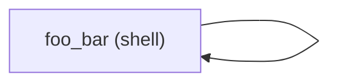

# Code Review: Task 145 (`--staged`)

## Context / Trust Boundary

- Verified: `.taskmaster/tasks/task_145/task-145.md`, staged diff, focused pytest, and two adversarial Mermaid repro snippets.
- Missing context: `.taskmaster/tasks/task_145/task-review.md` and `.taskmaster/tasks/task_145/implementation/progress-log.md` do not exist in this checkout.
- Test execution: `uv run pytest ...` is not usable in this sandbox (`uv` panics before pytest starts), so verification used `.venv/bin/python -m pytest`.

## Critical - must fix before merge

- None found in the staged patch.

## Warnings - should be addressed

- `src/pflow/core/workflow/mermaid.py:31` and `src/pflow/core/workflow/mermaid.py:132` use one global `seen` set for cycle detection and never pop paths after recursive expansion. That suppresses legitimate non-cyclic reuse of the same child workflow from multiple parent steps. Repro:

```python
parent_ir = {
    "nodes": [
        {"id": "first", "type": "workflow", "params": {"workflow": "child"}},
        {"id": "second", "type": "workflow", "params": {"workflow": "child"}},
    ],
    "edges": [{"from": "first", "to": "second"}],
}
```

Current output expands only `first`; `second` is rendered as an opaque node. Cycle detection should be scoped to the current recursion stack/path, not to the whole traversal history, so sibling references to the same child can still expand under different namespaces.

- `src/pflow/core/workflow/mermaid.py:142` rewrites `-` to `_` in Mermaid node IDs, but pflow itself allows both characters (`src/pflow/core/markdown_parser.py:56`). That means distinct workflow nodes like `foo-bar` and `foo_bar` collapse to the same Mermaid node ID, producing duplicate declarations and a self-edge:



Preserve hyphens as-is, or use a reversible escaping scheme that cannot collide with valid `_` IDs.

## Suggestions - optional improvements

- `src/pflow/cli/commands/visualize.py:39` manually catches `resolve_workflow()` exceptions and prints `str(e)`, while validation failures use the shared diagnostics formatter. That creates two output styles for the same command and can drop structured suggestions attached to `WorkflowNotFoundError`. Consider letting `WorkflowRunner.validate(workflow, params={})` own resolution failures too, or converting resolver exceptions through the same diagnostic formatting path.

## Verification

- Passed: `.venv/bin/python -m pytest tests/test_core/test_sub_workflow_resolver.py tests/test_core/test_mermaid.py tests/test_cli/test_visualize.py`
- Passed: `.venv/bin/python -m pytest tests/test_core/test_sub_workflow_validation.py tests/test_runtime/test_workflow_executor`
- Reproduced: duplicate child workflow expansion is suppressed by global `seen`
- Reproduced: `foo-bar` and `foo_bar` collide in generated Mermaid IDs
