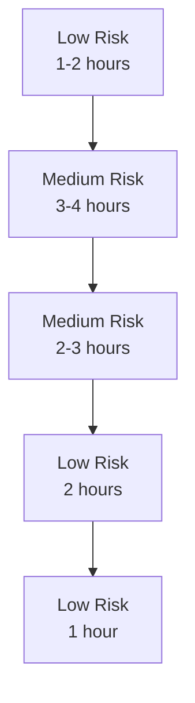

# Task 52 Refactoring Plan - Comprehensive Implementation Guide

## Executive Summary

Task 52 successfully implemented requirements analysis and planning steps with prompt caching, achieving 90%+ cost savings. However, the implementation created unnecessary complexity with dual caching architectures and legacy code paths. This refactoring plan provides a systematic approach to simplify the codebase while preserving all functionality.

## Current State Analysis

### Two Parallel Caching Systems

1. **prompt_cache_helper.py** (Template-based caching)
   - Used by 6 planning nodes
   - Loads prompts from `.md` files
   - Special-case logic for discovery and component_browsing nodes
   - 268 lines of code with complex special handling

2. **PlannerContextBuilder** (Block-based accumulation)
   - Used by PlanningNode and WorkflowGeneratorNode only
   - Programmatically builds cache blocks
   - Supports context accumulation for retries
   - Tightly coupled to planning workflow

### Key Problems Identified

1. **Special-case complexity**: 100+ lines handling discovery/component_browsing special cases
2. **Legacy context support**: Dead code for string-based contexts still present
3. **Dual code paths**: Every node has `if cache_planner:` branches
4. **4-cache-marker workarounds**: Complex logic to handle Anthropic's limit
5. **Monkey-patching**: Fragile injection of AnthropicLLMModel

## Verification Results

### Legacy Context Keys Status
- **planner_extended_context**: ❌ Dead code - safe to remove
- **planner_accumulated_context**: ❌ Dead code - safe to remove
- **planning_context**: ✅ Still actively used - DO NOT remove

### Cache Blocks Handling
- AnthropicLLMModel: ✅ Safely handles `cache_blocks=None`
- Regular llm library: ❌ Does not support cache_blocks parameter
- Model routing: ✅ Automatic detection based on model name

### Test Impact Analysis
- **Tests to remove**: 2 files (~100 lines)
- **Tests to refactor**: 4 files (~200 lines)
- **Tests unchanged**: 10+ files

## Refactoring Implementation Plan

### Phase 1: Remove Legacy Context Support (Low Risk)
**Time Estimate**: 1-2 hours
**Risk Level**: Low
**Files Affected**: 3

#### Step 1.1: Remove legacy context collection
```python
# In WorkflowGeneratorNode.prep() - Remove lines 1729-1730
- "planner_extended_context": shared.get("planner_extended_context"),  # Legacy strings
- "planner_accumulated_context": shared.get("planner_accumulated_context"),  # Legacy strings
```

#### Step 1.2: Update tests using legacy context
- Update `test_generator_parameter_integration.py`
- Update `test_workflow_generator_context_prompt.py`
- Update `test_path_b_generation_north_star.py`
- Replace `create_minimal_context()` calls with proper block creation

#### Step 1.3: Run tests to verify
```bash
make test
```

### Phase 2: Eliminate Dual Code Paths (Medium Risk)
**Time Estimate**: 3-4 hours
**Risk Level**: Medium
**Files Affected**: 7 (6 nodes + 1 helper)

#### Step 2.1: Create unified prompt handling
```python
# New pattern for all nodes
def exec(self, prep_res: dict[str, Any]) -> dict[str, Any]:
    # Always build blocks (cache_control conditional)
    cache_blocks = self._build_cache_blocks(prep_res)
    prompt = self._get_prompt_content(prep_res)

    # Model handles whether to actually cache
    model = llm.get_model(prep_res["model_name"])
    response = model.prompt(
        prompt,
        cache_blocks=cache_blocks if prep_res.get("cache_planner") else None,
        schema=self.ResponseSchema,
        temperature=prep_res["temperature"]
    )
```

#### Step 2.2: Implement for each node
Apply pattern to:
1. WorkflowDiscoveryNode
2. ComponentBrowsingNode
3. RequirementsAnalysisNode
4. ParameterDiscoveryNode
5. ParameterMappingNode
6. MetadataGenerationNode

#### Step 2.3: Update tests
- Remove `cache_planner=False` test cases
- Keep cache block validation tests
- Simplify integration tests

### Phase 3: Simplify Special-Case Logic (Medium Risk)
**Time Estimate**: 2-3 hours
**Risk Level**: Medium
**Files Affected**: 3 (2 nodes + helper)

#### Step 3.1: Move discovery logic to WorkflowDiscoveryNode
```python
class WorkflowDiscoveryNode(Node):
    def _build_cache_blocks(self, prep_res: dict[str, Any]) -> list[dict]:
        blocks = []

        # Load and cache instructions
        instructions = load_prompt_instructions("discovery")
        if instructions:
            blocks.append({
                "text": instructions,
                "cache_control": {"type": "ephemeral"}
            })

        # Add discovery context (node knows it's cacheable)
        discovery_context = prep_res.get("discovery_context", "")
        if discovery_context and len(discovery_context) > 1000:
            blocks.append({
                "text": f"## Context\n\n<existing_workflows>\n{discovery_context}\n</existing_workflows>",
                "cache_control": {"type": "ephemeral"}
            })

        return blocks

    def _get_prompt_content(self, prep_res: dict[str, Any]) -> str:
        # Return only the dynamic user input part
        return f"## Inputs\n\n<user_request>\n{prep_res['user_input']}\n</user_request>"
```

#### Step 3.2: Move component_browsing logic to ComponentBrowsingNode
Similar pattern - node owns its caching strategy

#### Step 3.3: Simplify prompt_cache_helper.py
Remove:
- `CACHEABLE_CONTEXT_NODES` constant
- `_build_context_cache_blocks()` method
- Special handling in `build_cached_prompt()`

Keep only:
- Basic instruction caching logic
- Prompt loading utilities

### Phase 4: Test Suite Cleanup (Low Risk)
**Time Estimate**: 2 hours
**Risk Level**: Low
**Files Affected**: 6 test files

#### Step 4.1: Remove obsolete tests
- Delete `test_cache_planner_flag.py` entirely
- Remove `should_use_caching` tests from `test_cache_builder.py`

#### Step 4.2: Simplify dual-path tests
- Update `test_nodes_caching.py` - remove False branches
- Update `test_caching_integration.py` - single path only

#### Step 4.3: Fix broken tests
- Fix imports in `test_cache_builder.py`
- Update mocks in `test_nodes_caching.py`

### Phase 5: Documentation Updates (Low Risk)
**Time Estimate**: 1 hour
**Risk Level**: Low
**Files Affected**: 3-4 documentation files

#### Step 5.1: Update architecture docs
- Update `architecture/prompt-caching-architecture.md`
- Update progress log with refactoring results

#### Step 5.2: Update CLAUDE.md
- Document the simplified architecture
- Remove references to dual paths

## Implementation Order & Dependencies



Total Time Estimate: **9-12 hours**

## Success Metrics

### Quantitative
- Lines of code removed: ~300-400
- Test execution time: Reduced by ~20%
- Code complexity: Cyclomatic complexity reduced by ~30%

### Qualitative
- Single code path for all nodes
- No special-case constants
- Clear separation of concerns
- Easier to add new nodes

## Risk Mitigation

### Backup Strategy
1. Create feature branch: `refactor/task-52-simplification`
2. Commit after each phase
3. Run full test suite after each phase
4. Keep original branch as reference

### Rollback Plan
Each phase is independently revertible:
- Phase 1: Restore legacy context support
- Phase 2: Restore dual code paths
- Phase 3: Restore special-case logic
- Phase 4: Restore original tests
- Phase 5: Documentation only - no rollback needed

### Testing Strategy
1. Unit tests after each node change
2. Integration tests after each phase
3. Manual testing with --cache-planner flag
4. Performance comparison before/after

## Alternative Approaches Considered & Rejected

### 1. Unify on PlannerContextBuilder
**Rejected because**: Would abandon prompt templates, moving backwards

### 2. Complete rewrite
**Rejected because**: Too risky, working system with good performance

### 3. Keep status quo
**Rejected because**: Technical debt will compound

## Next Steps

1. Review this plan with stakeholders
2. Create feature branch
3. Start with Phase 1 (lowest risk)
4. Proceed phase by phase with testing
5. Merge when all phases complete

## Appendix: Affected Files List

### Core Files (7)
- `src/pflow/planning/nodes.py`
- `src/pflow/planning/utils/prompt_cache_helper.py`
- `src/pflow/planning/utils/cache_builder.py`
- `src/pflow/planning/context_blocks.py`
- `src/pflow/planning/utils/anthropic_llm_model.py`
- `architecture/prompt-caching-architecture.md`
- `CLAUDE.md`

### Test Files (6)
- `tests/test_cli/test_cache_planner_flag.py`
- `tests/test_planning/unit/test_nodes_caching.py`
- `tests/test_planning/unit/test_cache_builder.py`
- `tests/test_planning/integration/test_caching_integration.py`
- `tests/test_planning/integration/test_generator_parameter_integration.py`
- `tests/test_planning/llm/prompts/test_workflow_generator_context_prompt.py`

### Documentation Files (3)
- `architecture/prompt-caching-architecture.md`
- `.taskmaster/tasks/task_52/implementation/progress-log.md`
- `scratchpads/task-52-refactoring/*`

## Conclusion

This refactoring plan provides a systematic approach to simplifying the Task 52 implementation while preserving all functionality. The phased approach minimizes risk, with each phase independently valuable and testable. The end result will be a cleaner, more maintainable codebase with the same performance characteristics but significantly reduced complexity.