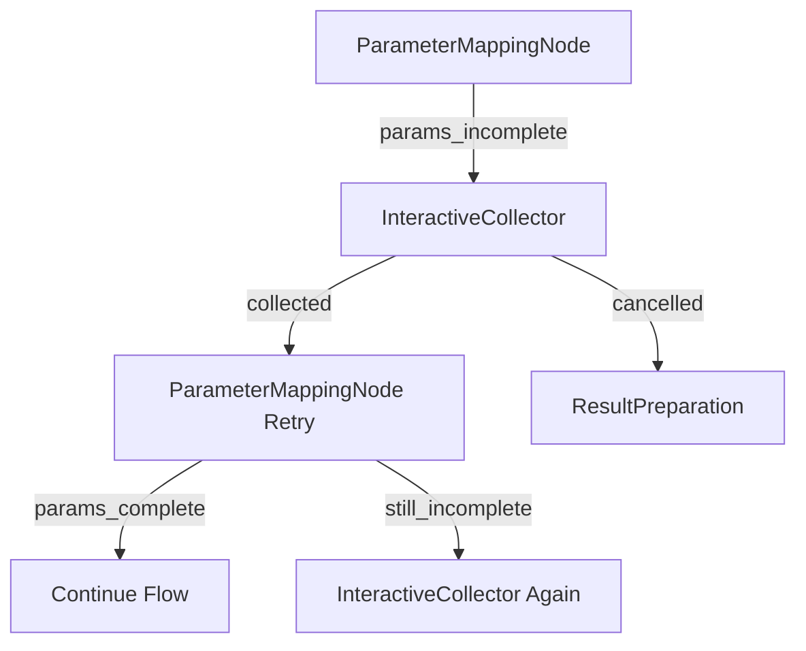

# Interactive Parameter Collection - Technical Design

## Executive Summary

This document specifies the technical design for Interactive Parameter Collection in the Natural Language Planner. With the validation redesign complete (parameters extracted BEFORE validation), we can now enhance the system to interactively request missing parameters from users instead of failing outright.

## Current State (Post-Validation Redesign)

### What Works Now
After the validation redesign implementation:
- Parameters are extracted BEFORE validation (fixed flow order)
- Template validation uses actual extracted values
- Both Path A (reuse) and Path B (generation) work correctly

### What Still Fails
When ParameterMappingNode cannot extract all required parameters:
```
User: "analyze some data"
System: Extracts {} (no file names found)
Result: "params_incomplete" → ResultPreparation → FAIL
Error: "Missing required parameters: input_file, output_file"
```

The user must provide everything upfront or the planner fails completely.

## Proposed Architecture

### High-Level Design



### Key Architectural Decisions

1. **Stateful Collection**: Interactive collection requires maintaining state across user interactions
2. **Flow Suspension**: PocketFlow doesn't support suspension; we need a wrapper mechanism
3. **CLI Integration**: Primary interface for user interaction (future: web UI support)
4. **Progressive Disclosure**: Ask for parameters one at a time with context

## Component Specifications

### 1. InteractiveParameterCollector (New Component)

**Location**: `src/pflow/planning/interactive.py`

```python
class InteractiveParameterCollector:
    """Manages interactive parameter collection from users."""

    def __init__(self, workflow_ir: dict, missing_params: list,
                 extracted_params: dict, user_input: str):
        self.workflow_ir = workflow_ir
        self.missing_params = missing_params
        self.extracted_params = extracted_params
        self.original_input = user_input
        self.collection_state = CollectionState()

    def prepare_prompts(self) -> list[ParameterPrompt]:
        """Generate user-friendly prompts for each missing parameter."""
        prompts = []
        for param_name in self.missing_params:
            param_spec = self.workflow_ir["inputs"].get(param_name, {})
            prompt = ParameterPrompt(
                name=param_name,
                description=param_spec.get("description", f"Value for {param_name}"),
                type=param_spec.get("type", "string"),
                required=param_spec.get("required", True),
                default=param_spec.get("default"),
                examples=self._generate_examples(param_name, param_spec),
                validation_rules=self._extract_validation(param_spec)
            )
            prompts.append(prompt)
        return prompts

    def validate_input(self, param_name: str, value: str) -> ValidationResult:
        """Validate user-provided parameter value."""
        param_spec = self.workflow_ir["inputs"].get(param_name, {})
        param_type = param_spec.get("type", "string")

        # Type validation
        if param_type == "integer":
            try:
                int(value)
            except ValueError:
                return ValidationResult(False, f"Must be a valid integer")

        # File existence validation (if applicable)
        if "file" in param_name.lower() and param_spec.get("must_exist", False):
            if not Path(value).exists():
                return ValidationResult(False, f"File not found: {value}")

        # Custom validation rules
        if "pattern" in param_spec:
            if not re.match(param_spec["pattern"], value):
                return ValidationResult(False, f"Must match pattern: {param_spec['pattern']}")

        return ValidationResult(True)

    def merge_collected_params(self, collected: dict) -> dict:
        """Merge newly collected parameters with existing ones."""
        return {**self.extracted_params, **collected}
```

### 2. PlannerFlowWrapper (New Component)

**Location**: `src/pflow/planning/flow_wrapper.py`

```python
class PlannerFlowWrapper:
    """Wraps the planner flow to support suspension and resumption."""

    def __init__(self):
        self.flow = create_planner_flow()
        self.suspension_point = None
        self.suspended_state = None

    def run_with_interaction(self, initial_shared: dict) -> dict:
        """Run planner with interactive parameter collection support."""
        shared = initial_shared.copy()
        max_interactions = 3  # Prevent infinite loops
        interaction_count = 0

        while interaction_count < max_interactions:
            # Run the flow
            self.flow.run(shared)

            # Check if interaction needed
            if self._needs_interaction(shared):
                # Suspend flow state
                self.suspended_state = self._capture_state(shared)
                self.suspension_point = "parameter_mapping"

                # Trigger interactive collection
                collected = self._interactive_collect(shared)

                if collected is None:  # User cancelled
                    return self._create_cancelled_result(shared)

                # Resume with collected parameters
                shared = self._prepare_resume_state(shared, collected)
                self.flow = self._create_resume_flow()
                interaction_count += 1
            else:
                # Flow completed successfully
                return shared.get("planner_output")

        # Max interactions reached
        return self._create_max_interactions_result(shared)

    def _needs_interaction(self, shared: dict) -> bool:
        """Check if interactive collection is needed."""
        output = shared.get("planner_output", {})
        return (
            not output.get("success") and
            output.get("missing_params") and
            not output.get("validation_errors")  # Only for missing params, not validation errors
        )

    def _capture_state(self, shared: dict) -> dict:
        """Capture current flow state for resumption."""
        return {
            "workflow_ir": shared.get("found_workflow") or shared.get("generated_workflow"),
            "extracted_params": shared.get("extracted_params", {}),
            "missing_params": shared.get("missing_params", []),
            "user_input": shared.get("user_input"),
            "workflow_metadata": shared.get("workflow_metadata", {}),
            "path": "A" if shared.get("found_workflow") else "B"
        }

    def _create_resume_flow(self) -> Flow:
        """Create a flow that starts from ParameterMappingNode."""
        # Special flow that starts directly at parameter mapping
        parameter_mapping = ParameterMappingNode()
        parameter_preparation = ParameterPreparationNode()
        result_preparation = ResultPreparationNode()
        validator = ValidatorNode()
        metadata_generation = MetadataGenerationNode()

        flow = Flow(start=parameter_mapping)

        # Wire based on path
        if self.suspended_state["path"] == "B":
            parameter_mapping - "params_complete_validate" >> validator
            validator - "metadata_generation" >> metadata_generation
            metadata_generation >> parameter_preparation
        else:
            parameter_mapping - "params_complete" >> parameter_preparation

        parameter_mapping - "params_incomplete" >> result_preparation
        parameter_preparation >> result_preparation

        return flow
```

### 3. CLI Integration Updates

**Location**: `src/pflow/cli/interactive.py`

```python
class InteractiveCLI:
    """Handles interactive parameter collection in CLI."""

    def __init__(self, style: Optional[StyleConfig] = None):
        self.style = style or StyleConfig()
        self.console = Console()

    def collect_parameters(self, prompts: list[ParameterPrompt],
                          context: dict) -> Optional[dict]:
        """Interactively collect parameters from user."""
        collected = {}

        # Show context
        self._show_context(context)

        # Collect each parameter
        for prompt in prompts:
            value = self._collect_single_parameter(prompt)
            if value is None:  # User cancelled
                return None
            collected[prompt.name] = value

        # Confirm collected values
        if not self._confirm_values(collected):
            return self.collect_parameters(prompts, context)  # Retry

        return collected

    def _show_context(self, context: dict):
        """Display context about what's being collected."""
        self.console.print(Panel(
            f"[bold]Need Additional Information[/bold]\n\n"
            f"Original request: {context['user_input']}\n"
            f"Workflow: {context['workflow_name']}\n"
            f"Missing {len(context['missing_params'])} required parameters",
            title="Parameter Collection",
            border_style="yellow"
        ))

    def _collect_single_parameter(self, prompt: ParameterPrompt) -> Optional[str]:
        """Collect a single parameter with validation."""
        # Show parameter info
        self.console.print(f"\n[bold]{prompt.name}[/bold]")
        self.console.print(f"  {prompt.description}")

        if prompt.examples:
            self.console.print(f"  Examples: {', '.join(prompt.examples)}")

        if prompt.default:
            self.console.print(f"  Default: {prompt.default}")

        # Get input with validation
        while True:
            try:
                if prompt.type == "password":
                    value = getpass.getpass(f"Enter {prompt.name}: ")
                else:
                    value = Prompt.ask(
                        f"Enter {prompt.name}",
                        default=prompt.default if prompt.default else ...
                    )

                # Handle cancellation
                if value.lower() in ['cancel', 'quit', 'exit']:
                    if Confirm.ask("Cancel parameter collection?"):
                        return None
                    continue

                # Validate
                validation = prompt.validate(value)
                if validation.is_valid:
                    return value
                else:
                    self.console.print(f"[red]Error: {validation.message}[/red]")

            except KeyboardInterrupt:
                if Confirm.ask("\nCancel parameter collection?"):
                    return None

    def _confirm_values(self, collected: dict) -> bool:
        """Confirm collected values with user."""
        table = Table(title="Collected Parameters")
        table.add_column("Parameter", style="cyan")
        table.add_column("Value", style="green")

        for name, value in collected.items():
            # Mask sensitive values
            display_value = "***" if "password" in name.lower() else value
            table.add_row(name, display_value)

        self.console.print(table)
        return Confirm.ask("Use these values?", default=True)
```

## User Interaction Flows

### Flow 1: Simple Missing Parameters

```
User: analyze data
System: I found a workflow for data analysis, but need some additional information:

📋 Parameter Collection
────────────────────
Original request: analyze data
Workflow: data-analyzer
Missing 2 required parameters

input_file
  The data file to analyze
  Examples: data.csv, dataset.json
Enter input_file: sales_2024.csv

output_format
  Format for the analysis report
  Examples: pdf, html, markdown
  Default: pdf
Enter output_format: [Enter for pdf]

┌─────────────────────────┐
│ Collected Parameters    │
├────────────┬────────────┤
│ input_file │ sales_2024.csv │
│ output_format │ pdf     │
└────────────┴────────────┘
Use these values? [Y/n]: y

✅ Workflow ready to execute with all parameters
```

### Flow 2: Progressive Collection with Validation

```
User: process files
System: Found file processing workflow. Let me collect the required parameters:

source_directory
  Directory containing files to process
Enter source_directory: /tmp/data
[red]Error: Directory not found: /tmp/data[/red]
Enter source_directory: ~/Documents/data

file_pattern
  Pattern to match files (glob syntax)
  Examples: *.txt, data_*.csv
Enter file_pattern: *.csv

operation
  Processing operation to perform
  Options: compress, encrypt, transform, analyze
Enter operation: analyze

✅ Parameters collected. Validating workflow...
✅ All parameters valid. Ready to execute.
```

### Flow 3: Cancellation Handling

```
User: complex workflow
System: This workflow needs several parameters:

Parameter 1 of 5:
database_url
  Connection string for the database
Enter database_url: cancel
Cancel parameter collection? [y/N]: y

❌ Parameter collection cancelled.
💡 Tip: To run this workflow, provide parameters in your request:
   "complex workflow with database postgres://... and output report.pdf"
```

## State Management

### Collection State Model

```python
@dataclass
class CollectionState:
    """Tracks state during interactive collection."""
    session_id: str = field(default_factory=lambda: str(uuid4()))
    started_at: datetime = field(default_factory=datetime.now)
    interaction_count: int = 0
    collected_params: dict = field(default_factory=dict)
    remaining_params: list = field(default_factory=list)
    validation_attempts: dict = field(default_factory=dict)
    user_cancelled: bool = False

    def add_collected(self, param_name: str, value: Any):
        """Record a collected parameter."""
        self.collected_params[param_name] = value
        if param_name in self.remaining_params:
            self.remaining_params.remove(param_name)

    def increment_validation_attempts(self, param_name: str):
        """Track validation attempts per parameter."""
        self.validation_attempts[param_name] = \
            self.validation_attempts.get(param_name, 0) + 1

    def should_abort(self) -> bool:
        """Check if collection should be aborted."""
        return (
            self.user_cancelled or
            self.interaction_count > 3 or
            any(attempts > 3 for attempts in self.validation_attempts.values())
        )
```

### Persistence Strategy

For future enhancement, collection state could be persisted to enable:
- Resume after disconnection
- Multi-device collection
- Audit trail

```python
class StateStore:
    """Persist collection state (future enhancement)."""

    def save_state(self, state: CollectionState):
        """Save state to ~/.pflow/sessions/{session_id}.json"""
        pass

    def load_state(self, session_id: str) -> Optional[CollectionState]:
        """Load state from disk."""
        pass

    def cleanup_old_sessions(self, older_than: timedelta):
        """Remove expired sessions."""
        pass
```

## Error Handling & Edge Cases

### Validation Failures

```python
class ParameterValidator:
    """Comprehensive parameter validation."""

    def validate_with_context(self, param_name: str, value: str,
                             context: dict) -> ValidationResult:
        """Validate parameter considering context."""

        # Check dependencies
        if param_name == "output_file":
            input_file = context.get("input_file")
            if input_file and value == input_file:
                return ValidationResult(False, "Output cannot be same as input")

        # Check conflicts
        if param_name == "format" and value == "csv":
            if context.get("operation") == "compress":
                return ValidationResult(False, "Cannot compress to CSV format")

        # Validate paths
        if "path" in param_name or "file" in param_name:
            return self._validate_path(value, param_name)

        return ValidationResult(True)
```

### Timeout Handling

```python
class TimeoutManager:
    """Manage collection timeouts."""

    def __init__(self, timeout_seconds: int = 300):
        self.timeout = timeout_seconds
        self.start_time = None

    def start(self):
        """Start timeout timer."""
        self.start_time = time.time()

    def check_timeout(self) -> bool:
        """Check if timeout reached."""
        if self.start_time:
            return (time.time() - self.start_time) > self.timeout
        return False

    def get_remaining(self) -> int:
        """Get remaining time in seconds."""
        if self.start_time:
            elapsed = time.time() - self.start_time
            return max(0, self.timeout - int(elapsed))
        return self.timeout
```

### Edge Cases to Handle

1. **Circular Dependencies**
   - Parameter A depends on B, B depends on A
   - Solution: Detect and break cycles, collect both together

2. **Dynamic Parameters**
   - Number of parameters depends on previous values
   - Solution: Progressive collection with re-evaluation

3. **Sensitive Data**
   - Passwords, API keys, tokens
   - Solution: Mask display, don't log, secure storage

4. **Large Value Input**
   - Multi-line content, file contents
   - Solution: Support file references, multi-line input mode

5. **Disconnection/Timeout**
   - User loses connection during collection
   - Solution: Session persistence, resumption capability

## Implementation Strategy

### Phase 2.1: Basic Interactive Collection (MVP)
1. Implement InteractiveParameterCollector
2. Add basic CLI prompting (no fancy UI)
3. Support string parameters only
4. Simple validation (required/optional)

### Phase 2.2: Enhanced Collection
1. Add PlannerFlowWrapper for suspension/resume
2. Implement comprehensive validation
3. Support all parameter types
4. Add timeout handling

### Phase 2.3: Rich User Experience
1. Implement rich CLI with tables, panels
2. Add progress indicators
3. Support parameter dependencies
4. Add smart defaults based on context

### Phase 2.4: Advanced Features
1. Session persistence
2. Multi-step collection wizards
3. Parameter templates/profiles
4. Integration with external sources

## Testing Strategy

### Unit Tests
- InteractiveParameterCollector logic
- Validation rules
- State management
- Timeout handling

### Integration Tests
- Flow suspension/resumption
- CLI interaction simulation
- Parameter validation chains
- Error recovery

### User Experience Tests
- Mock user sessions
- Cancellation scenarios
- Timeout scenarios
- Validation failure loops

## Success Metrics

1. **Completion Rate**: % of sessions that successfully collect all params
2. **Abandonment Rate**: % of sessions cancelled by user
3. **Retry Rate**: Average validation attempts per parameter
4. **Time to Complete**: Average time to collect all parameters
5. **User Satisfaction**: Feedback on collection experience

## Future Enhancements

1. **Web UI Support**: Rich web interface for parameter collection
2. **Smart Suggestions**: ML-based parameter value suggestions
3. **Batch Collection**: Collect parameters for multiple workflows
4. **Template System**: Save/load parameter sets
5. **External Integration**: Pull parameters from config files, env vars
6. **Collaborative Collection**: Multiple users contributing parameters
7. **Conditional Parameters**: Show/hide based on other values
8. **Rich Input Types**: File browsers, date pickers, dropdowns

## Conclusion

Interactive Parameter Collection transforms the planner from a rigid system requiring perfect upfront input to a collaborative assistant that guides users through providing the necessary information. By implementing this in phases, we can deliver immediate value while building toward a comprehensive solution.