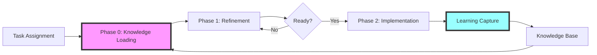

# Epistemic Workflow Overview

This document provides a high-level view of the epistemic learning system for task implementation. The system transforms isolated task execution into a compound learning accelerator.

## The Three-Phase System



### Phase 0: Knowledge Loading (📚 `refining-subtask.md`)
**Purpose**: Start smart by learning from ALL previous implementations
- Read all task implementation reviews
- Read relevant subtask reviews
- Synthesize patterns and pitfalls
- Build mental model of codebase evolution

### Phase 1: Refinement (🔍 `refining-subtask.md`)
**Purpose**: Transform ambiguous tasks into crystal-clear specifications
- Validate against actual code
- Surface and resolve ALL ambiguities
- Get explicit user decisions
- Create unambiguous specification

### Phase 2: Implementation (🔨 `implement-subtask.md`)
**Purpose**: Execute systematically while capturing learnings in real-time
- Implement the refined specification
- Log discoveries AS THEY HAPPEN
- Extract reusable patterns
- Create comprehensive review

## When to Use Which Document

### Start with `refining-subtask.md` when:
- [ ] Beginning any new task or subtask
- [ ] Task description seems unclear
- [ ] You're not sure what's already been tried
- [ ] Dependencies need validation

### Move to `implement-subtask.md` when:
- [ ] ALL ambiguities are resolved
- [ ] Refined specification exists
- [ ] Success criteria are clear
- [ ] `ready-for-implementation` marker exists

### Return to `refining-subtask.md` if:
- [ ] Core assumptions prove false during implementation
- [ ] New ambiguities surface
- [ ] Dependencies don't exist as expected
- [ ] Success criteria can't be met as specified

## The Compound Learning Effect

```
Task 1: 4 hours (no prior knowledge)
  ↓ Discovers authentication pattern
Task 5: 3 hours (reuses auth pattern)
  ↓ Discovers caching approach
Task 10: 2 hours (uses both patterns)
  ↓ Adds error handling pattern
Task 20: 1 hour (applies all patterns)
  ↓ Mostly configuration at this point
```

Each task contributes to a growing knowledge base that makes future tasks progressively easier.

## Example Workflow

### Scenario: Implement Task 5.2 - "Add user authentication to CLI"

#### Phase 0: Knowledge Loading
```bash
$ task-master show-reviews --all
# Discovers Task 2.3 implemented JWT auth
# Discovers Task 3.1 tried OAuth but failed
# Discovers Task 4.2 established CLI patterns

# Creates knowledge-synthesis.md:
# - Use JWT pattern from Task 2.3
# - Avoid OAuth complexity (failed in 3.1)
# - Follow CLI conventions from 4.2
```

#### Phase 1: Refinement
```bash
$ task-master show --id=5.2
# "Add user authentication to CLI"

# Ambiguity detected: Which auth method?
# Creates evaluation.md with options:
# - Option A: JWT (proven in 2.3)
# - Option B: API keys (simpler)
# User chooses: Option A

# Creates refined-spec.md:
# - Use JWT with refresh tokens
# - Store tokens in ~/.pflow/auth
# - Add login/logout commands
# Success criteria: User can authenticate and make authorized requests
```

#### Phase 2: Implementation
```bash
$ task-master set-status --id=5.2 --status=in-progress

# 10:15 - Try to reuse auth module from Task 2.3
# Discovery: Module too tightly coupled to web server
# Learning: Need auth abstraction layer

# 10:45 - Create auth abstraction
# Success! Clean separation of concerns
# Pattern: AuthProvider interface

# 11:30 - Implementation complete
# Creates review.md:
# - Extracted AuthProvider pattern
# - Affects Task 6.1 (can use same pattern)
# - Update arch docs with auth abstraction
```

## File Structure

```
.taskmaster/
├── knowledge/                    # Accumulated wisdom
│   ├── patterns/                # What works
│   ├── pitfalls/               # What doesn't
│   └── decisions/              # Architectural choices
├── tasks/
│   └── task_X/
│       ├── refinement/         # Phase 0 & 1 artifacts
│       │   ├── knowledge-synthesis.md
│       │   ├── evaluation.md
│       │   ├── refined-spec.md
│       │   └── ready-for-implementation
│       ├── implementation/     # Phase 2 artifacts
│       │   ├── plan.md
│       │   ├── progress-log.md
│       │   └── review.md
│       └── impact/            # Cross-task effects
│           └── affects-tasks.md
```

## Key Success Factors

### 1. **Actually Read Previous Reviews**
The system only works if you genuinely load knowledge. Skipping Phase 0 breaks the compound effect.

### 2. **Capture Learnings in Real-Time**
Discoveries captured after-the-fact lose critical details. Log AS YOU WORK.

### 3. **Surface Ambiguities Aggressively**
Every assumption is a future bug. Get clarity upfront in refinement.

### 4. **Extract Patterns Immediately**
When something works, document it as a pattern before moving on.

## Quick Reference Card

```bash
# Phase 0: Knowledge Loading
task-master show-reviews --all              # Load all knowledge
task-master show-reviews --task=X           # Load task-specific

# Phase 1: Refinement
task-master show --id=X.Y --with-deps       # Understand task
# Create: evaluation.md → decisions → refined-spec.md
touch .../refinement/ready-for-implementation

# Phase 2: Implementation
task-master set-status --id=X.Y --status=in-progress
# Log continuously to progress-log.md
task-master update-subtask --id=X.Y --prompt="DISCOVERY:..."
# Create: review.md → extract patterns
task-master set-status --id=X.Y --status=done
```

## The Payoff

When this system is followed:
- **No repeated mistakes** - Pitfalls are documented and avoided
- **Faster implementation** - Patterns accelerate development
- **Higher quality** - Ambiguities caught before coding
- **Team learning** - Everyone benefits from discoveries - Humans as well as AI Agents
- **Compound returns** - Each task is easier than the last

## Getting Started

1. Pick a task ID - Assigned by the user or by using `task-master next`
2. Open `refining-subtask.md`
3. Start with Phase 0: Knowledge Loading
4. Follow the workflow systematically
5. Watch your velocity increase with each task

---

*"Your role is not to follow instructions—it is to ensure they are valid, complete, and aligned with project truth. And that truth includes the accumulated wisdom of all who came before you."*
